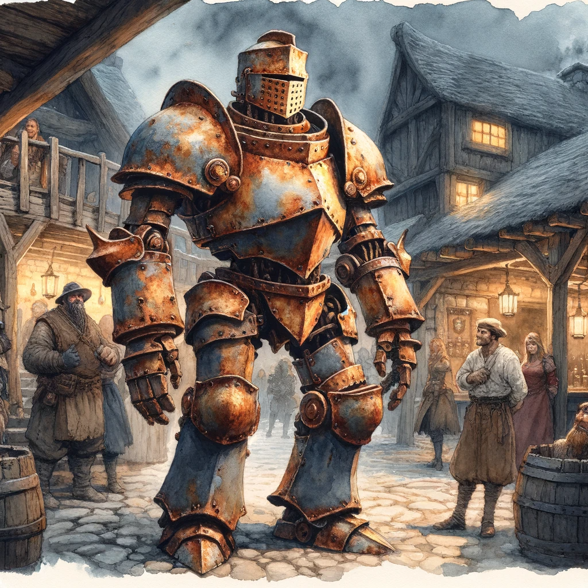
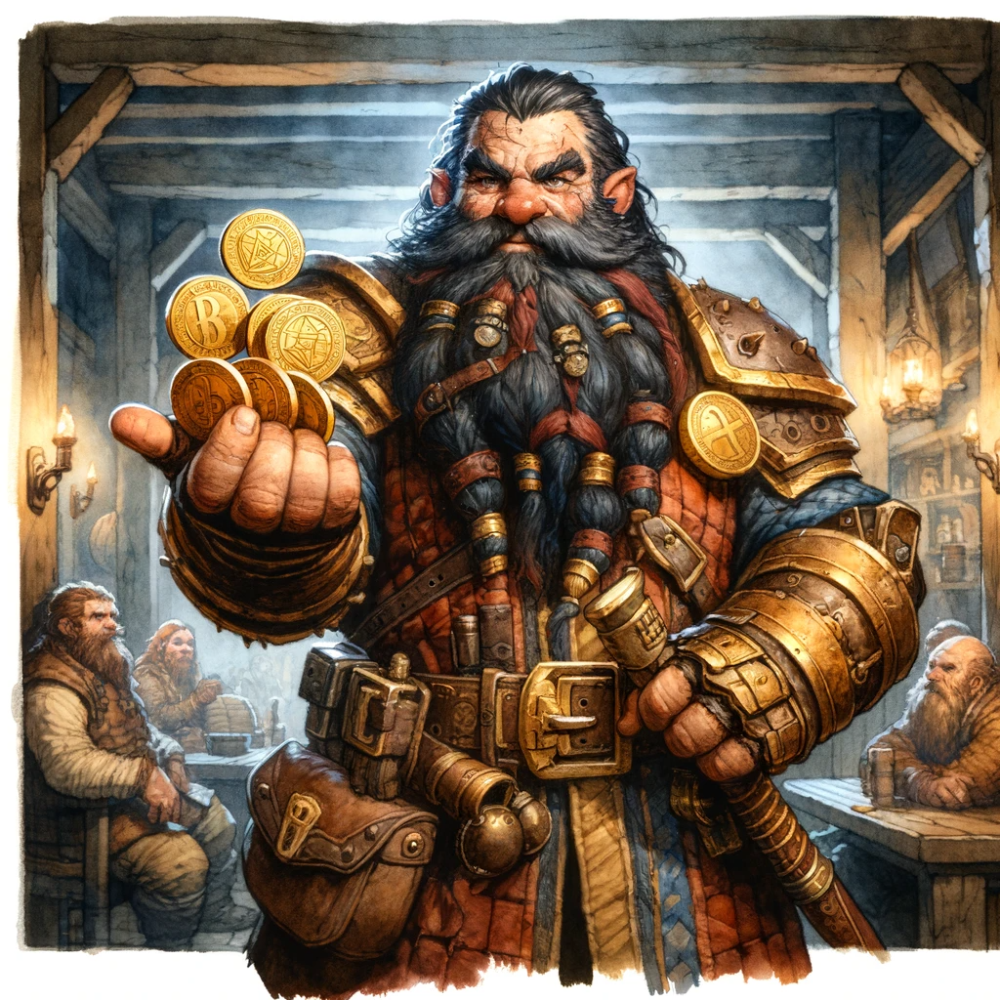
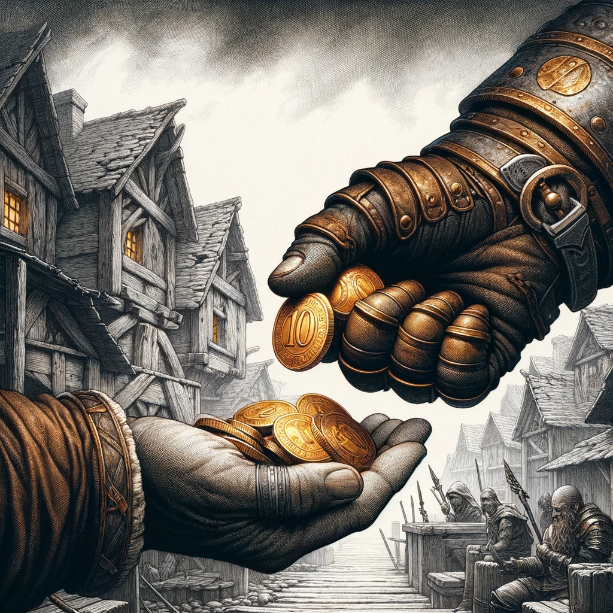

# Day 01

## The Brawl with Old Rattlecan

In the cozy, yet somewhat rugged interior of the Skull and Sword Tavern, Lord Eldrin Blackwood, Kaelor Quickbreath, Grekson, and Tukuy Pachamama were deep in discussion about their foray into Drakkenheim. The tavern was abuzz with the energy of adventurers and townsfolk, all reveling in the brief respite from the harsh realities outside.

"We need to be cautious," Eldrin said, his voice low. "The streets of Drakkenheim are treacherous, littered with both visible and unseen dangers."

Grekson nodded, his eyes serious. "I know a few safe passages, but we'll need to be prepared for anything. Delirium's effects are unpredictable."

Kaelor, ever the optimist, leaned back in his chair. "As long as we stick together and watch each other's backs, we'll make it through. Be wary though as there's a lot of ratling roaming about, and the abominations from Delerium are at every corner".

Eldrin was mid-sentence when a raucous cheer erupted from a group of ruffians at a nearby table. "Oi, you lot!" one of them called out, sloshing his drink. "Fancy a kick at the ol' Rattlecan?"

Kaelor raised an eyebrow, a grin spreading across his feline face. "Rattlecan? That old suit of armor? I've heard tales, but I thought it was just an ale-fueled myth."

Grekson chuckled, leaning back in his chair. "Oh, it's real alright. A favorite pastime here is to challenge that animated heap of metal to a duel. It's like a rite of passage for the local drunkards."

Before they could decline the offer, a sudden clanging of metal drew their attention outside. "Aha! Take that!" shouted a metallic voice, followed by a series of boastful taunts like "Ha! 'Tis but a flesh wound!" and "Was that the best you can do?"

Curiosity piqued, the four companions made their way outside, where they witnessed a bizarre spectacle. Old Rattlecan, the animated suit of armor, was engaged in a clumsy yet spirited battle with two overconfident ruffians.

The armor moved with surprising agility for something that looked like it belonged in a scrapyard. "Have at thee!" it bellowed, swinging a gauntleted fist at the nearest ruffian.

Kaelor leaned against the tavern wall, watching the fight with amusement. "Well, I've seen many things, but a trash-talking suit of armor is a first."

Tukuy folded his arms, observing the scene. "It fights with more honor than its challengers, that's for sure."

The brawl was both comical and chaotic. One ruffian tried to tackle the armor, only to bounce off with a groan. The other swung wildly, missing more often than hitting. Old Rattlecan, seemingly enjoying the fray, danced around them, landing thumping blows.

"Ouch, that's got to hurt," Grekson winced as one ruffian took a solid hit to the stomach, doubling over.

The fight reached its climax when the armor knocked one ruffian unconscious with a well-aimed punch. The remaining combatant, however, managed to find a weak spot in Rattlecan's back, causing it to stagger and eventually collapse in a heap, pieces scattering across the street.

The victorious ruffian, panting and bruised, spat on the ground and staggered away, leaving the defeated armor behind.

Eldrin stepped forward, inspecting the fallen Rattlecan. "Remarkable. Even in defeat, it retains a sense of dignity."

Kaelor picked up a detached gauntlet, examining it with a mix of respect and curiosity. "Well, it seems Old Rattlecan has been disarmed," he quipped, eliciting a groan from Eldrin.

Tukuy shook his head, chuckling. "Only in Emberwood would you find such entertainment. But let's not forget our purpose here."

As the group returned to the tavern, Old Rattlecan, in a display of magical resilience, began to reassemble itself. Within moments, the suit of armor stood upright, its metallic frame glinting under the tavern's dim lights, seemingly awaiting a new challenger.

The tavern's lively chatter was interrupted as a boisterous voice cut through the air. "Oi, you lot! Fancy a real challenge?" A stout dwarf, flanked by a sly-looking kobold and a tall human, gestured towards the adventurers and Old Rattlecan.

Eldrin turned, a competitive glint in his eye. "A challenge, you say? We're listening."

The dwarf chuckled, stroking his thick beard. "Simple. First group to knock down Rattlecan wins. One gold coin says we drop it before you do."

Eldrin's smirk widened. "Make it five gold coins. We never back down from a challenge."

The dwarf's eyes sparkled with amusement. "Ten gold coins it is, then! Let's see what you're made of!"

Kaelor stepped forward, cracking his knuckles. "Well, this just got interesting. Shall we show them how it's done?"

Grekson nodded, his hand resting on the hilt of his dagger. "I'm not one for gambling, but I do enjoy a good skirmish."

Tukuy, standing tall, flexed his muscles. "For ten gold coins, Rattlecan won't know what hit it."

As the two groups faced off, the atmosphere in the tavern shifted from festive to electric. Patrons gathered around, placing their own bets and cheering.

The dwarf's group took their positions, weapons at the ready. The human brandished a sword, the kobold wielded a set of daggers, and the dwarf hefted a hefty hammer.

Eldrin drew his sword with a flourish, Kaelor gripped his greataxe tightly, Grekson unsheathed his daggers with a swift motion, and Tukuy prepared to charge.

Old Rattlecan, seemingly aware of the stakes, adopted a defensive stance, its metallic voice booming, "Come then, challengers! Show me your mettle!"

With a nod from Eldrin, the two groups lunged forward, converging on the animated armor. The clanging of metal, shouts of effort, and the crowd's roars filled the air.

The scene was a chaotic dance of steel and strategy, each group trying to outmaneuver the other to land the decisive blow on Old Rattlecan. The adventurers' skills were matched only by their determination not to be outdone by their boisterous rivals.

The animated suit of armor, its movements clunky yet surprisingly effective, landed a hefty blow on one of the ruffians, sending him reeling backwards, stars dancing before his eyes.

Kaelor, with a mischievous twinkle in his eye, leaped into action alongside Tukuy. "Time to dent some metal!" he exclaimed, swinging his axe with precision.

The Minotaur's muscles, honed from years of defending his tribe and battling the blight that plagued his lands, coiled like springs ready to unleash their power. With a roar that echoed through the village, Tukuy swung his arm, aiming a crushing blow at Old Rattlecan's torso. The impact resounded with a metallic clang that sent vibrations through the air. The force of the strike was so immense that it caused the armor to stagger backward, its structure rattling as if it would come apart at any moment.

The crowd erupted in cheers and gasps, their excitement reaching a fever pitch. Kaelor couldn't help but shout, "That's it, Tukuy! Show that pile of bolts what Minotaur strength is all about!"

With a resounding clang, Kaelor's axe struck Rattlecan, leaving a sizable dent in its chest. Tukuy followed with a powerful blow, bending the armor's helm.

The dwarf from the opposing team, watching the action with a mix of admiration and frustration, shouted, "Oi, no spells on Rattlecan, by the way!" He then lunged forward, his hammer sweeping at Rattlecan's legs in a deft arc.

Lord Eldrin, inspired by the sacred flame of his faith, called upon his divine powers. "By the light of the Sacred Flame, let our blows be guided!" he intoned, his voice resonating with a celestial harmony.

A warm, radiant light enveloped Grekson, Tukuy, and Kaelor, each feeling a surge of divine energy coursing through them. Grekson's daggers gleamed with a holy light, Tukuy's muscles seemed to swell with holy vigor, and Kaelor's eyes sparkled with an ethereal fire.

"Now that's what I call divine intervention!" Kaelor quipped, his axe swinging with renewed force.

The trio, now imbued with the blessing of the sacred flame, pounced on Old Rattlecan with a ferocity that was both awe-inspiring and terrifying. The animated armor, overwhelmed by the onslaught, succumbed to the relentless barrage. With a final, echoing crash, it collapsed into a heap of battered metal.

The crowd around them erupted into cheers and applause, the excitement palpable in the air. The dwarf, his expression a mix of shock and respect, walked over to Lord Eldrin. With a hearty slap on the back that nearly sent Eldrin stumbling, he planted a kiss on Eldrin's cheek.

"By the beards of my ancestors, that was the finest brawl I've seen in ages!" he exclaimed, his voice booming with laughter.

Eldrin, rubbing his cheek and trying to hide a smile, responded, "Well, it seems Old Rattlecan met its match today. But your enthusiasm is... quite infectious."

As the dust settled and the excitement of the duel with Old Rattlecan began to wane, the dwarf, with a grandiose flourish that seemed almost comical given his stout stature, he pulled out a small pouch and counted out ten gold coins into Eldrin's palm.

"Fair's fair," the dwarf said with a nod. "You lot fought well. But since you're heading to Drakkenheim, let me offer you a wee bit of advice—stay away from Slaughterstone Square."

Eldrin raised an eyebrow, the coins clinking in his hand. "Slaughterstone Square? That sounds ominous."

The dwarf leaned in closer, his voice dropping to a conspiratorial whisper. "Oh, it's more than ominous, my lord. It's a right nightmare. The place is cursed, they say. Haunted by the ghosts of those who perished there. Best to steer clear if you value your sanity."

Grekson, who had been quietly observing the exchange, couldn't resist chiming in with his characteristic dry wit. "But it has such a lovely warm name to it," he quipped, a smirk playing on his lips. "Sounds like the perfect spot for a picnic, doesn't it?"

Kaelor burst into laughter, his booming voice filling the tavern. "Yes, and perhaps after our picnic, we can take a leisurely stroll through the 'Valley of Eternal Screams.' I hear it's lovely this time of year."

Tukuy, not usually one for humor, cracked a small smile at the banter. "And let's not forget to visit the 'Pit of Despair.' I hear the view is to die for."

The dwarf, caught off guard by the barrage of jokes, chuckled despite himself. "You're a funny lot. But mark my words, there's nothing funny about Slaughterstone Square. You'd do well to remember that."

Eldrin nodded, pocketing the gold coins. "Your advice is noted and appreciated. We'll be sure to pack extra sandwiches for our picnic in the square."

The group erupted into laughter, the tension of the earlier battle dissipating into the warm camaraderie of the moment. Lord Eldrin Blackwood, holding the ten gold coins in his palm, turbed to his companions, a look of genuine appreciation in his eyes. 

With deliberate movements, Eldrin separated three coins and handed them to Grekson. "For your cunning and swiftness," he said, his voice imbued with respect. Eldrin then turned to Kaelor, extending another three coins. "For your strength and bravery, Kaelor. Your axe swings as fiercely as your spirit." Finally, Eldrin presented the last three coins to Tukuy. "And for you, Tukuy, for your unwavering resolve and mighty tree truks for arms."

With one coin remaining, Eldrin held it up, the light reflecting off its surface. "I am nothing without you all. Together, we are more than just adventurers seeking fortune. We are a fellowship bound by a common cause."

Kaelor, his feline eyes sparkling. "Ah, but remember, Lord Eldrin, it's not the gold that makes the warrior. Though, it does buy a fine round of ale," he chuckled, his tail swishing in amusement.

As Eldrin pocketed the last coin, they returned inside, and the tavern around them continued its lively bustle, oblivious to the significance of the moment. Yet for the four companions, it was a reaffirmation of their unity and purpose, a beacon of light in the shadowed path that lay ahead.

## The silver order asks for a favor

As the adventurers where about to settle to an evening of camraderie, they were approached by High Flamekeeper Ophelia Reed of the Silver Order, accompanied by two cavaliers "Adventurers," Ophelia greeted them, her voice carrying a sense of urgency. "I have a task of utmost importance, one that cannot fall to just any hands."

Eldrin stepped forward, recognising the symbol identifyin Ophelia as a High Flamekeeeper of the Silver Order, curiosity piqued. "High Flamekeeper, we are at your service. What is this task you speak of?" Ophelia urged them to follow her.

As the evening shadows grew longer in Emberwood Village, casting an almost mystical glow over the rustic buildings, the companions found themselves outside the small but serene Chapel of the Sacred Flame. The circular fieldstone building, with its copper domed rooftop and thin stained glass windows, stood as a beacon of hope in the desolate landscape surrounding Drakkenheim. The simple wooden double doors of the chapel opened to a crematory garden and scattering plot, offering a peaceful resting place for the ashes of the departed.

Inside the chapel, the bronze brazier of the Sacred Flame burned with a golden fire, its light flickering across the faces of those who sought solace within. Flamekeeper Hanna, a young woman in a simple white and yellow frock, her black hair neatly tied in a braid, tended to the flame. Despite her youth, she exuded a sense of calm wisdom, having taken the mantle of Flamekeeper after the death of her predecessor.

Ophelia, a figure of authority and dedication, had been attempting to persuade Hanna to join the Silver Order, but Hanna remained committed to her neutrality and service to the village.

Ophelia's eyes scanned the group, assessing their resolve. "The task concerns the Sceptre of Saint Vitruvio. It's been discovered that it lies buried beneath the Chapel of Saint Brenna. This artifact is of great significance and must not fall into the wrong hands."

Kaelor, leaning on his axe, chuckled. "Sounds like a treasure hunt. Count us in. But what's so special about this scepter?"

"The Sceptre of Saint Vitruvio is not just a relic; it's a symbol of the faith and power of the Sacred Flame. In the wrong hands, it could spell disaster," Ophelia explained. "Help us retrieve it, and you shall be handsomely rewarded for your efforts."

Grekson, ever the skeptic, raised an eyebrow. "And what's the catch? Such tasks are seldom without their dangers."

Ophelia nodded solemnly. "The race is on to recover the scepter. You won't be the only ones searching for it, and the others may not share our noble intentions."

Tukuy, his voice deep and steady, added, "We understand the risks. The Sacred Flame has guided us this far. We shall see this through."

Ophelia offered a grateful smile. "Meet me back at Camp Dawn once you have the scepter. Time is of the essence."

As the group prepared to leave, Hanna approached them. "May the Sacred Flame light your path and protect you in the shadows of Drakkenheim."

With their new task at hand, the companions stepped out of the chapel, the weight of their mission settling upon them. The Chapel of Saint Brenna and the Sceptre of Saint Vitruvio awaited, shrouded in mystery and danger.

As they walked away from the chapel, Kaelor quipped, "Well, looks like we're going from kicking cans to chasing scepters. What's next? Dragon-slaying?"

Grekson smirked. "Let's stick to scepters for now. Dragons can wait."

The group shared a light-hearted laugh, their spirits bolstered by the camaraderie and the challenge ahead. As they set off towards their next adventure, the Chapel of Saint Ardenna faded into the background, a silent witness to the beginning of their quest.

## The first expedition

## Rattling ambush

## The chapel of Saint Brenna

## Devils

## A complicated mechanism

## Saint Brenna
