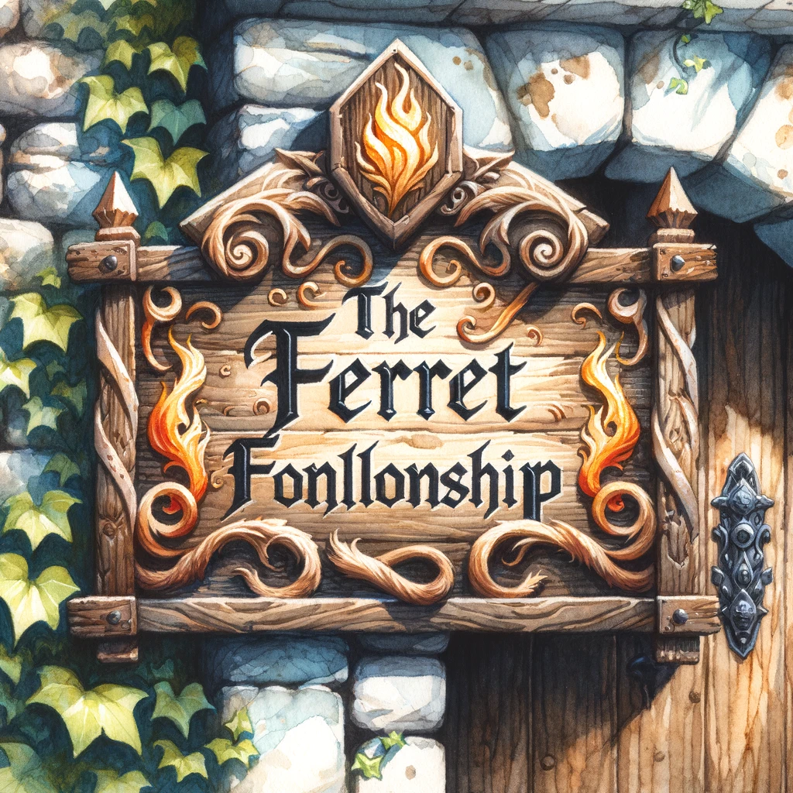

# Running "The Ferret Fellowship" Adventurers' Guild

### Creating the Guild

**What Are You Offering?**
- **Adventuring Services**: Job postings, quest assignments, and a hub for adventurers.
- **Training**: Basic combat and survival training.
- **Community Hub**: A place for adventurers to gather, rest, and share information.

**Location**
- Start small with a shed or a room next to one of the inns.
- Use starting capital to set up the space with essentials.

**Management**
- **General Manager**: Appoint one of the Fire Ferrets to manage day-to-day operations.
- **Stat Blocks**: Use their stats to handle various challenges:
  - **CHA**: Client interactions and social tasks.
  - **WIS**: Strategic planning and long-term decisions.
  - **INT**: Problem-solving and day-to-day management.

### Business Mechanics

**Business Stats**
- **Cash Flow (GP)**: Represents the gold available to handle issues and invest.
- **Brand Health (HP)**: Represents the guild's reputation and standing in the community.

**Running the Guild**
- Check up on the guild regularly. For each week you're away, roll on the Minor Encounter Table.
- For every four weeks, roll once on the Major Encounter Table instead of four Minor Encounters.

### Encounter Tables

**Minor Encounter Table**

| d12 | Encounter | Difficulty | Pass | Fail |
| --- | --------- | ---------- | ---- | ---- |
| 1   | Loan called in by a creditor | Hard | -5gp, +25hp | -15gp, -10hp |
| 2   | Theft from the guild | Easy | +10gp | -5gp, -5hp |
| 3   | Manager ill, junior takes over | Hard | +10gp, +10hp | -15hp, -10hp |
| 4   | Rain damages guild hall | Medium | +15hp | -10gp, -5hp |
| 5   | Profits dwindling, need a new plan | Medium | +10gp, +5hp | -10gp, -5gp |
| 6   | Employee threatens to leave | Medium | +15hp | -15hp |
| 7   | New tavern causing trouble | Hard | +5gp, +15hp | -10gp, -15hp |
| 8   | Giant rats eating supplies | Easy | +5gp, +5hp | -10gp |
| 9   | Con-man targets the guild | Medium | +10gp, +5hp | -10gp, -5hp |
| 10  | Floor rot requires fixing | Medium | -5gp, +20hp | -5gp, -10hp |
| 11  | Staff morale is low | Easy | +10hp | -5gp, -5hp |
| 12  | Missed letters and fines | Medium | +10gp, +5hp | -15gp |

**Major Encounter Table**

| d4 | Encounter | Pass | Fail |
| --- | --------- | ---- | ---- |
| 1   | Manager's dubious romance | +25gp, +25hp | -35gp, -25hp |
| 2   | Heavy fines and threats | +10gp, +40hp | -15gp, -45hp |
| 3   | Product-related deaths and investigation | +50gp, -10hp | -35gp, -25hp |
| 4   | Manager missing with stock | -10gp, +50hp | -30gp, -30hp |

### Starting Capital and Weekly Income

**Starting Capital**
To set up "The Ferret Fellowship," you'll need to cover initial expenses for acquiring or renting a space, furnishing it, and providing basic supplies. Here’s an estimate:

- **Guild Hall (renting a small shed or room next to an inn):** 50-100 gp
- **Furnishings and Basic Equipment:** 100-200 gp
- **Initial Supplies and Provisions:** 50-100 gp
- **Hiring Staff/Initial Salary for the Manager:** 50 gp

**Total Starting Capital:** 250-450 gp

**Weekly Income**
The income generated by "The Ferret Fellowship" will depend on the services provided, the number of adventurers using the guild, and the general success of the business.

**Estimated Weekly Income:**
- **Base Weekly Income:** 50 gp (equivalent to basic adventuring services and job postings)
- **Additional Income from Training Services and Events:** 20-30 gp
- **Membership Fees/Donations:** 10-20 gp

**Total Estimated Weekly Income:** 80-100 gp

**Income Calculation Based on Successes:**
Adjust the weekly income based on recent successes or failures, as detailed in the encounter tables.

- **High Success (passing multiple encounters):** Up to 150 gp/week
- **Average Success (steady business):** 80-100 gp/week
- **Low Success (failing encounters):** 50-70 gp/week

**Example Breakdown:**
- If the business faces no major issues and runs smoothly, you might consistently earn around 80-100 gp per week.
- If the business encounters significant challenges or passes major encounters, the income could increase to around 150 gp per week.

### Income Adjustments Based on Encounters

To simulate the variability and challenges of running a business, use the encounter tables to adjust the income and expenses.

- **Minor Encounter Failures:** Deduct 5-15 gp per failed encounter.
- **Major Encounter Failures:** Deduct 30-45 gp per failed encounter.
- **Minor Encounter Successes:** Add 5-15 gp per successful encounter.
- **Major Encounter Successes:** Add 25-50 gp per successful encounter.

### Income and Growth

**Income**
- Generate income equivalent to about two quests' worth of gold per four weeks of operations.
- Adjust income based on recent successes or failures.

### Practical Steps

1. **Set Up the Guild**: Use starting capital to set up a small guild hall.
2. **Appoint a Manager**: Choose one of the Fire Ferrets to manage the guild.
3. **Roll for Encounters**: Regularly roll on the encounter tables based on how long you're away.
4. **Handle Issues**: Address minor and major encounters to maintain Cash Flow and Brand Health.
5. **Expand and Grow**: As the guild succeeds, reinvest profits to expand services and improve the guild hall.

