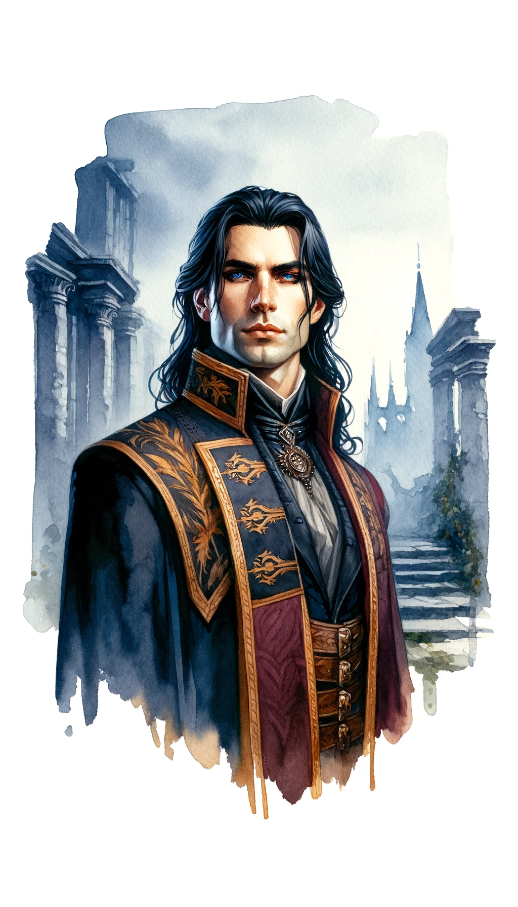
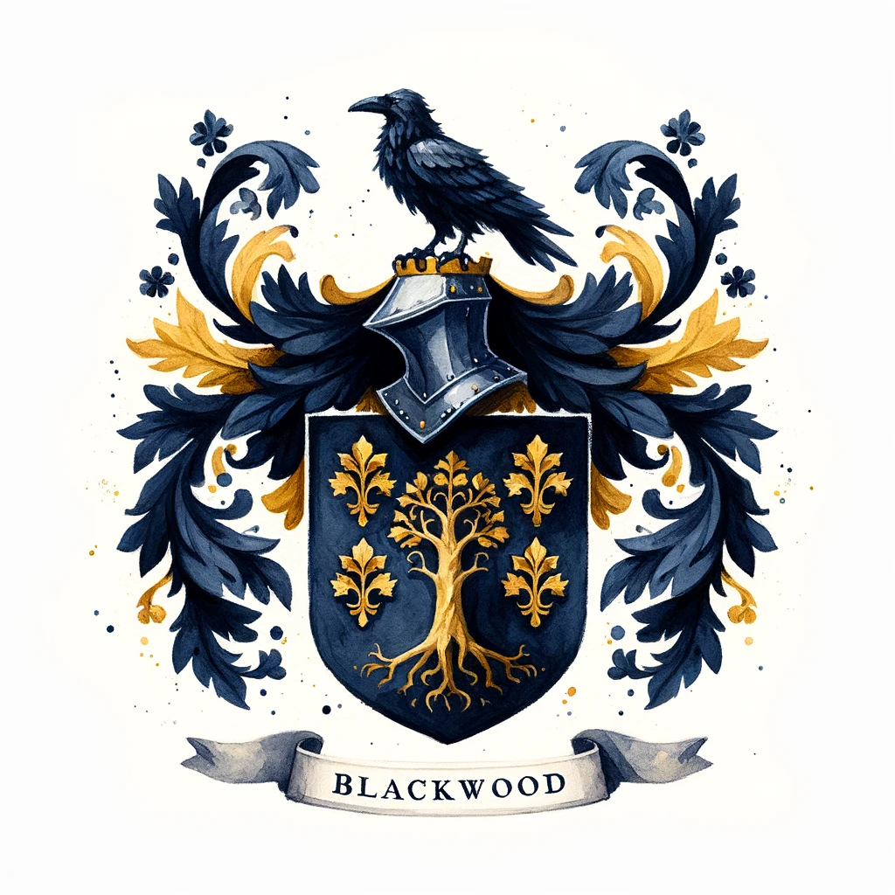
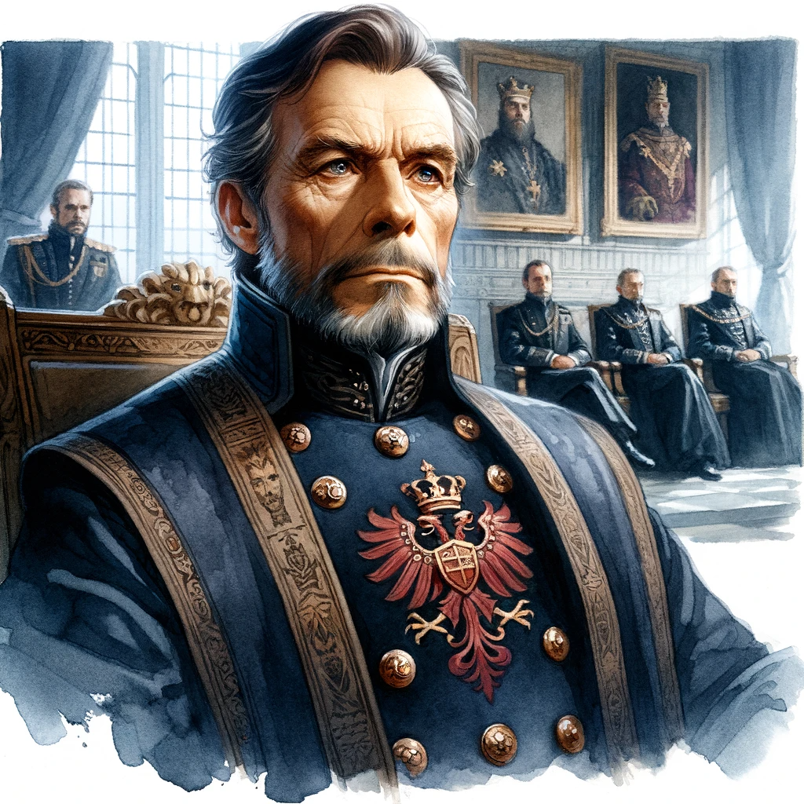
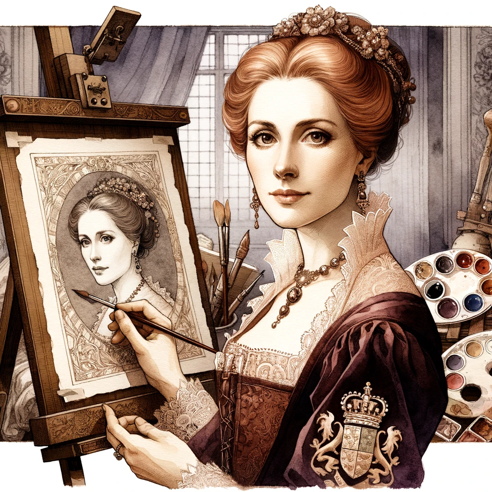
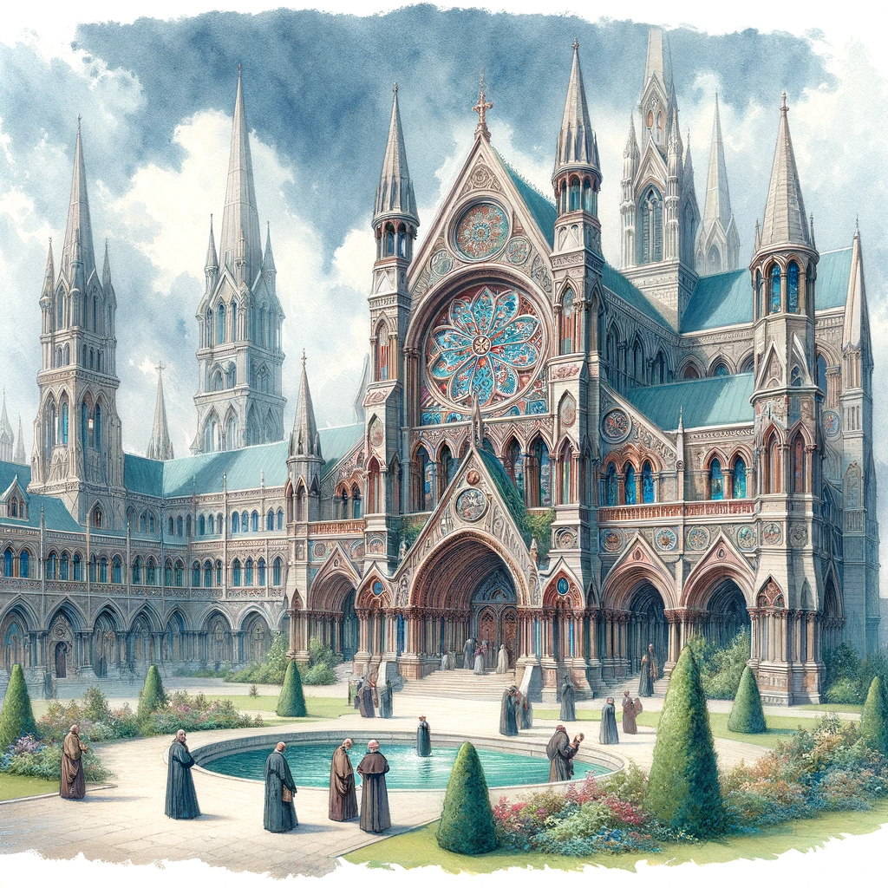
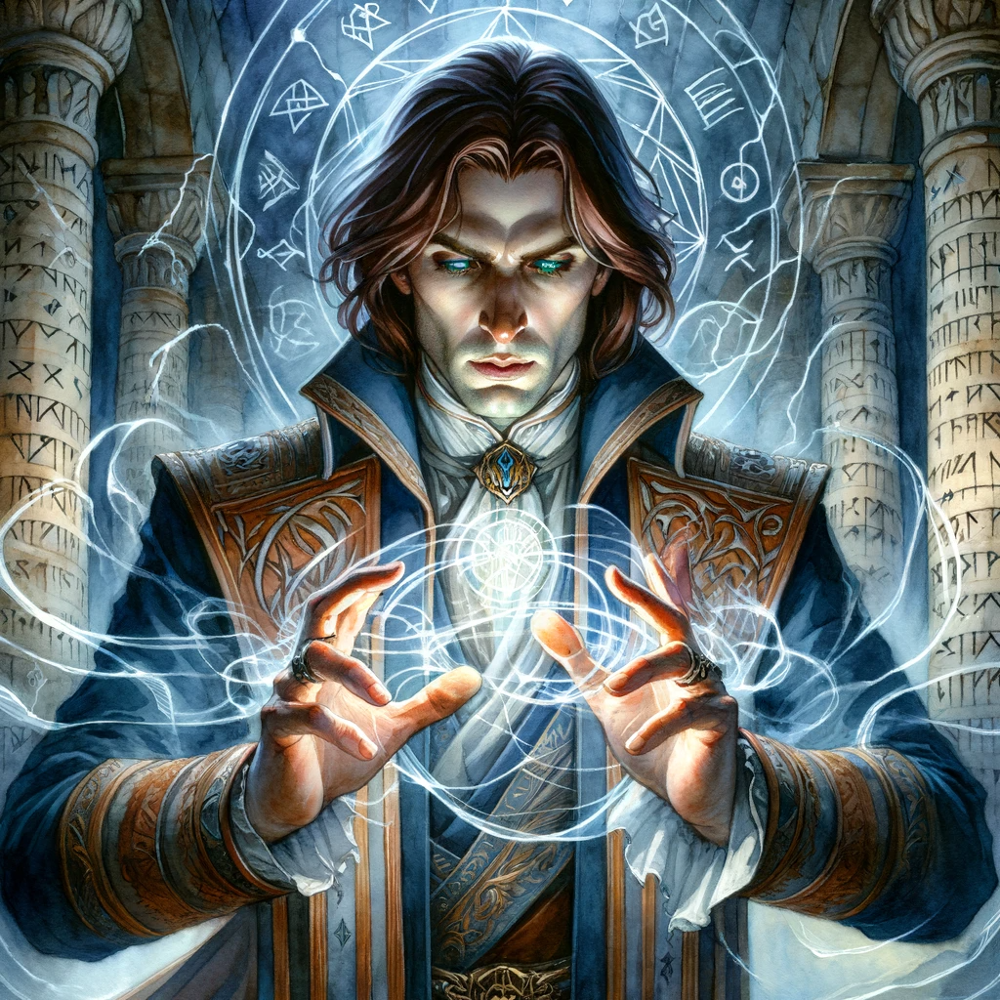
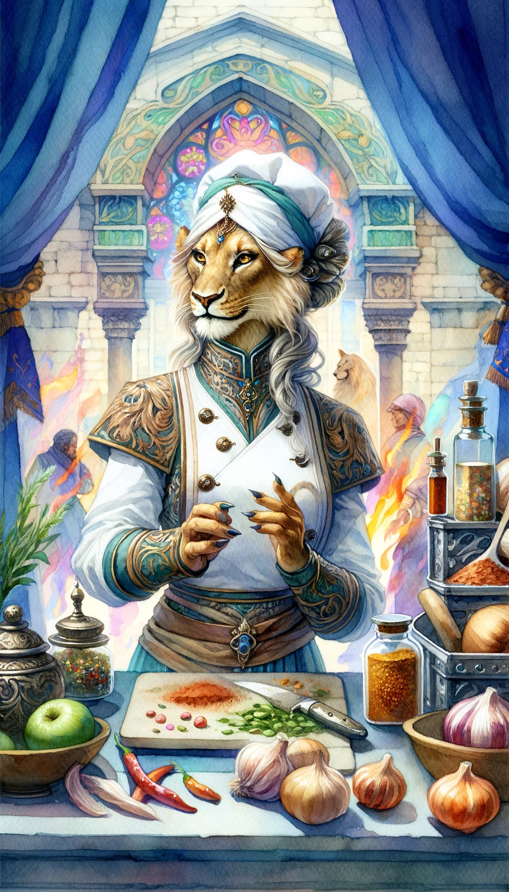
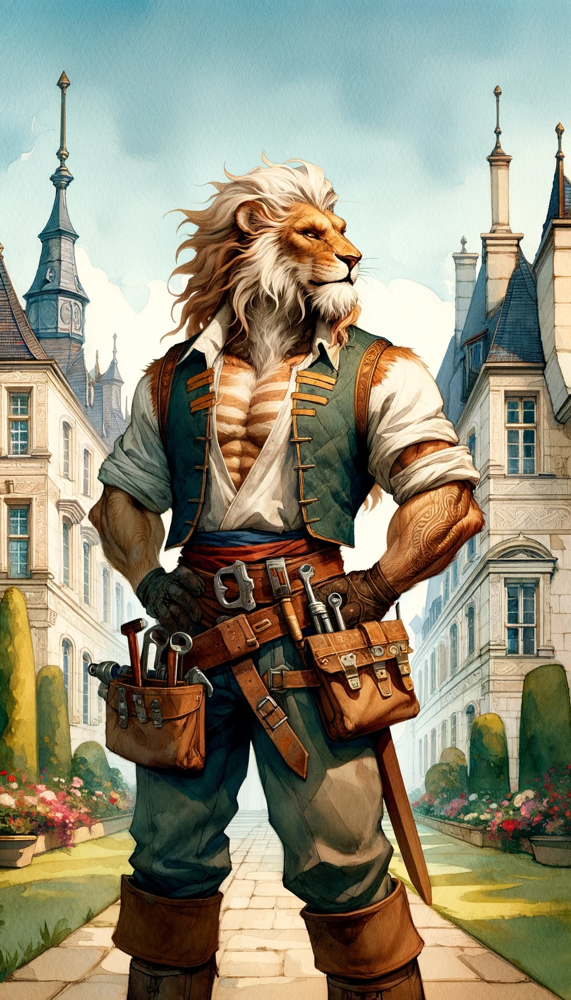
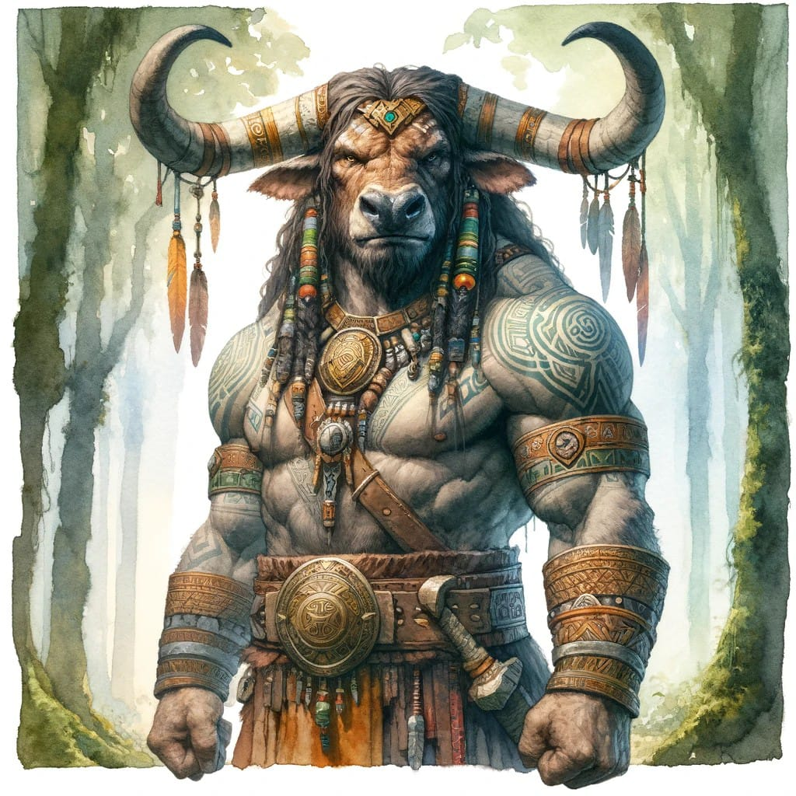

# Characters

## Lord Eldrin Blackwood :material-shield-sword:

### Physical Description

{ width="300" }

Eldrin Blackwood is a figure of noble bearing, standing at a height of 6 feet with a well-maintained physique honed by years of martial training. His skin is fair and unblemished, a testament to his meticulous grooming and the sheltered life of nobility. His long, raven-black hair is usually tied back neatly to keep it away from his face, revealing a high forehead and sharp, aristocratic features.

His eyes are a piercing blue, reflecting the depth of his resolve and the enigmatic blend of divine and arcane energies that dwell within him. They sparkle with a curious light, always scanning his surroundings with a mix of scrutiny and fascination.

When in the confines of noble society, Eldrin is seen adorned in rich fabrics tailored to perfection, displaying the Blackwood crest proudly. His attire is a blend of elegance and tradition, with long coats, fine tunics, and well-polished boots. Each garment is chosen meticulously to reflect his status and the proud lineage he represents.

In the field, Eldrin dons a suit of full plate armor, polished to a mirror shine that catches the light with a gleam that's almost ethereal. The armor is well-crafted, with the Blackwood crest engraved over the heart and delicate, arcane symbols etched discreetly along the inner linings, a silent nod to his clandestine sorcerous journey. A cloak of deep blue, the color of the Blackwood house, flows from his shoulders, billowing softly as he moves through the ruins of Drakkenheim.

His demeanor is a blend of noble aloofness and disciplined calm, bearing the weight of his family's legacy with a quiet, dignified resolve. Each movement is measured and precise, reflecting the discipline instilled in him from his clerical training. Yet, there’s a spark of rebellion in his eyes, a flicker of the arcane fire that burns within, ready to forge a new destiny amidst the ashes of the old.

### Backstory

{ width="300" }

Eldrin's childhood was steeped in the traditions of nobility and the high expectations of his father, Lord Alistair Blackwood. Lord Alistair was a close advisor to the royal family of Drakkenheim House von Drakken, and a staunch upholder of law and order. His relationship with Eldrin was a complex blend of stern mentorship and paternal concern. Eldrin was groomed to follow in his father’s footsteps, being educated in the political, military, and social intricacies of noble life. The unyielding expectations from his father to uphold the family honor and continue the Blackwood lineage often weighed heavily upon Eldrin's shoulders. Yet, the respect and admiration Eldrin held for his father compelled him to strive toward these expectations.

{ width="300" }

His mother, Lady Marianne, was his solace amidst the stern world of nobility. Lady Marianne was a kind-hearted woman with a love for arts and literature. She encouraged Eldrin to explore the world beyond the strict boundaries of nobility, nurturing his curious and imaginative side. Her gentle ways provided a balance to the stern discipline imparted by his father.

{ width="300" }

From a young age, Eldrin was enrolled in the prestigious clerical institution known as The Sanctum of Order, located in a tranquil part of Drakkenheim away from the bustling heart of the city. This was a tradition in the Blackwood family to ensure that its heirs were imbued with a strong sense of duty, discipline, and a moral compass aligned with the principles of order and righteousness. Under the stern but wise mentorship of High Cleric Bartholomew, Eldrin delved into the studies of theology, divine rituals, and the moral codes that govern the laws of both men and gods.

{ width="300" }

His clerical training also entailed rigorous physical drills to hone his combat skills, as a cleric of order was expected to be a bulwark against chaos and a guardian of the societal structure. These years of disciplined training under the vigilant eye of High Cleric Bartholomew forged a strong, dutiful personality within Eldrin, echoing his father’s teachings of upholding the Blackwood legacy of loyalty, honor, and duty.

The fall of the meteor on Drakkenheim was a cataclysmic event that shattered Eldrin's world. The Blackwood estate in the city was obliterated, claiming the lives of both Lord Alistair and Lady Marianne. This tragedy wasn’t just a personal loss for Eldrin, but also a grave threat to the legacy of the Blackwoods. With no heir to carry forward the family's lineage and uphold its noble status, the name of Blackwood faced the threat of fading into oblivion. This crisis weighed heavily on Eldrin, igniting a fervent resolve to reclaim and restore his family's honor and position in Drakkenheim.

The Blackwoods had always aligned with Mannfred during the Civil War, valuing the preservation of the established order that Mannfred represented. When the war erupted, Eldrin found himself amidst the turmoil, his loyalties tied to the forces supporting Mannfred. He served as a military cleric, offering his healing and strategic expertise to the cause he believed would restore order to the land.

In the immediate aftermath of the meteorite's fall and during the subsequent civil war, Eldrin delved deeper into his clerical training, the structured teachings providing a semblance of order amidst the chaos that reigned outside the walls of The Sanctum of Order. His dedication to his training was a beacon of hope amidst the uncertainty, a means to prepare himself for the monumental task of restoring his family’s legacy.

Years later, whispers of an ancient secret started surfacing. It was rumored that the Blackwoods were privy to a royal secret that could potentially alter the power dynamics within the house von Drakken. This secret was believed to be known only to Lord Alistair and a few within the royal circle. With his father's demise, the onus of uncovering and wielding this secret fell upon Eldrin. The secret was said to be a lever of power or leverage over the royalty, a clandestine truth that, if revealed, could significantly benefit the Blackwood family, reinstating their position within the royal court and possibly even beyond.

Uncle Eadric, who survived the calamity, was the only other person who had knowledge about this royal secret. In his deathbed he revealed a shattering truth to Eldrin. His sister, Evangeline, was the fruit of a clandestine union between the head of the von Kessel family and his mother, Lady Marianne. This revelation was not only a bittersweet sting of the past but also a flicker of hope in the gloomy halls of Blackwood's legacy. There might still be proof of this royal connection within the old estates of Drakkenheim, yet the perilous journey to uncover this truth lay ahead, amidst the ruins that now veiled the city in sorrow and mystery.

Uncle Eadric urged Eldrin to venture into the heart of Drakkenheim to uncover the remnants of this royal liaison, possibly ensconced within the old estates where the whispers of bygone days might still linger. The quest for truth and the desire to restore the honor of House Blackwood beckoned Eldrin towards the haunting echoes of Drakkenheim’s past.

The catastrophe that struck Drakkenheim brought a tide of change in Eldrin's life. The tragedy of losing his parents was not only a personal loss but a loss of the structured world he had always known. Amidst the ruins of his former life, Eldrin began to feel an unexplainable stirring within his soul, a whisper of power that beckoned him towards a path less trodden by the nobles of Blackwood lineage.

{ width="300" }

Despite the awe-inspiring allure of this newfound power, Eldrin chose to keep it a secret. The world of arcane magic was often viewed with skepticism and fear amongst the nobility, and the disclosure of his sorcerous tendencies could jeopardize his family's already precarious standing. Moreover, the principles of order and tradition ingrained in him during his clerical training resonated with a voice of caution against the unpredictable realm of arcane magic.

Yet, the potential of this arcane path to restore his family's honor and unravel the royal secret was too promising to ignore. Eldrin seeks discreet guidance from the Amethyst Academy, under the guise of exploring magical means to protect and restore Drakkenheim. His dual life as a cleric of order and a clandestine sorcerer became a delicate dance between the structured world of his past and the boundless realm of arcane possibilities.

### Faction Sentiments

#### Amethyst Academy

    "The Amethyst Academy holds the key to arcane secrets, but in their quest for knowledge, they often forget the weight of power."
    "A tome from the Academy is worth a kingdom’s ransom, but the price of their power is a currency we're yet to comprehend."
    "Their spells are woven with the threads of the cosmos, yet sometimes I wonder if they ever consider the fabric they might unravel."

Eldrin holds a guarded respect for the Amethyst Academy, valuing their knowledge but wary of their neutrality, especially in the face of Drakkenheim’s dire straits.
  
#### Followers of the Falling Fire

    "Beware the zeal of the Falling Fire's followers; for they dance too close to the flames that could consume us all."
    "They gaze upon the sky's scar with hope, but I see the shadow it casts upon their souls."
    "Their devotion to the delirium's glow is as fervent as it is folly; for such fire is not meant to warm but to consume."

He views them with suspicion and concern, wary of their extreme fascination with the meteorite and its potentially dangerous implications.

#### Hooded Lanterns

    "The Hooded Lanterns are the flickering light in Drakkenheim’s darkness, though even the brightest flame can cast troubling shadows."
    "We lend our coin to the Hooded Lanterns not for charity, but for the salvation of order within these walls."
    "The Hooded Lanterns march on with unwavering courage, but even the most disciplined soldier's flame can flicker in the chaos."
    "In the murk of this city, the Lanterns' light guides our steps, yet one must question if they lead us to dawn or into the depths of dusk."

Eldrin sees them as a necessary force trying to restore order, aligning with his own values, yet remains cautious of their limitations and agenda.

The Blackwood family has secretly supported financially the Hooded Lanterns in the past

#### Knights of the Silver Order

    "In the steely resolve of the Silver Order, I see the reflection of our own house's legacy – unyielding and resolute."
    "The Knights' armor shines not from polish, but from the valor that burns within them, a beacon against the encroaching dark."
    "Clad in their conviction, the Knights stand as a bulwark; in their reflection, we must see the strength to endure and the wisdom to overcome."

Eldrin holds a strong affinity for the Knights, perhaps even idolizing their valor and dedication to order and justice.

#### Queen’s Men

    "The Queen’s Men are like carrion birds, preying upon the city's carcass for their own gain. Their honor is as tarnished as the ruins they rifle through."
    "They dress in finery and speak of fealty, but strip away the veneer, and you'll find nothing but greed's grim grin."
    "In the Queen’s Men, you will find ambition's edge sharpened, but often pointed at the heart of the realm they claim to serve."

Eldrin despises the Queen’s Men for their exploitative nature and their self-serving pursuits amidst the city’s suffering.

## Kaelor Quickbreath

{ width="300" }

### Physical description

Kaelor Quickbreath, the leonin of Drakkenheim, commands a presence that is at once both regal and formidable. Standing tall at over six feet, with a robust build that weighs in at 225 pounds, he is the epitome of leonin strength and resilience. His body, etched with scars, tells the tale of countless battles and narrow escapes, each mark a badge of survival in the unforgiving chaos that has consumed his home.

His fur, a sandy hue reminiscent of the sprawling savannas of his ancestors' land, carries the dust and shadows of Drakkenheim's rubble. It speaks to his wanderer's soul, a testament to the life he's led amidst the ruins and the lost dreams he carries. Cloaked in darkness, Kaelor wears a hooded shroud that seems to absorb the light around him, its edges fraying from his constant travels through the city's perilous landscapes.

Underneath the hood, intense blue eyes gleam with an unexpected arcane spark, betraying an inner magic that belies his warrior's exterior. They scan the horizon with a predator's focus, always alert to the dangers that lurk in the city's desolation. His mane, though matted and unkempt from his solitary lifestyle, is streaked with lighter shades that catch the light, adding depth and complexity to his visage.

In his grip, he carries a greataxe, its blade a testament to his martial skill, cared for with a soldier's respect for his weapon. The axe is an extension of his will, a tool for carving a path through the darkness that has enveloped his home. Its handle is wrapped in leather, worn from the countless times Kaelor's calloused hands have swung it in defense of the weak or in challenge to the threats of Drakkenheim.

Dark leather bands encircle his biceps and forearms, serving both as protection and as a silent reminder of the warrior's code he upholds. They complement the sheer physical power of his form, which is always coiled and ready for combat. Kaelor moves with a grace that belies his size, each step a measured tread on the fine line between the vigilant guardian of Drakkenheim's remnants and the solitary hunter in the wilds of a city lost to time and tragedy.

### Backstory

{ width="300" }

Kaelor Quickbreath's story is one of loss, survival, and the quest for closure in a world torn asunder by cataclysmic forces. Born in the bustling downtown of Drakkenheim, the capital of the Wastemär region, Kaelor spent his cubhood amidst the clamor and vibrancy of the city's grand market. His mother, Sagnola, renowned for her culinary prowess, served as the official cook at the prestigious Von Drakken residence, enchanting the noble palates with her daring flavors. It was in this environment that Kaelor learned the value of work and the spice of life, often accompanying his mother to procure rare ingredients in the vast market.

{ width="300" }

His father, Xathos, a robust and diligent Leonin, ran a thriving handyman business, capitalizing on his strength and agility to meet the demands of Drakkenheim's noble families. He was the representation of hard work and dedication for young Kaelor, who occasionally was assisting his father. That moments honed his physical capabilities, each task shaping the sinew of his growing frame. And the embodiment of what the warrior he will have to become to survive the future. He father dedicated long hours to his work, meaning he could be present for all the need of the family. A sacrifice that did not gloomed the young Leonin, instead it inspire him to get bigger and stronger. A strong cub could soften the burden a proud old Leonin would have to carry.

Kaelor's world shattered like the city itself when a meteor shower struck Drakkenheim, cloaking what was once familiar in a veil of darkness and spawning unspeakable horrors from the depths of an enigmatic mist. In the ensuing chaos, Kaelor was torn from his family, his mother's warm embrace and father's sturdy shoulder becoming distant memories haunted by the phantom whispers of their voices in the night. Deep into the intricacies of nightmares, was the hope to regain an ounce of life. Behind this terror and destruction, could he find the treasure that only his heart was brave enough to desire? Could these nightmares be more that simple dream of a lost soul? Could it be a vision coming from his new abilities? The magic that grew inside him. Magic born were no magic could ever born. 

For fifteen years, Kaelor has wandered the mist-entwined ruins, avoiding the brutalities of civil strife while seeking signs of his loved ones' fate. His personal odyssey, laden with the weight of unresolved grief and the glimmers of hope that refuse to die with the dawn, continues. Each day, as the sunlight scatters the shadows of the night, Kaelor Quickbreath faces the world anew, a solitary Leonin against the remnants of Drakkenheim, driven by the unyielding desire to reunite with the echoes of his past.

### Faction Sentiments

#### Amethyst Academy

Kaelor recognize them as powerful being capable of shifting the balance of societies. While reported neutral, he knows that people with power as tendency to use it. They can be very good allies, but one should interact with cautious. 
  
#### Followers of the Falling Fire

Delusional and crazy, they live in a dark and dangerous illusion. Avoiding them is the best path. Interacting with them should only be done, when no other path exists.

#### Hooded Lanterns 

Kealor recognize the bravery and dedication of this faction to the city that he loves. For many times they have helped him, directly or indirectly, with his fight for survival and personal quest to discover the fate of his family. 

#### Knights of the Silver Order

Good warriors with noble agenda, they will have the support of Kaelor, if no risk is associated to it. However, he is not convinced by all theirs believes… Not just yet.

#### Queen’s Men

He hates them, they are disgusting being that feed in a despair of lost souls and a broken city. Drakkenheim will be better without them. 

#### Lord Eldrin Blackwood

As a young cub, Kaelor worked with his father occasionally. His father provided services for most of Drakkenheim’s noble families. Lord Alistair Blackwood was apologist of using Xathos’ services, for innumerous reasons, he was the main source of revenue of Kaelor’s father business. While the young cub never exactly understood what his father exact services range was, every time his helped his father it was just hard physical jobs. During his time working on the Blackwood’s family, he meets a couple of time with young Eldrin. Usually just a simple greeting and never bounding, but this young boy has left a good impression on Kaelor mind. 

## The Druid Turok

{ width="300" }

### Backstory

### Faction Sentiments

#### Amethyst Academy
  
#### Followers of the Falling Fire

#### Hooded Lanterns 

#### Knights of the Silver Order

#### Queen’s Men

## The Aberrant Mind Sorcerer

### Backstory

### Faction Sentiments

#### Amethyst Academy
  
#### Followers of the Falling Fire

#### Hooded Lanterns 

#### Knights of the Silver Order

#### Queen’s Men