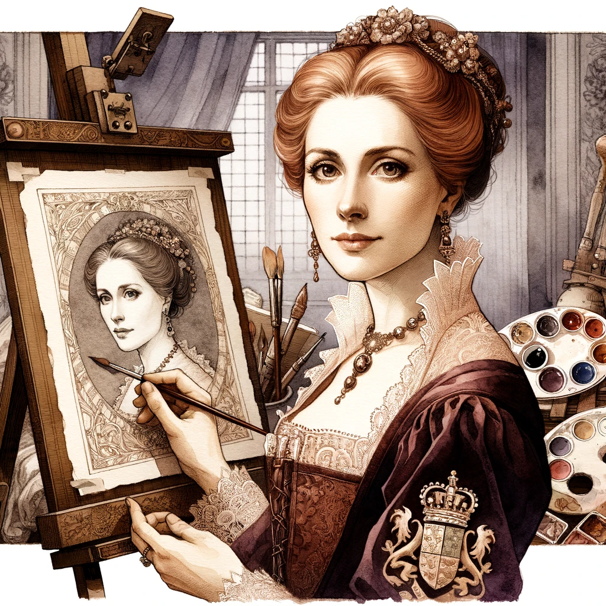
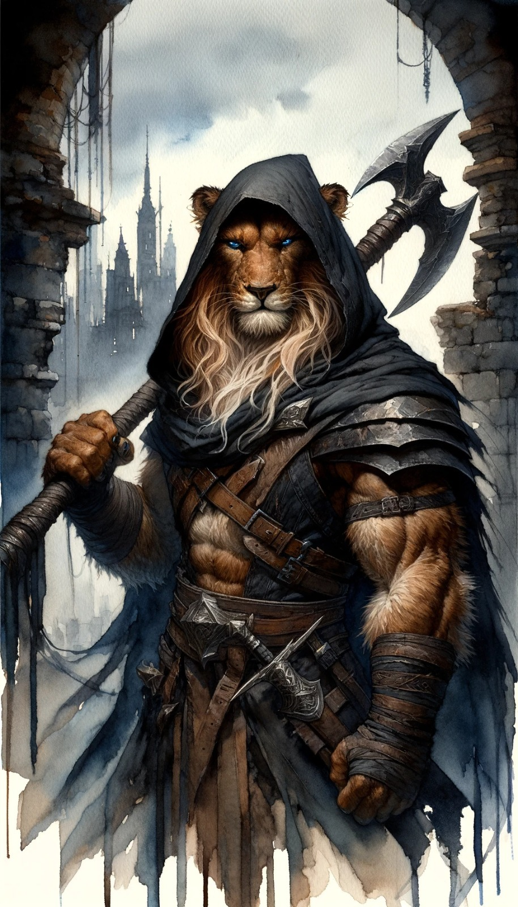
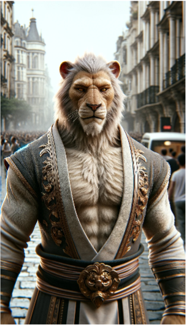
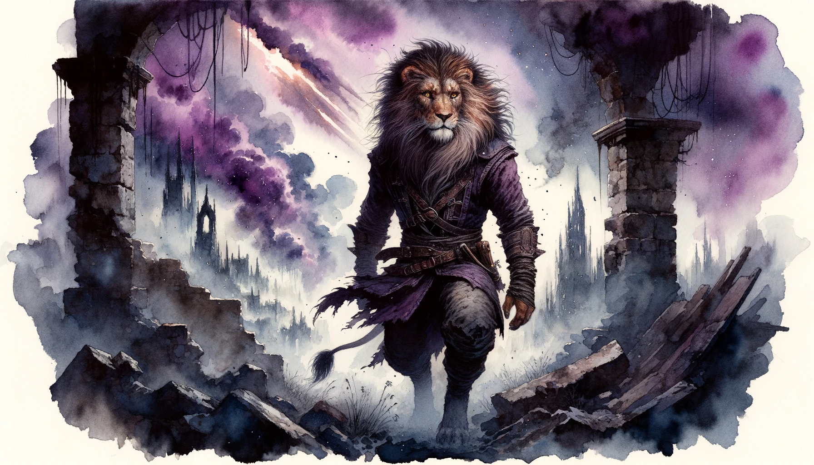
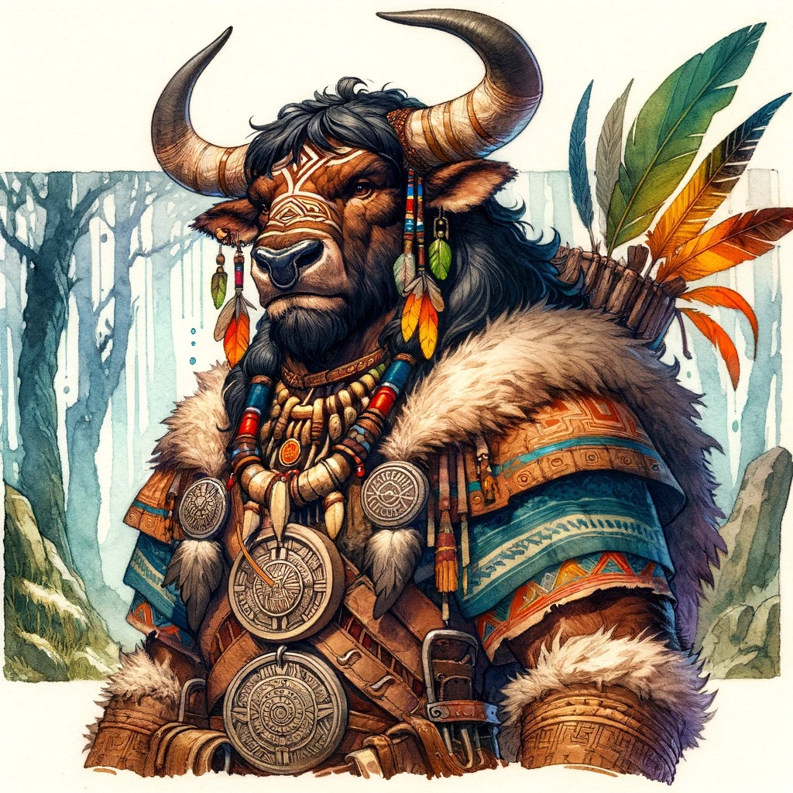
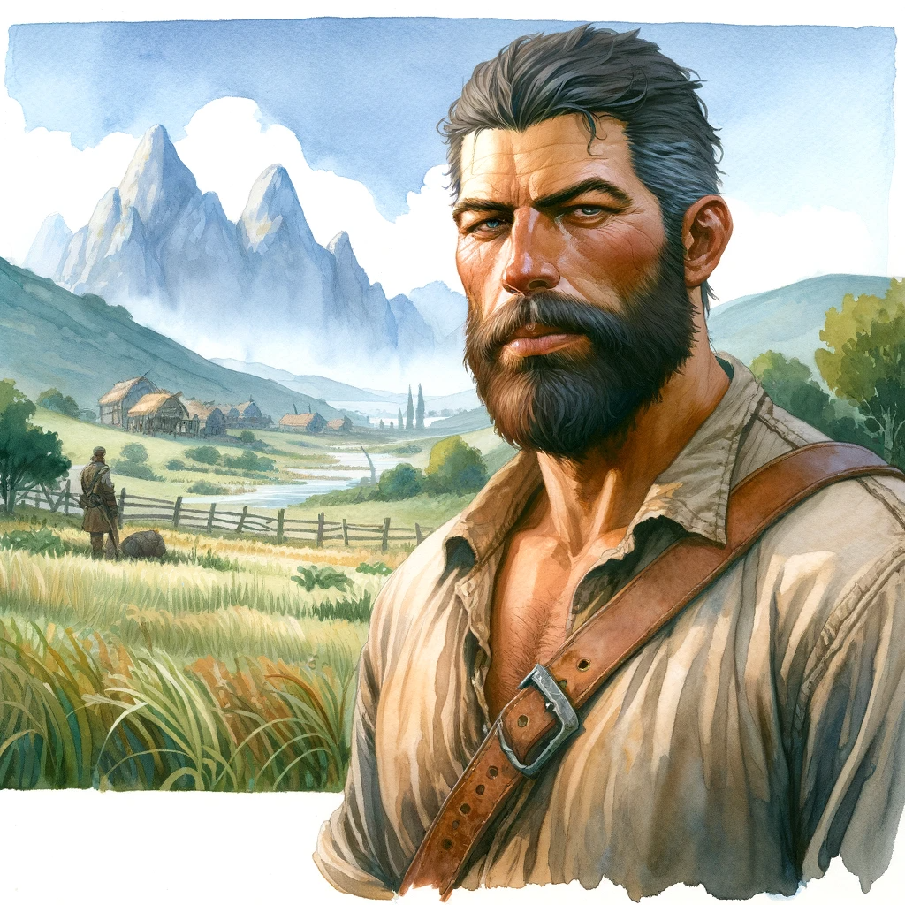
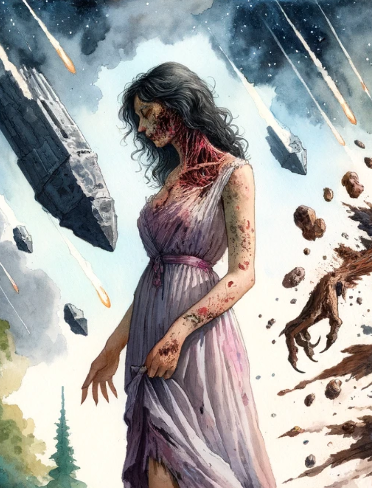

# Characters

## Lord Eldrin Blackwood :material-shield-sword:

### Physical Description

{ width="300" }

Eldrin Blackwood is a figure of noble bearing, standing at a height of 6 feet with a well-maintained physique honed by years of martial training. His skin is fair and unblemished, a testament to his meticulous grooming and the sheltered life of nobility. His long, raven-black hair is usually tied back neatly to keep it away from his face, revealing a high forehead and sharp, aristocratic features.

His eyes are a piercing blue, reflecting the depth of his resolve and the enigmatic blend of divine and arcane energies that dwell within him. They sparkle with a curious light, always scanning his surroundings with a mix of scrutiny and fascination.

When in the confines of noble society, Eldrin is seen adorned in rich fabrics tailored to perfection, displaying the Blackwood crest proudly. His attire is a blend of elegance and tradition, with long coats, fine tunics, and well-polished boots. Each garment is chosen meticulously to reflect his status and the proud lineage he represents.

In the field, Eldrin dons a suit of full plate armor, polished to a mirror shine that catches the light with a gleam that's almost ethereal. The armor is well-crafted, with the Blackwood crest engraved over the heart and delicate, arcane symbols etched discreetly along the inner linings, a silent nod to his clandestine sorcerous journey. A cloak of deep blue, the color of the Blackwood house, flows from his shoulders, billowing softly as he moves through the ruins of Drakkenheim.

His demeanor is a blend of noble aloofness and disciplined calm, bearing the weight of his family's legacy with a quiet, dignified resolve. Each movement is measured and precise, reflecting the discipline instilled in him from his clerical training. Yet, there’s a spark of rebellion in his eyes, a flicker of the arcane fire that burns within, ready to forge a new destiny amidst the ashes of the old.

### Backstory

{ width="300" }

Eldrin's childhood was steeped in the traditions of nobility and the high expectations of his father, Lord Alistair Blackwood. Lord Alistair was a close advisor to the royal family of Drakkenheim House von Kessel, and a staunch upholder of law and order. His relationship with Eldrin was a complex blend of stern mentorship and paternal concern. Eldrin was groomed to follow in his father’s footsteps, being educated in the political, military, and social intricacies of noble life. The unyielding expectations from his father to uphold the family honor and continue the Blackwood lineage often weighed heavily upon Eldrin's shoulders. Yet, the respect and admiration Eldrin held for his father compelled him to strive toward these expectations.

{ width="300" }

Raised in a household that followed the main religion of Drakkenheim, the Sacred Fire, Eldrin was deeply influenced by its teachings and principles. His mother, Lady Marianne, was his solace amidst the stern world of nobility. Lady Marianne was a kind-hearted woman with a love for arts and literature. She encouraged Eldrin to explore the world beyond the strict boundaries of nobility, nurturing his curious and imaginative side. Her gentle ways provided a balance to the stern discipline imparted by his father.

{ width="300" }

From a young age, Eldrin was enrolled in the revered Saint Selina's Monastery, located in a tranquil part of Drakkenheim away from the bustling heart of the city. This was a tradition in the Blackwood family to ensure that its heirs were imbued with a strong sense of duty, discipline, and a moral compass aligned with the principles of order and righteousness. Under the stern but wise mentorship of Flamekeeper Nathaniel Flint, Eldrin delved into the studies of theology, divine rituals, and the moral codes that govern the laws of both men and gods, and also entailed rigorous physical drills to hone his combat skills, as a cleric was expected to be a bulwark against chaos and a guardian of the societal structure.

{ width="300" }

The fall of the meteor on Drakkenheim was a cataclysmic event that shattered Eldrin's world. The Blackwood estate in the city was obliterated, claiming the lives of both Lord Alistair and Lady Marianne. This tragedy wasn’t just a personal loss for Eldrin, but also a grave threat to the legacy of the Blackwoods. With no heir to carry forward the family's lineage and uphold its noble status, the name of Blackwood faced the threat of fading into oblivion. This crisis weighed heavily on Eldrin, igniting a fervent resolve to reclaim and restore his family's honor and position in Drakkenheim.

In the immediate aftermath of the meteorite's fall and during the subsequent civil war, Eldrin delved deeper into his clerical training, the structured teachings providing a semblance of order amidst the chaos that reigned outside the walls of The Sanctum of Order. The years of disciplined training under the vigilant guidance of Flamekeeper Nathaniel Flint forged a strong, dutiful personality within Eldrin, echoing his father’s teachings of upholding the Blackwood legacy of loyalty, honor, and duty.

The Blackwoods had always aligned with Mannfred during the Civil War, valuing the preservation of the established order that Mannfred represented. When the war erupted, Eldrin found himself amidst the turmoil, his loyalties tied to the forces supporting Mannfred. He served as a military cleric, offering his healing and strategic expertise to the cause he believed would restore order to the land.

Years later, whispers of an ancient secret started surfacing. It was rumored that the Blackwoods were privy to a royal secret that could potentially alter the power dynamics within the house von Kessel. This secret was believed to be known only to Lord Alistair and a few within the royal circle. With his father's demise, the onus of uncovering and wielding this secret fell upon Eldrin. The secret was said to be a lever of power or leverage over the royalty, a clandestine truth that, if revealed, could significantly benefit the Blackwood family, reinstating their position within the royal court and possibly even beyond.

Uncle Eadric, who survived the calamity, was the only other person who had knowledge about this royal secret. In a rare conversation, he revealed to Eldrin a surprising truth. Eldrin's sister, Evangeline, who had been kept away from Drakkenheim since a young age and whom Eldrin barely remembered, was the result of a clandestine union between the head of the von Kessel family and his mother, Lady Marianne. This revelation was not only a bittersweet sting of the past but also a flicker of hope in the gloomy halls of Blackwood's legacy. There might still be proof of this royal connection within the old estates of Drakkenheim, yet the perilous journey to uncover this truth lay ahead, amidst the ruins that now veiled the city in sorrow and mystery.

Uncle Eadric urged Eldrin to venture into the heart of Drakkenheim to uncover the remnants of this royal liaison, possibly ensconced within the old estates where the whispers of bygone days might still linger. The quest for truth and the desire to restore the honor of House Blackwood beckoned Eldrin towards the haunting echoes of Drakkenheim’s past.

The catastrophe that struck Drakkenheim brought a tide of change in Eldrin's life. The tragedy of losing his parents was not only a personal loss but a loss of the structured world he had always known. Amidst the ruins of his former life, Eldrin began to feel an unexplainable stirring within his soul, a whisper of power that beckoned him towards a path less trodden by the nobles of Blackwood lineage.

{ width="300" }

Despite the awe-inspiring allure of this newfound power, Eldrin chose to keep it a secret. The world of arcane magic was often viewed with skepticism and fear amongst the nobility, and the disclosure of his sorcerous tendencies could jeopardize his family's already precarious standing. Moreover, the principles of order and tradition ingrained in him during his clerical training resonated with a voice of caution against the unpredictable realm of arcane magic.

In the years that followed, Eldrin carefully navigated the dual aspects of his life, growing ever more adept at balancing his duties as a cleric and his secret explorations into the arcane. His deepening understanding of magic, coupled with his noble position, enabled him to aid in Drakkenheim's reconstruction in subtle but significant ways. Yet, the need to maintain secrecy about his arcane abilities meant he often walked a tightrope, always wary of revealing too much to either the Amethyst Academy or the nobility. This tension was a constant reminder of the delicate balance he had to maintain to protect his family's legacy and his own identity.

Amidst his father's old effects, a cryptic reference in a tattered journal caught his attention. It spoke of a lost vault hidden deep within the ruins of Drakkenheim, rumored to contain not only significant wealth but potentially vital information about his family's past. The exact details were shrouded in mystery, and Eldrin knew that the key to unlocking this secret could well lie in understanding the chaotic history of Drakkenheim itself.

Realizing the dangers and complexities of venturing into the heart of a city marred by war and dark magic, Eldrin decided that Emberwood Village would be his starting point. This settlement, on the fringes of Drakkenheim, was an ideal place to gather information, resources, and perhaps even allies for the daunting journey ahead. In Emberwood, he could quietly probe into the past, seeking out old records or knowledgeable locals who might have heard tales of the Blackwood family and their lost vault. Moreover, Emberwood offered a vantage point to observe the current state of Drakkenheim, allowing Eldrin to plan his foray into the city with the caution and strategy befitting his noble and clerical training. Thus, with a mix of trepidation and resolve, Eldrin set his sights on Emberwood Village, a crucial step in his quest to unearth the secrets of his lineage and the potential royal connection that could redefine his family's legacy.

### Faction Sentiments

#### Amethyst Academy  

"The Amethyst Academy, custodians of arcane wisdom, hold my utmost respect. Their pursuit of knowledge, especially in these tumultuous times, is critical. I believe their role in unraveling the mysteries of Drakkenheim is indispensable and should be supported. While I hold the Amethyst Academy in high regard for their unrivaled mastery of arcane knowledge, I must tread carefully. Their discovery of my own arcane abilities could lead to the forfeiture of my titles and lands. Thus, while I respect and support their pursuit of knowledge, I do so from a cautious distance."

#### Followers of the Falling Fire

"The Followers of the Falling Fire are heretics who have twisted the sacred teachings of our faith into something unrecognizable and corrupt. They have not only besmirched the religion my family has devoutly followed but also led my former mentor astray. Their fanaticism and misinterpretation of divine signs are a dangerous blight upon true believers. Their obsession with the meteor and its powers is a path to ruin, not salvation. Their fanaticism is a threat to the order and stability of Drakkenheim and must be opposed."

#### Hooded Lanterns

"The Hooded Lanterns, many of whom are veterans of the civil war like myself, represent a steadfast commitment to the city's survival. I wholeheartedly support their cause and see them as key allies in the fight to reclaim the city from chaos. Their leader, Captain Elias Drexel, who valiantly fought for Mannfred as the King's General, continues to embody the unwavering spirit we upheld during those tumultuous times. While our paths diverged, our shared history in the war bonds us in a mutual understanding of sacrifice and the cost of peace."

#### Knights of the Silver Order

"In my eyes, the Silver Order embodies a paradox that resonates deeply with my own struggles. Their unwavering devotion to the Sacred Flame and their mission to combat otherworldly evils is commendable and aligns with the virtues I hold dear. Yet, their historical role as witch-hunters and mage-slayers casts a shadow over their noble intentions. This aspect of their legacy is particularly troubling, considering the nuanced and often misunderstood nature of arcane powers. It's a stark reminder of the fine line between upholding righteousness and descending into oppression. The Order's recent entanglement in Elyria's political affairs further complicates my view of them. While their presence in Drakkenheim might be cloaked in righteousness, I can't help but question whether their actions serve a higher purpose or merely Elyria's expansionist ambitions. This conflict between idealism and reality echoes within me, a reminder of the complex balance between duty, honor, and the often hidden facets of one's identity."

#### Queen’s Men

"The Queen's Men, led by that cunning Queen of Thieves, represent the chaos that's overtaken Drakkenheim. They've turned criminality into an empire, which is both troubling and somehow impressive. They're a problem, no doubt about it – thriving on corruption and fear. But, here's the thing: they know Drakkenheim's secrets like no other. I despise their methods, but I can't deny the value of the information they have. Sometimes you need to use the tools at hand, even if they're not the cleanest. The Queen's Men might just be a necessary evil in our quest to bring back real order to the city."

## Kaelor Quickbreath

{ width="300" }

### Physical description

Kaelor Quickbreath, the leonin of Drakkenheim, commands a presence that is at once both regal and formidable. Standing tall at over six feet, with a robust build that weighs in at 225 pounds, he is the epitome of leonin strength and resilience. His body, etched with scars, tells the tale of countless battles and narrow escapes, each mark a badge of survival in the unforgiving chaos that has consumed his home.

His fur, a sandy hue reminiscent of the sprawling savannas of his ancestors' land, carries the dust and shadows of Drakkenheim's rubble. It speaks to his wanderer's soul, a testament to the life he's led amidst the ruins and the lost dreams he carries. Cloaked in darkness, Kaelor wears a hooded shroud that seems to absorb the light around him, its edges fraying from his constant travels through the city's perilous landscapes.

Underneath the hood, intense blue eyes gleam with an unexpected arcane spark, betraying an inner magic that belies his warrior's exterior. They scan the horizon with a predator's focus, always alert to the dangers that lurk in the city's desolation. His mane, though matted and unkempt from his solitary lifestyle, is streaked with lighter shades that catch the light, adding depth and complexity to his visage.

In his grip, he carries a greataxe, its blade a testament to his martial skill, cared for with a soldier's respect for his weapon. The axe is an extension of his will, a tool for carving a path through the darkness that has enveloped his home. Its handle is wrapped in leather, worn from the countless times Kaelor's calloused hands have swung it in defense of the weak or in challenge to the threats of Drakkenheim.

Dark leather bands encircle his biceps and forearms, serving both as protection and as a silent reminder of the warrior's code he upholds. They complement the sheer physical power of his form, which is always coiled and ready for combat. Kaelor moves with a grace that belies his size, each step a measured tread on the fine line between the vigilant guardian of Drakkenheim's remnants and the solitary hunter in the wilds of a city lost to time and tragedy.

### Backstory

{ width="300" }

Kaelor Quickbreath spent his early years in the heart of Drakkenheim, the bustling capital of Wastemär. His childhood was marked by frequent visits to the vast marketplace alongside his companion Markle, where they reveled in the throngs and marveled at the array of shops. The allure of exotic spices and gastronomic delights was a joy inherited from his revered mother, Lady Sagnola Starwind. As the diligent stewardess of House von Kessel, a role bestowed upon her after her father, Sir Teor Starwind, passed away. Lady Sagnola ascended from a young kitchen cook to a culinary virtuoso, whose innovative dishes won the hearts of many an aristocrat, before step in as administratress of House von Kessel’ resources.

{ width="300" }

While serving the household, Lady Sagnola encountered the elite of Drakkenheim, including the illustrious Xathos Quickbreath, Kaelor's father, whose enterprise catered to the city's nobility. through various demanding tasks requiring formidable strength and agility. Kaelor never quite grasped the full scope of the services offered, but from what he observed, they often entailed demanding physical tasks that demanded sheer strength and nimbleness. He perceived him as a steadfast laborer, enduring grueling hours without grievance. On occasion, Kaelor lent his father aid, thus bolstering his own physical prowess and gaining exposure to the city's high society.

Kaelor was caught in a dichotomy, proud of his Leonin heritage yet facing the stark loneliness of his kind's scarcity. Leonins were an uncommon sight in Wastemär, leaving Kaelor to navigate life largely in human company. Despite his parents' esteem, the absence of other Leonins within House von Kessel's circle remained a perplexing enigma to him.

Disaster struck Drakkenheim fifteen years prior with a devastating meteor shower that wrecked the city and enshrouded it in a sinister, enchanted fog from which emerged unspeakable terrors and grotesque creatures. Amidst this chaos, Kaelor was torn from his family, but not before his mother entrusted him with the safeguarding of her professional emblem, the von Kessel house insignia, urging him to protect it at all costs. Though unsure of its significance, Kaelor vowed to preserve it until he could return it to her. Since the disaster, he's made his home atop the Clocktower, high above the menacing mist, crafting a solitary existence far removed from the outside world, purposely steering clear of the civil war over the von Kessel succession.

During his relentless quest to find his family, Kaelor encountered River, a Tiefling mage from the Amethyst Academy, who offered a deal to aid his survival. In return for delirium, River guaranteed the essentials for his sustenance without him having to abandon Drakkenheim. River, like many Tieflings, was reserved and strictly professional, always honoring her agreements. When River wasn’t nearby, Kaelor resorted to hunting Ratlings, a less formidable quarry than other creatures, which feasted on the city's everlasting deceased.

{width="300"}

A decade and a half of relentless search and survival left its indelible mark on Kaelor's psyche, a weight of loneliness so heavy that it seemed to manifest his old friend Markle for companionship—whether as a figment of his mind or not, few would dare address it. The city's dark magic touched him too, igniting uncontrolled, arcane bursts whenever he succumbed to his rage, leaving him to wonder if it was a curse or a perverse blessing from the city's shadows.

Mutations were not uncommon in the haze of Drakkenheim, with many residents undergoing monstrous transformations. But Kaelor had allies too; the Hooded Lanterns, who had saved him on occasion from falling prey to the city's many dangers. While Kaelor offered aid to those still fighting for the city, his assistance was brief; his primary focus remained unraveling his parents' fate.

The Queen's men, scouring for delirium, complicated his endeavors but were not the cause of his relocation to Emberwood Village. His Clocktower refuge was seized by a band of harpies, forcing Kaelor to flee and leave behind many possessions. He vows to one day reclaim his sanctuary, for it houses the remnants of his mother's last charge to him—a mission he is determined not to fail.

### Faction Sentiments

#### Amethyst Academy

    - "Amethyst wizards have big magic. I watch careful. Power is like fire — can warm or burn."

Kaelor recognize them as powerful beings capable of shifting the balance of societies. While reported neutral, he knows that people with power as tendency to use it. They can be very good allies, but one should interact with cautious.
  
#### Followers of the Falling Fire

    - "Falling Fire folks, they dance with danger. I keep eyes open, stay away if I can."

Delusional and crazy, they live in a dark and dangerous illusion. Avoiding them is the best path. Interacting with them should only be done, when no other path exists.

#### Hooded Lanterns

    - "Lanterns fight good. They help us, I help them. That's what pack does."

Kaelor recognizes the bravery and dedication of this faction to the city that he loves. For many times they have helped him, directly or indirectly, with his fight for survival and personal quest to discover the fate of his family. He has a certain relationship with Lieutenant Petra Lang, a teenage human, that is responsible for most of the help he received from the Hooded Lanterns.

#### Knights of the Silver Order

    - "Silver Order knights strong, like pride of lions. I fight with them. But no chains for me."

Good warriors with noble agenda, they will have the support of Kaelor, if no risk is associated to it. However, he is not convinced by all theirs believes… Just not yet.

#### Queen’s Men

    - "Queens's men are like bad meat — rotten. Drakkenheim better without them."

He hates them, they are disgusting beings that feed from the despair of lost souls and a broken city. Drakkenheim will be better without them.

#### Lord Eldrin Blackwood

As a young cub, Kaelor worked with his father occasionally. His father provided services for most of Drakkenheim’s noble families. Sir Alistair Blackwood was apologist of using Xathos’ services, for innumerous reasons, he was the main source of revenue of Kaelor’s father business. During his time working on the Blackwood’s family, he meets a couple of time with young Eldrin. Usually just a simple greeting and never really bounding, but this young boy has left a good impression on Kaelor mind.

## Tukuy Pachamama

{ width="300" }

### Physical Description

Tukuy Pachamama, a formidable Minotaur, stands at an imposing height of 6 feet 3 inches. His horns, adorned with tribal symbols, accentuate his intimidating presence. A sense of self-confidence is evident in his firm gaze, and his appearance is further enriched by details like decorated dreadlocks, multiple obsidian necklaces, and Chakanas on his bracelets, all highlighting his deep connection with natural forces and reverence for Earth's energies.

Despite his seemingly coarse movements, Tukuy displays remarkable grace in certain situations, particularly on rough terrain. His aura radiates confidence and acceptance, and his deep, calm voice facilitates approachability with other creatures. However, his soul is tinged with anguish due to his disappointment in the disrespect shown towards nature, fueling a merciless attitude towards those who harm it.

Tukuy is equipped with medicinal kits and various druidic items, among which a tribal warhammer embedded with obsidian stands out, symbolizing the duality of Earth. His well-maintained shield is a testament to his dedication to the upkeep and repair of his belongings.

### Backstory

{ width="300" }

Born in a Minotaur tribe in the mountains south of Drakkenheim, the Thunderhoof Clan, Tukuy Pachamama stood out early as a curious and brave spirit, deeply connected to the land. Recognizing his potential for elemental powers, the Druid Masters initiated him into druidic studies and rites in an underground temple. Excelling in spell mastery, Tukuy became the youngest member of the Circle of Earth. His recurring dreams of a rock falling from the sky evolved from being initially dismissed to dark visions of impending destruction, seemingly a warning of something to come. Despite his tribe's skepticism, his mentor stood by him, albeit with reservations.

When not engaged in study or aiding his tribe, Tukuy explored the woods, sometimes to play his flute. On one such day, he encountered an injured Quasit. After healing it, Tukuy discovered the creature's malevolent nature, as it harmed animals. In a fury, Tukuy killed the Quasit. Following this, a haunting voice in the wind challenged him: "This is your true nature; face and accept it. No matter your choice, you are always a servant of my will," sparking deep introspection.

Years later, the fateful day arrived when a meteor, named Rumi Hanpay, streaked across the skies. Its impact resonated through every stone and leaf, casting a dense, dark cloud over the land. Initially perplexed, Tukuy's tribe eventually recognized his unique connection to the land. Eager to explore the impact site but still incomplete in his druidic training, Tukuy was restrained. Years later, changes in the river's water, attributed to the meteor, led to Tukuy being assigned a solitary mission of study and regeneration, while others remained to protect and purify resources.

{ width="300" }

Five years post-impact, Tukuy embarked on a three-year journey following the river towards Drakkenheim. Initially, his Minotaur appearance invoked fear due to old legends, but he defied expectations by offering healing and assistance. Encountering disturbing tales of deformed creatures and a supposed curse, Tukuy's sense of urgency grew. Along his journey, encounters with needy and malicious individuals intensified his resolve to combat threats to the natural world, which he referred to as 'nanqak' in his language.

After a decade-long odyssey, Tukuy settled in Emberwood, near Drakkenheim, to deeply study the environment and the meteor's impact. Longing for his tribe's peaceful communal life, he now endures a challenging and perilous existence. His friend Kondo, a loyal bird, brings disturbing news about poisoning in his homeland, further heightening Tukuy's concern for nature's fate. On witnessing the arrival of an intriguing wanderer accompanied by the Knights of the Silver Order, Tukuy sensed potential allies. Surviving by offering construction services and healing rituals, he plans to form a group to study the meteor and counteract its harmful effects.

Tukuy Pachamama is a focused and devoted missionary, seeking divine guidance to combat the evils unleashed by the meteor. His journey is also an inner quest to comprehend his true nature and the darkness within. Blessed with divine intuition for survival, he possesses extensive knowledge in arcanism and nature.

### Faction Sentiments

#### Knights of the Silver Order

They share the vision about the evils of delirium and the will to completely destroy it. He considers that they have noble goals, although he believes they are mistaken in their faith.

    Their blades reflect the light of justice and hope, even though they deviate from the path of nature.

#### Hooded Lanterns

A definition of leadership is necessary, especially amid such a crisis. But he knows that leaders can be greedy and desecrators of nature. Tukuy is suspicious of every step they take but maintains hope that they can ally against delirium.

    Under the mantle of leadership, I distrust their shadows, but like a flame in the dense night, light may prevail.

#### Amethyst Academy

Tukuy is interested in them as scholars of magic and tries to maintain contact out of curiosity, but disapproves of their ideas to use delirium. The corruptive magic of delirium spreading would be terrible. On the other hand, could they find a way to eliminate the crystal's harms?

    Among tomes and crystals, they risk themselves at the limits of delirium. Their paths may reveal the power of healing or an abyss of doom.

#### Followers of the Falling Fire

It seemed a good idea to help them investigate delirium, but he realized they are fanatics about the power of the crystal. Thus, Tukuy disapproves and considers them a dangerous threat. It would not be good to share discoveries with them.

    They are like devouring flames invading dry woods. I will guard the discoveries as one awaits water from a contaminated source.

#### Queen's Men

Detestable. They only care about taking advantage of the lamentable situation and desperation to gain influence and power. Tukuy keeps a close eye on them.

    Despicable, with their rotten entrails of ambition, they rejoice, distilling poison like a silent breeze at dawn.

## Grekson

### Physical Description

{ width="300" }

Grekson, at first glance, appears no different than a standard vagrant. A bit short for his human stature, he seems even smaller due to his slouched back. His unimpressive physique, possibly a result of malnutrition, blends seamlessly amongst the refugees of Drakkenheim. When he pulls back the tattered hood of his cloak, greasy brown hair cascades to his stubbled chin, cut as if hastily done with a knife. His garments consist of torn cloth wrapped like bandages over his entire body, giving off a leper-like impression, if not for the reddish hue on his face.

Upon closer inspection, the image becomes more complex. The ripped and tattered fabrics, though dirty and stained, are of overall brighter tones. They look scavenged, yet not suited for skulking in shadows. With two daggers on his sash and a mundane crossbow slung on his back, he cuts the silhouette of a survivor.

Meeting his gaze reveals the first peculiarity. It's alarming, as it could suggest he's mageborn without the symbols of the Amethyst Academy. This is explained away as a mark left by the meteor crash 15 years ago, which affected many things, causing him to blink with an odd frequency. In truth, if one could focus on his still pupil, they might see something inside move.

All this is contrasted by his persona as an engaged conversationalist, with a deep timbre and a crooked smile. He is ready and attentive to the stories at the table, not the loudest voice but the one encouraging more from his company. His disarming enthusiasm for drinking, being merry, and venturing out is noticeable.

### Backstory

{ width="300" }

Grekson has lived in Drakkenheim, though he's unsure if he was born there. His father, Grek, speaks little of their past, only mentioning their life at the foot of the Glimmer Mountains in Caspia. Grekson was near the impact of the meteor 15 years ago, but his memories of that day are fragmented and disjointed, filled with scenes that defy even the realm of magic.

{ width="300" }

There was a blinding flash that seemed to strip the color from Grekson's eyes. He remembers fragmented shards and a searing pain in his chest when he was knocked to the ground, enveloped in a haunting silence.

As Grekson struggled to rise, he saw his mother, Melinda, approaching the crater, perhaps to help survivors. But it was Grek who grabbed Grekson and ran, clutching him so tightly that his ribs broke. Grekson's memory is a blur of a warping landscape, with people not dying from collapsing buildings but transforming into grotesque abominations. They traveled non-stop until they reached Caspia, but that journey marked the end of Grek's strength and will to move. Grekson considers it a blessing that he couldn't hear anything that day, believing it might be the only reason his sanity remains intact.

{ width="300" }

From then on, Grek and Grekson lived a simple life off the land, as Grek couldn't bear more. When Grekson began manifesting arcane talents, Grek refused to inform the Amethyst Academy, perhaps because Grekson was his last family member or out of fear that his abilities might be linked to the meteor. They built a quiet relationship, marked by mutual respect in their own ways. Grek, a well-built man, secretly blamed himself for Grekson's stunted growth due to the damaged ribs but encouraged his son to use his abilities discreetly.

As Grekson grew older, he began working along trade routes, promising his father not to head towards Drakkenheim—a promise he did not keep. Despite his slight build, his skill with a crossbow and an uncanny ability to escape sticky situations made him a sought-after protector. His thirst for knowledge and interest in every story transformed him from a sheltered commoner to a charismatic traveler. Yet, Grekson always kept a safe distance from Drakkenheim.

Presently, Grekson conceals his abilities, wary of the factions' interest in mageborn individuals. He wears bandages and old, frayed clothing from the day of the meteor strike, hiding an arcane focus potentially laced with Delirium dust from the impact. Suspecting it won't be long before he reveals his talents to the party as the aid will be necessary for everyone, and trusts they will respect his discretion. Admitting to himself that as he gets closer to Drakkenheim at the outskirts of Landhelm his power is amplified and there is a thirst for these secrets. Wary of if his desire is his own, or the corrupted entity toying beneath his eye.

Grekson's mind often wanders back to a harrowing incident that wasn't too far in his past. He was tasked with guarding a wagon for the Knights of the Silver Order, a responsibility he took seriously. However, during the journey, the wagon was ambushed by a group of opportunistic thieves. In a desperate bid to control the situation, Grekson resorted to using his subtle, yet potent, magical abilities. With a series of barely noticeable gestures and murmured incantations, he managed to induce a deep sleep upon the attackers, effectively neutralizing the threat without violence.

However, amidst this chaotic scene, Grekson overlooked a crucial detail. Almir, a friend and ally, had not been affected by the spell. Almir, fully conscious, watched in both confusion and horror as the thieves around them succumbed to sudden slumber. He observed Grekson moving among the unconscious bodies, acting with a calmness that starkly contrasted the bizarre scenario unfolding.

In that moment, Almir's gaze met Grekson's. There was an instant of profound realization, a fleeting second that seemed to stretch into eternity. It was then that Grekson acted decisively, launching a bolt from his crossbow straight to Almir's heart. The haunting part for Grekson was not the act of killing his friend, but the sheer terror reflected in Almir's eyes in that final moment. Almir's last words, a mix of fear and bewilderment, echoed in Grekson's memory: "What are you?"

This incident encapsulates Grekson's struggle and his resolve. He is a survivor, one who will ensure that High Flamekeeper Ophelia Reed's goods reach their destination, undisturbed by the perils that lurk in the shadows. The weight of his actions and the secrets he carries continue to shape his journey, as he navigates the treacherous paths of a world filled with danger and mystery.

### Companions

Landhelm was the closest Grekson went to Drakkenheim, but a route he took at any opportunity, slowly building connections with the Knights of the Silver Order. By consistency he became familiar with the efforts of Eldrin Blackwood and Kaelor Quickbreath, they had ambitions within Drakkenheim, these ambitions would prove to be enough. Grekson would assist the Knights of the Silver Order along these trusted companions to Emberwood, the closest point to Drakkenheim

### Faction Sentiments

#### Amethyst Academy

As a mageborn not brought to the Amethyst Academy, I approach them with extreme caution, yet their information is unparalleled. My father chose not to inform the Academy about my abilities, and I'm unsure why; but it's too late to change that now.

#### Followers of the Falling Fire

The beliefs of Lucretia Mathias seem naive, assuming such twisted powers are of divine origin. However, their eagerness to explore the crater's edge aligns with my curiosity, allowing me to align with them when convenient.

#### Hooded Lanterns

Despite the apparent loss of the capital city, the efforts of Lord Commander Elias Drexel provide valuable staging grounds for skirmishes. Born in Drakkenheim, the city's fate no longer directly concerns me, but I respect their enduring hope.

#### Knights of the Silver Order

Knight-Captain Theodore Marshal and the Knights of the Silver Order are justified in their attempts to purge the city. However, I fear that ultimately, Theodore Marshal may view me as a threat due to the aberrant nature of my mageborn roots.

#### Queen’s Men

The Queen of Thieves' pragmatism in the midst of chaos is admirable. I aim to stay out of the Queen's Men's sight, as their opportunistic nature could prove problematic.
