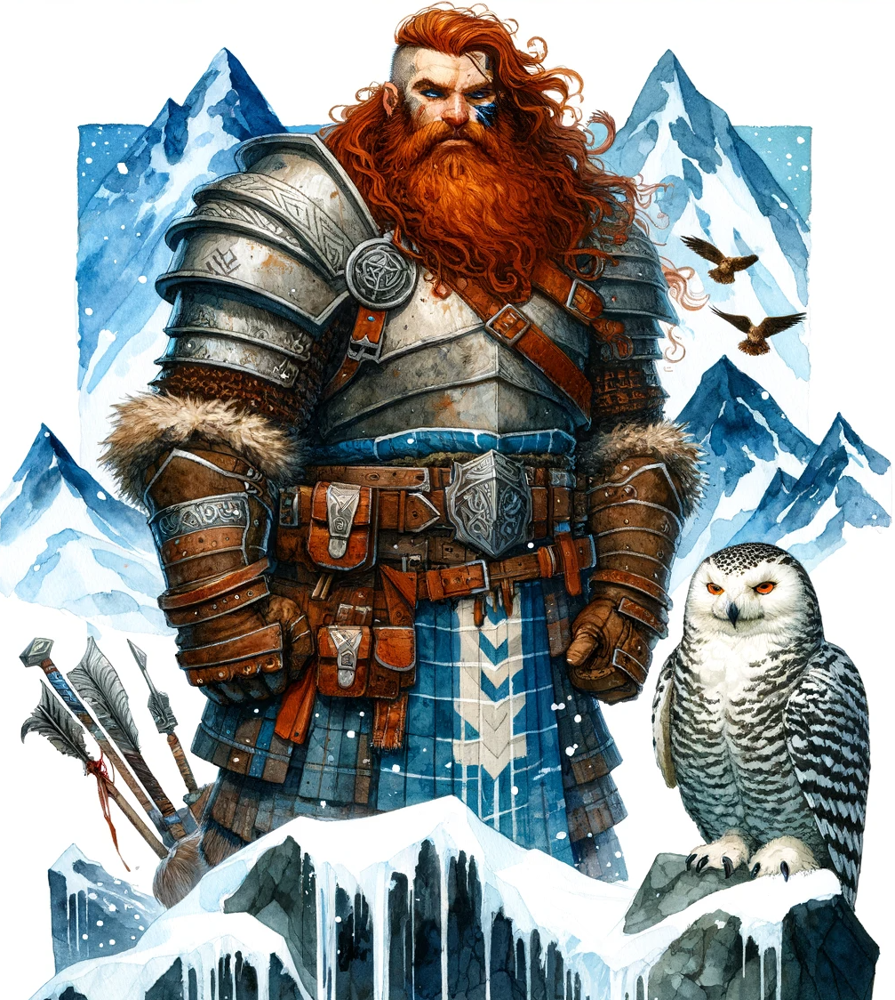

# Characters

## Dylan Galestride: Outlaw Turned Tempest Cleric

Dylan Galestride was born to a minor noble family on Alaron, the largest of the Moonshae Isles. As the second son, he was not in line to inherit the family estate and was often overlooked in favor of his elder brother. Seeking attention and excitement, Dylan fell in with the island's smugglers and pirates, using his family's influence to aid their illicit activities. His charisma and brute strength quickly earned him a reputation as a fearsome enforcer, known for his lightning-fast strikes during raids.

However, when his elder brother unexpectedly died, his family called him back to assume his responsibilities. Dylan found the noble life stifling and continued his criminal activities in secret, which eventually led to a tragic incident where a smuggling operation turned into a bloodbath. Dylan, though he escaped, was left with a severe wound and a heavy heart, as innocent lives were lost due to his actions.

Hiding from both the law and his former comrades, Dylan sought refuge in the wilderness of the isles. Lost, both physically and spiritually, he stumbled upon a secluded shrine battered by a relentless storm. It was here, within the eye of the tempest, that Dylan found solace and encountered the presence of Talos, the storm deity. Talos offered him a path to atonement: to become a tempest cleric and wield the storm's might to protect those he once would have preyed upon, albeit in a manner that reflected the chaotic and destructive nature of the Stormlord.

Accepting this tumultuous mantle, Dylan's outlaw's cunning and ferocity gave way to the disciplined focus of a cleric of Talos. He adopted the name Galestride, a testament to his new path, and vowed to use his powers to not only uphold the balance of nature but also to embrace the unbridled force of the storms. His newfound allegiance to Talos was a constant dance between control and chaos, redemption and destruction.

His transformation made him a target for his former allies, who felt betrayed, and the law, which still sought him for his past crimes. Dylan knew he needed to leave the Moonshae Isles. He heard tales of Frostwood, a frontier settlement to the north of Silverymoon, a haven for those seeking second chances or escaping troubled pasts.

The journey to Frostwood was long and filled with inner turmoil, as Dylan grappled with the duality of his nature and the expectations of Talos. Yet, the farther north he traveled, the more he proved his dedication to his new, albeit complex, calling. Upon reaching Frostwood, he found a community in need of protection and guidance, a place where his unique blend of tempestuous power and desire for redemption could be put to good use.

However, Dylan's arrival in Frostwood did not go unnoticed. His fiery red hair, so starkly contrasting with the typical appearance of Frostwood's inhabitants, immediately marked him as an outsider. In a land where the predominant hues were the whites and blues of snow and ice, Dylan's vibrant red locks drew curious stares and whispered rumors. This unusual trait, alien in Frostwood, was a constant reminder of his past and the distance he had traveled, both physically and spiritually. It served as both a challenge and a motivation for Dylan to prove his worth and dedication to his newfound purpose, in a land where he stood out in more ways than one.
