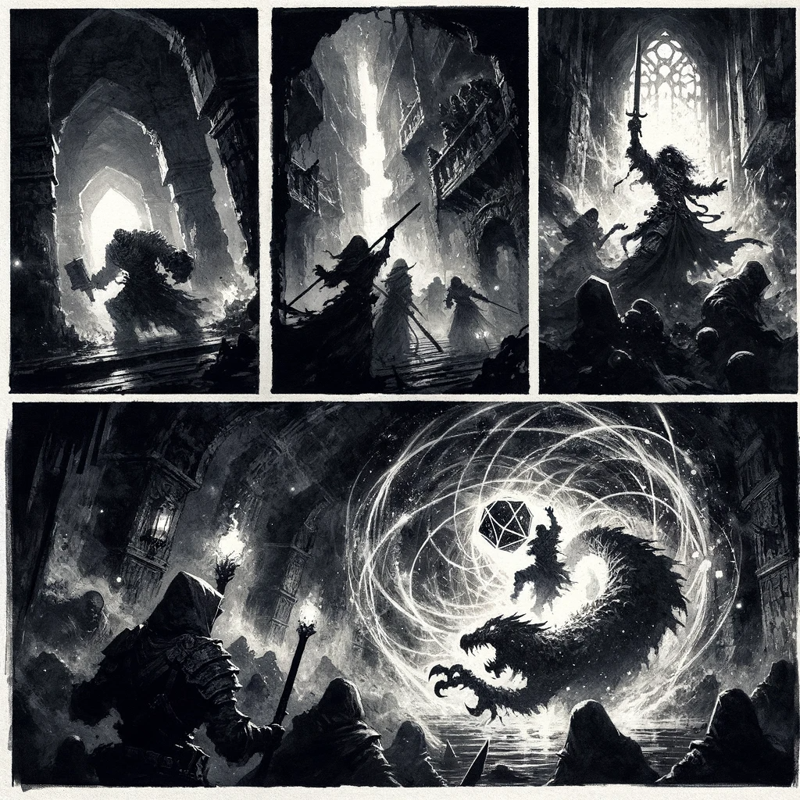
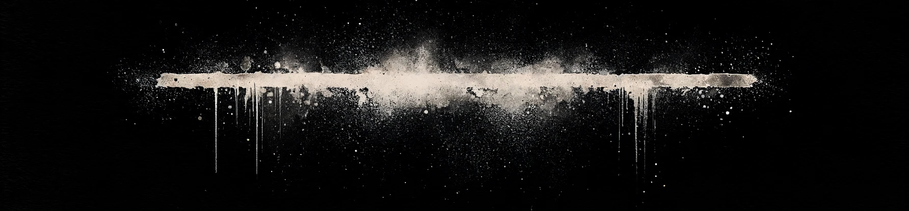
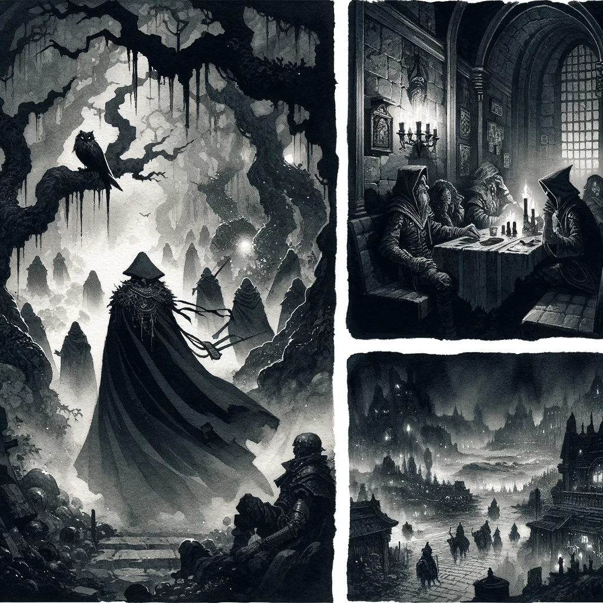
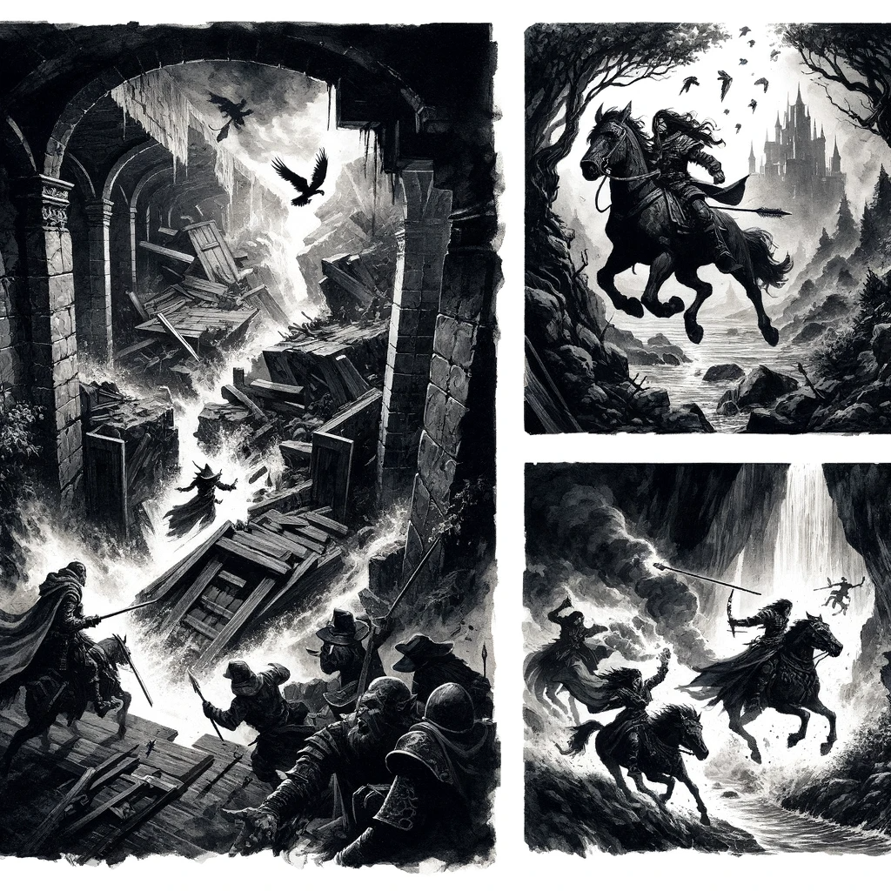
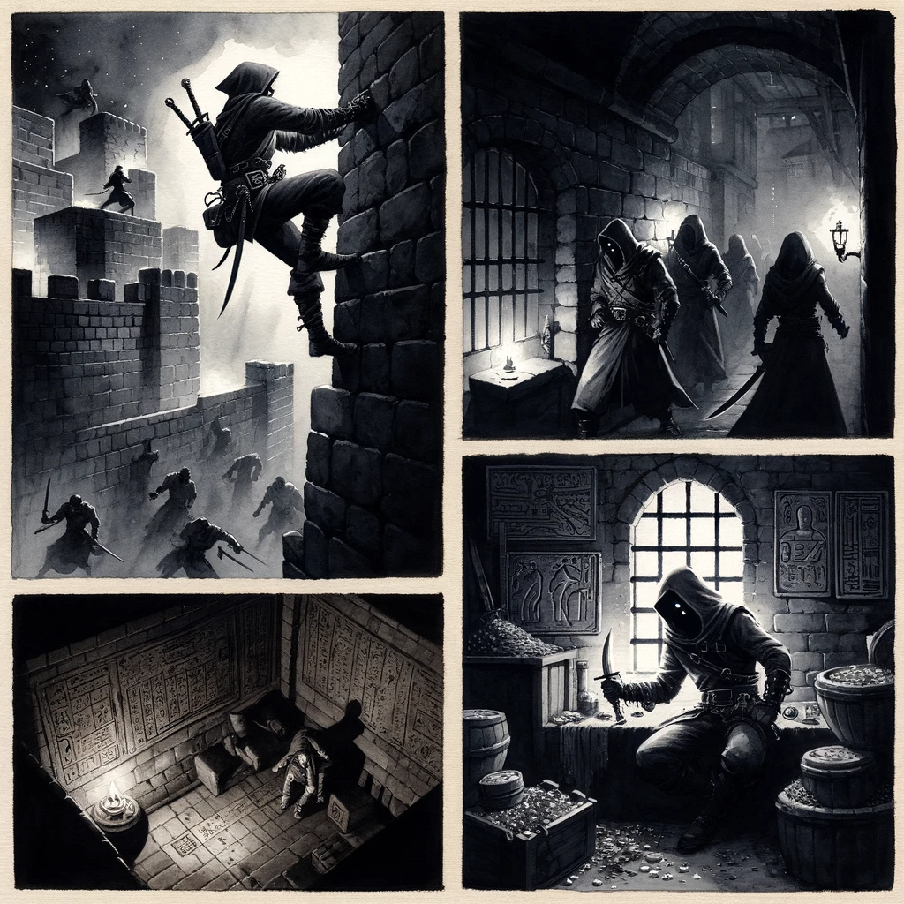
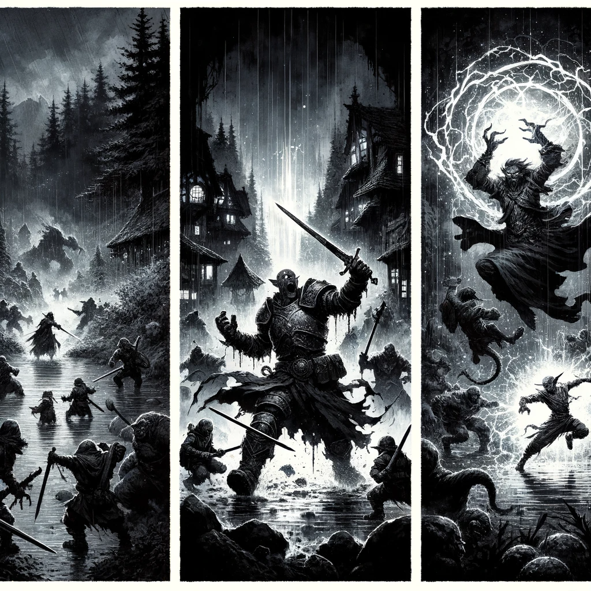
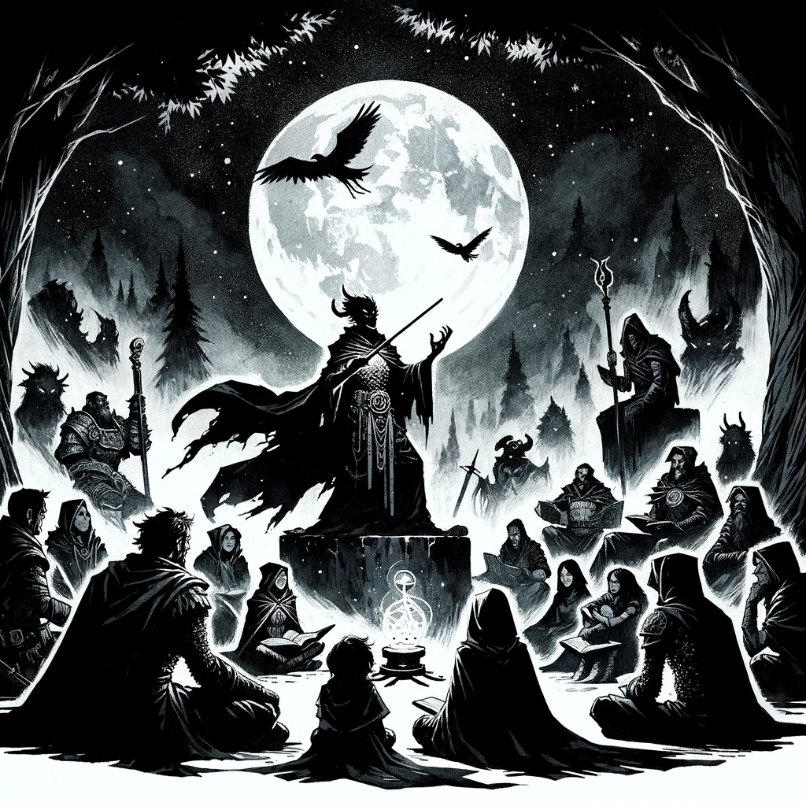
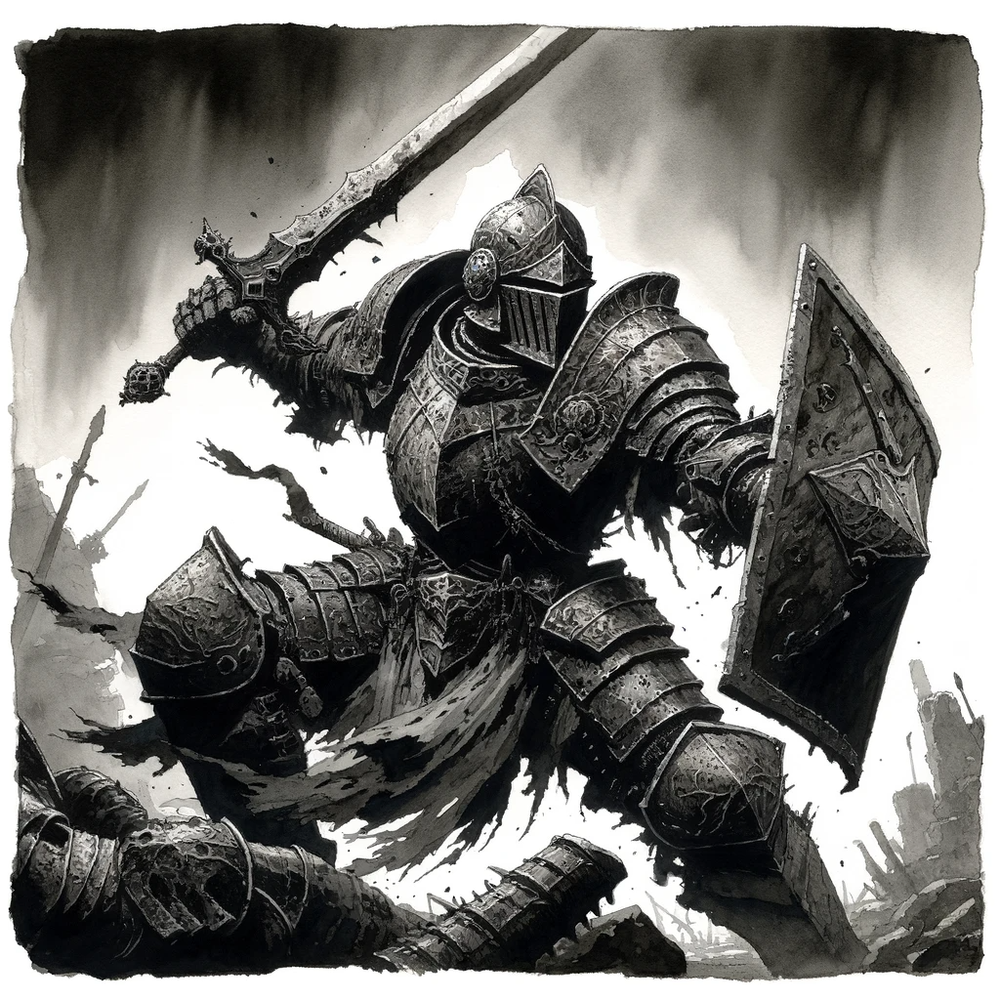
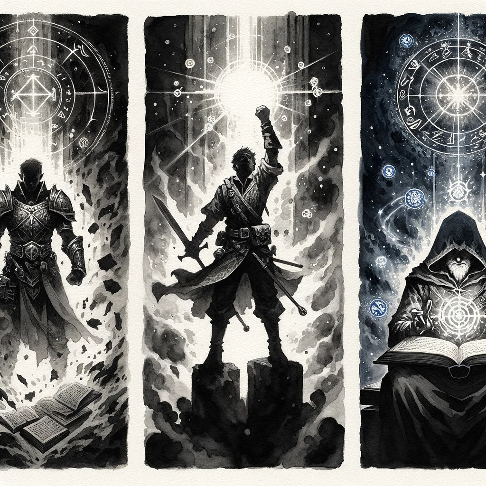
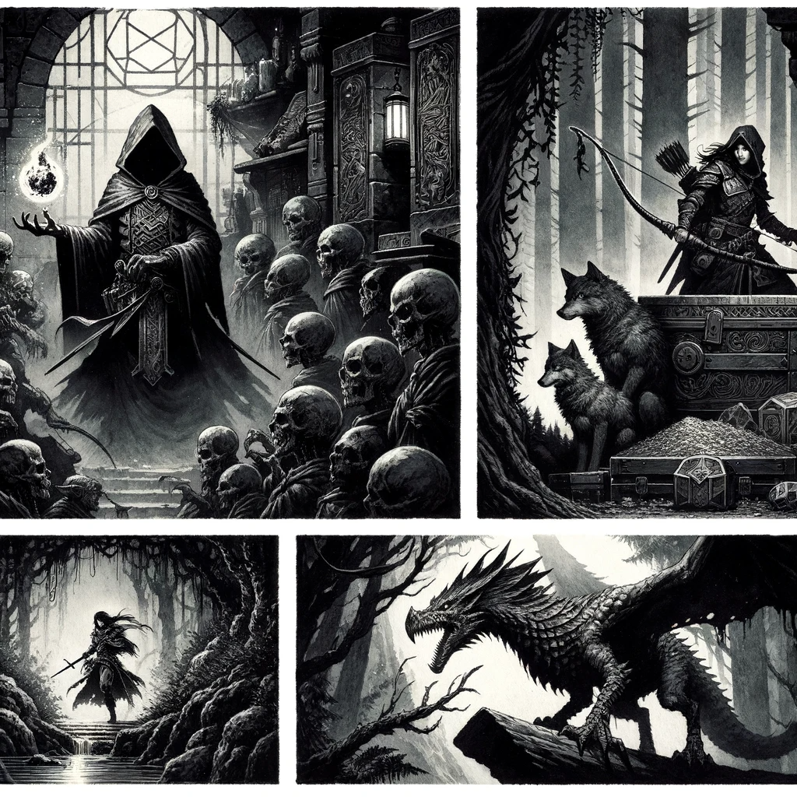

# Grim

## Definitions

- Game Master (GM): the narrator and referee.
- Player Characters (PC): Fictional characters devised by  players.
- Non-Player Character (NPC): Fictional individuals brought to life by the GM
- Party: a group of PCs collaborating for a common goal
- Monster: a hostile NPC who wants to kill and/or eat the PCs.
- Adventure/Scenario: a series of encounters with an objective
- Campaign: a series of connected adventures featuring the same characters
- Test/Attempt/Check: rolling a target number or better on a twenty-sided die (d20).

{ width="600" }

## Introduction

Grim is the lean, mean cousin of the most renowned tabletop role-playing game out there. It's less of a game and more of a 'mod kit', a set of tweaks for a quicker, rawer experience.

Deploy these rules solo, or blend them into any 5E or old-school renaissance game. Mix and match to your heart's content. Think of Grim as the kick of hot sauce to your RPG feast.

---

### Why go Grim?

We enjoy RPGs teetering on the edge, where every shadow on the corner of your eye could be your last. We prefer our PCs as rough-around-the-edges underdogs, scrapping by in a world that's out to get them. And we're fans of gameplay that's more impromptu cinema than pushing pieces, where players say things like, “I silently sneak up behind him and stab him in his kidney” instead of, “I roll 18 stealth, move to the tile next to his and attack”

---

### Embracing the Grim

{ align=right width="400" }

In the realm of Tabletop RPGs, a trend has emerged: complexity that bogs down the essence of adventure. Battles that should be swift and thrilling stretch into hour-long marathons. Character sheets have become as daunting as advanced calculus. Characters start off as mighty heroes and only get mightier, rarely tasting defeat or death. Magic, once a rare and wondrous art, has turned routine, losing its mystique.

    **Screw that.**

Grim is here to shake things up. Here, combat is quick, instinctual, and full of flair. Forget about intricate character sheets – we’re keeping it straightforward. Characters gain power, but they’re not invincible. They’re heroes, yes, but still mortals vulnerable to a well-placed strike. Magic here is volatile and unpredictable. Death is a constant companion in our adventures, making every moment in the dungeon pulse with peril.

We stand for a few fundamental beliefs:

    Rules Limit, Not Liberate

{ align=right width="400" }

The common notion is that rules define a character's capabilities. More rules, more options, right? Wrong. We argue that rules actually constrict creativity.

Specific skills and feats condition players to think inside the box, trapped by the confines of their character sheets. This leads to repetitive gameplay and a reluctance to try actions not explicitly listed. Grim breaks these chains.

Here, your limits are bound only by your creativity. Outmaneuver a giant by sliding between its legs? Why not. Use your shield as a surfboard in a staircase showdown? Absolutely. Make a weapon out of a dinner plate? Go for it. Every character can wield an improvised weapon – no special skill needed.

What you do hinges on the scenario and your imagination, not a list on paper.

    Simplicity Speeds Up the Game

{ align=right width="400" }

Actions, ready actions, bonus actions, reactions, grids, individual initiative—all of these create a game that is slower and longer. Especially during combat, when it should be getting faster!

Overcomplicating character sheets with endless subskills only slows the game further as players sift through minutiae. In Grim, character sheets are streamlined. Key information like Ability Score bonuses and a universal ‘Expertise’ bonus for relevant skills keep things moving fast. The GM handles the nitty-gritty, guiding players on what to roll and when.

    The GM Reigns Supreme

{ align=right width="400" }

There’s a misconception that the Game Master's role is to be a rulebook with legs. We couldn’t disagree more. In Grim, the GM isn’t just a rule interpreter – they are the rule.

They’re what sets TTRPGs apart from video games and board games. They're the human element that allows for spontaneous and creative gameplay. Remember, board games need rigid rules because there's no GM. But in TTRPGs, we have the best AI there is – the human brain. That's why our rules are intentionally malleable, empowering the GM to keep the adventure flowing. The cardinal rule here is simple:

    The Game Master's word trumps all.

No RPG can perfectly simulate real combat, skill mastery, or physics. That's why we trust our GMs to make smart calls and bridge gaps. This book? It’s a guide, not gospel.

#### The GM is the Final Judge

When rules and GM decisions collide, the GM’s call is final. They are the heart and soul of the gameplay, the architects of adventure, and the ultimate authority.

Grim is about returning to the roots of roleplaying – fast, fierce, and fun. It's about rekindling the spirit of adventure where anything is possible and the only limit is your imagination.

{ width="600" }

## Core Mechanic: Check

In Grim, the process for resolving actions is both streamlined and intuitive:

- **Setting the Scene**: The GM describes the current scenario. The player then states their character's intended action.

- **Determining Difficulty**: If the GM determines the action has a significant risk of failure, they set a Difficulty Rating (DR). This DR reflects the task's complexity, with more challenging tasks having a higher DR.

- **Rolling for Outcome**: The player rolls a d20, adding any relevant Ability Score Modifiers from their character sheet. A roll equal to or greater than the DR indicates success, while a roll below the DR results in failure.

  - **Formula for Test**: d20 roll + Ability Score Modifier + Expertise Bonus (when applicable)

In Grim, the results of dice rolls have significant implications:

- **Critical Success**: Rolling a natural 20 is not just a success, but a major triumph that brings extra benefits. In combat, this results in an additional d12 damage roll.

- **Critical Failure**: Conversely, rolling a natural 1 leads to severe consequences, such as weapon damage or loss during combat, or the failure of a spell with unintended effects.

---

### Assigning a Difficulty Rating

| Task Complexity | Difficulty Rating |
| --- | --- |
| Easy | 5 |
| Medium | 10 |
| Difficult | 15 |
| Improbable | 20 |

This scale is universal, applicable to all challenges: from physical feats like breaking doors or scaling walls to more nuanced tasks such as social interactions or combat. The GM evaluates the situation and sets the Difficulty Rating (DR). Players then roll a d20, add relevant Ability Score Modifiers, and aim to meet or exceed the DR. It's straightforward.

!!! tip "Easy Tasks"

    Easy tasks are commonplace, almost second nature. For instance:

    - A skilled rogue easily picking a standard lock.
    - Striking an unsuspecting adversary.
    - Casting a well-practiced spell in a tranquil setting.
    - A seasoned hunter following tracks on a clear day.

!!! success "Medium Tasks"

    Medium tasks require focus and skill. Examples include:

    - A rogue scaling a typical wall.
    - Engaging an alert and prepared enemy.
    - Casting an attack spell against a dodging target.
    - Tracking wildlife on a slightly rainy day.

!!! warning "Difficult Tasks"

    Difficult tasks push characters to their limits, often involving stress or unfamiliarity. Examples:

    - A rogue picking a lock amidst enemy fire.
    - Battling a formidable leader or a fearsome creature.
    - Spellcasting against a hostile, dual-headed troll.
    - An amateur trying their hand at lockpicking.

!!! danger "Improbable Tasks"

    Improbable tasks are those of exceptional challenge, often bordering on the heroic or foolhardy. For example:

    - Trying to rope a dragon mid-flight.
    - Climbing a slick, equipment-free cliff.
    - Breaking free from iron chains.
    - Diving off a cliff into a turbulent river to escape a goblin horde.

---

### Advantage & Disadvantage

In certain scenarios, the GM can determine that a PC either has an advantage or a disadvantage during a Test. This could be due to various factors, like attempting a stealth attack from behind or engaging in combat under challenging conditions like deep mud.

Advantage: Think of it as your lucky day. The GM decides the stars are aligned for your character - maybe you're pulling off a ninja move from the shadows or dropping down on some poor sap from above. You get to roll two d20s and keep the better one. It's like getting a second shot at success because the first one was just a warm-up.

Disadvantage: This is when the universe decides to have a laugh at your expense. Maybe you're trying to swing a sword in a swamp, or you're blindfolded on a tightrope. Roll two d20s, but guess what? You're stuck with the worse one. It's the game's way of saying, “Good luck with that.”

The use of Advantage and Disadvantage streamlines complex calculations and keeps the game moving at a brisk pace. It adds an exciting element as well, because let's face it - rolling more dice is always a blast!

---

### Expertise

Every character possesses a wide range of skills called Expertise. If a character attempts an action that falls within the range of their Expertise, the player adds a bonus to their attempt.

| Character Level | Expertise Bonus |
|---  | ---|
| 1-3 | +1 |
| 4-6 | +2 |
| 7-9 | +3 |
| 10+ | +4 |

If a character attempts a common action (hiding, climbing, riding a horse, etc.) outside their field of Expertise, they apply their Ability Score Modifier to their d20 test.

If a character attempts an uncommon action (safecracking, open-heart surgery, disarming an explosive device) outside their field of Expertise, the GM may assign a harder DR, disadvantage, or both.

{ width="600" }

## Character Creation

Some characters rise to great heights of power. Most will meet an ignominious end, devoured by monsters or left to rot on a cold dungeon floor. If adventuring were easy, every peasant would drop their hoe and run off to explore the nearest cave! Because Grim is so deadly, we recommend you make two characters to start. Think of one as the main character and the other as the replacement character when the first one bites the dust.

- You exist as a human or something close enough. In this bleak world, your race offers neither boon nor bane - survival hinges on more than mere lineage.
- No one can see in the dark.
- The gods of Grim are indifferent.
- Spellcasters have been hunted to near extinction.

To create a Player Character (PC), follow these steps:

1. Determine ability scores.
2. Choose a Class and roll a random Background; note your powers, special abilities, Expertise, and starting equipment.
3. Determine Hit Points (HP).
4. Determine your Defense (DEF).
5. Name the Character.

---

### Ability Scores

Characters are defined by six ability scores: Strength, Intelligence, Wisdom, Dexterity, Constitution, and Charisma.

- Strength (**STR**): Applies to melee weapon attacks and damage. Used for physical feats like lifting gates, bending bars, smashing doors, grappling, and provides a bonus to melee attacks.
- Dexterity (**DEX**): Influences Defense (DEF), missile attacks, damage, and skills like stealth, climbing, lockpicking, and acrobatics. It determines a character's DEFENSE, ability to dodge, and accuracy with ranged weapons, along with proficiency in tasks requiring agility and hand-eye coordination.
- Constitution (**CON**): Key for saving throws against poison. Helps in resisting extreme conditions such as heat, cold, starvation, poison, and torture, and aids in endurance for long-distance running. CON also determines the carrying capacity (CON + 10) and health regeneration (HP regained per day of rest equals CON). It does not add to HP.
- Intelligence (**INT**): Boosts spellcasting rolls, knowledge of history, and indicates literacy. A bonus in Intelligence enhances wizard spellcasting and knowledge about obscure facts and languages.
- Wisdom (**WIS**): Enhances mind-based Saving Throws, and skills in searching, perception, and tracking. It contributes to intuition, insight, cunning, and bonuses in searching and casting prayers.
- Charisma (**CHA**): Improves all reaction checks and skills in charm, deception, intimidation, performance, and persuasion. It governs the ability to influence, charm, and excel in social interactions.

Your Ability Bonus **IS** your proficiency bonus, skill level, and natural ability.

A +1 STR means you are proficient with ALL hand weapons.

A +1 DEX means you are proficient with all ranged weapons, acrobatics, climbing, stealth, etc.

#### Determining Ability Scores

There are three methods for determining Ability Scores

**5E Standard Array**
5E Standard Array

- **Initial Setup:** Begin with all attributes at -1.
- **Build Points:** Receive 12 “build points.”
- **Distribution**: Allocate these points as bonuses among your six Ability Scores.
- **Limits:** Ensure no Ability Score exceeds a +5 bonus, and minimum -3
Example: STR +3, DEX +1, CON +2, INT -2, WIS -1, CHA +2.

**OSR Standard Array**
OSR Standard Array

- **Initial Setup:** Begin with all attributes at -1.
- **Build Points:** Receive 6 “build points.”
- **Distribution**: Allocate these points as bonuses among your six Ability Scores.
- **Limits:** Ensure no Ability Score exceeds a +5 bonus, and minimum -3
Example: STR +3, DEX +1, CON +2, INT -2, WIS -1, CHA +2.

**Roll The Bones!**
5E: for each Ability, roll 4d6, determine the bonus, arrange as desired. No re-rolls!
OSR: for each Ability, roll 3d6, determine the bonus, arrange as desired. No re-rolls!

| Stat   | Bonus/Penalty |
| ------ | ------------- |
| 18+     | +4            |
| 16-17  | +3            |
| 14-15  | +2            |
| 12-13  | +1            |
| 10-11  | 0             |
| 8-9    | -1            |
| 6-7    | -2            |
| 4-5    | -3            |
| 3      | -4            |

!!! DANGER

    If a character ends up with no bonuses (all Ability Scores are 10 or below), it indicates a grim fate: the character succumbs to plague and is buried in a mass grave. The player must roll a new character.

---

### Class

work in progress - see [Classes](classes.md)

---

### Hit Points (HP)

Hit Points are a combination of overall health, skill, and luck. This is what separates the bad assess from the masses.

    CON score is the Max HP

Zero HP means a character is unconscious. Negative HP means you are dead. No death saves. No resurrections. Dead. Deal with it.

---

### Determine your Defense (DEF)

{ width="400" }

Defense (DEF) is what enemies need to roll to hit your character. Characters begin with a DEF of 10+ their DEX bonus/penalty + armor bonuses.

    DEFense= 10 + DEX + Armor.

| Armor Type | Description                       | DEF Bonus | Cost   |
|------------|-----------------------------------|-----------|--------|
| Shield     | Wood, battered.                   | +2        | 15gp   |
| Light      | Leather coat, jacket, or doublet  | +1        | 10gp   |
| Medium     | Gambeson, chain vest, scale shirt | +2        | 75gp   |
| Heavy      | Full plate armor, Horn Plate      | +3        | 1000gp |

---

### Determine Personality (Optional)

Toss 2d20 to determine a random vice and virtue for your character. If you roll the same number, toss one die again. If you don’t like the result, roll again—or choose. The point is to distinguish your character’s personality from all the other characters with the same Class.

| Number | Virtue        | Number | Vice                |
| ------ | ------------- | ------ | ------------------- |
| 1      | brave         | 1      | cowardly            |
| 2      | cautious      | 2      | compulsive gambler  |
| 3      | courteous     | 3      | rude                |
| 4      | generous      | 4      | greedy              |
| 5      | honorable     | 5      | self-serving/cheater|
| 6      | studious      | 6      | inattentive         |
| 7      | pious         | 7      | irreverent          |
| 8      | merciful      | 8      | ruthless            |
| 9      | stoic         | 9      | Ill-tempered        |
| 10     | industrious   | 10     | lazy                |
| 11     | optimistic    | 11     | pessimistic         |
| 12     | idealistic    | 12     | cynical             |
| 13     | reserved      | 13     | boisterous          |
| 14     | Non-drinker   | 14     | drunkard            |
| 15     | Modest/humble | 15     | Vain/braggart       |
| 16     | disciplined   | 16     | rebellious          |
| 17     | chaste        | 17     | promiscuous         |
| 18     | forgiving     | 18     | vengeful            |
| 19     | rational      | 19     | superstitious       |
| 20     | contemplative | 20     | unreflective        |

---

### Roll a Random Background (Optional)

You can choose from these tables or make your own background, it's your choice
Toss some dice. If the results don’t make sense, roll again.

| D20 | RANDOM MISERY | D20 | BACKGROUND |
| --- | ---- | --- | --- |
| 1 | Abandoned at birth. | 1 | Bounty Hunter |
| 2 | Banished from home. | 2 | Courtesan |
| 3 | Betrayed by a loved one. | 3 | Duelist |
| 4 | Cursed by vengeful witch. | 4 | Executioner |
| 5 | Disinherited or disowned. | 5 | Farmer |
| 6 | Escaped bondage or prison. | 6 | Grave Robber |
| 7 | Fled a scandal. | 7 | Leech Collector |
| 8 | Framed for a crime. | 8 | Mercenary |
| 9 | Killed someone important. | 9 | Minor Noble |
| 10 | Left for dead. | 10 | Outlaw |
| 11 | Locusts ate your crops. | 11 | Performer |
| 12 | Owe someone money. | 12 | Pit Fighter |
| 13 | Pursued by the law. | 13 | Pirate/Sailor |
| 14 | Raised in the streets | 14  | Priest/nun/monk |
| 15 | Reduced to poverty. | 15  | Rat Catcher |
| 16 | Rejected by society. | 16  | Servant |
| 17 | Ruined by vice. | 17  | Student/Scholar |
| 18 | Suffering from amnesia. | 18  | Swineherd |
| 19 | Survived a massacre. | 19  | Soldier |
| 20 | Town ravaged by plague. | 20  | Urchin |

Roll 2d10 for your birthplace

|    | |
| --- | --- |
| 1. Blighted | 1. Village |
| 2. Cursed | 2. Backwater town |
| 3. Decaying | 3. Hamlet |
| 4. Famine-Stricken | 4. Castle |
| 5. Haunted | 5. Slum |
| 6. Locust-ravaged | 6. Swamp |
| 7. Plague-infected | 7. Forest |
| 8. Putrid | 8. Outpost |
| 9. Squalid | 9. Ruin |
| 10. War-ravaged | 10. City |

| D10 | Parent fate |
| --- | --- |
| 1  | Both dead from plague |
| 2  | Burned at the stake. |
| 3  | Wrongly executed. |
| 4  | Killed in a raid. |
| 5  | Mother died in childbirth or disease. |
| 6  | Father died of pox. |
| 7  | Abandoned you at birth. |
| 8  | Sold you for coin. |
| 9  | Refuse to acknowledge you. |
| 10 | Alive and well |

| D10 | Tragic Love |
| --- | --- |
| 1.  | Died of plague. |
| 2.  | Was murdered |
| 3.  | Kidnapped or imprisoned. |
| 4.  | Betrayed you for another. |
| 5.  | Is betrothed or married to another. |
| 6.  | Is hated by your family. |
| 7.  | Is an occupational rival. |
| 8.  | Is of a different social class. |
| 9.  | Does not return your affections. |
| 10. |  You haven’t me them yet. |

SIBLINGS

You have d6-2 siblings

Roll D6

- 1-3 = Younger
- 4-6 = Older

Roll D6

- 1-3 = Male
- 4-6 = Female

| D10 | Sibling Fate |
| --- | --- |
| 1.  | Dead from plague. |
| 2.  | Murdered. |
| 3.  | Hate your guts. |
| 4.  | Want you dead. |
| 5.  | Jealous of you. |
| 6.  | Estranged. |
| 7.  | Starving from famine. |
| 8.  | Crushed by debts. |
| 9.  | Look up to you. |
| 10. |  Protective of you. |

{ width="600" }

## Experience and levelling

In Grim, characters level up when the GM says they do.

Experience points (XP) are awarded entirely at the GM’s discretion. How the GM awards XP will incentivize certain behaviors:

- If you want to emphasize story, award XP for completing scenario objectives. Example: each rescued prisoner is worth 1xp.
- If you want to emphasize character growth, award XP for character milestones. Example: when the fighter finds and kills the man who killed her father, she levels up.
- If you want to emphasize conflict, award XP for killing monsters. Example: each monster is worth 1-2xp.
- If you want to emphasize exploration and risk-taking, award XP for accumulating wealth. Example: 100gp = 1xp.
- If you want to encourage role-playing, award 1xp for a player staying in character or acting in a manner that entertains the other players.

Level up at 10xp.

When you gain a Level:

- Gain an additional Grim Die each level.
- Roll 1d4, that's how many points you have to add to your current ability scores, each score can only increase by one per level.

!!! tip

    Maximum HP is your CON Ability Score (not bonus).

That’s it. We’re tempted to provide more guidance, like hard numbers to reach the next level, but every campaign is different and groups enjoy levelling up at different rates. We will provide, however, these firm principles:

- It should take a minimum of 3-4 sessions to rise one level.
- PCs can never rise more than one level in a single session.

{ width="600" }

## Encumbrance Item Slots, Inventory, etc

---

### Item Slots

Each player character (PC) in Grim has a number of item slots equal to their Constitution (CON) score plus 10. These item slots represent the character's capacity to carry various items, weapons, armor, and supplies during their adventures.

For example, if a character has a Constitution score of 14, they would have a total of 24 item slots (14 CON + 10).

---

### Managing Coins

In Grim, coins have weight and take up space in a character's inventory. Specifically, 100 coins occupy one item slot. This rule encourages players to think about the practicality of carrying large amounts of currency, as it can quickly fill up their available item slots.

Once all slots are filled, characters move at half speed.

{ width="600" }

## Corruption

Corruption is an essential part of the Grim universe. Actions have consequences and the PCs may be heroes—but flawed heroes who are haunted by their pasts and who must constantly struggle against becoming the very monsters they fight against. Some characters may be forced to retire before they lose their souls.

Characters begin with zero Corruption. When a character gains ten Corruption, they become a monster controlled by the GM and are removed from play. Corruption may manifest physically in the form of a physical mutation (a third eye, scaley skin, or a second head growing out of the PC’s shoulder, etc.) or it can be mental, with the character having a seemingly normal appearance, but completely depraved and murderous thoughts.

- Gain +1 when you roll Nat 1 when spellcasting.
- Acts of corruption include anything the GM determines to be morally wrong or against your characters motives.
- At 10 Corruption you have lost all humanity and become a monster controlled by the GM.

There is no way to remove Corruption. PCs can only gain it. Deeds haunt a character forever. If the GM chooses, a PC may gain a mutation once they gain +6 Corruption and an additional mutation every point thereafter.

MUTATIONS (D20)

| Roll| Mutation |
| -  | - |
| 1  | Pustules. |
| 2  | Candles dim when you enter a room. |
| 3  | Hair turns white or falls out. |
| 4  | Craving for raw meat. |
| 5  | Gaunt. |
| 6  | Strong, distinct scent. |
| 7  | Eyes glow faintly in the dark. |
| 8  | Black, pupilless eyes. |
| 9  | Translucent skin. Hates sunlight. |
| 10 | Ages d20 years. |
| 11 | Scaley skin. Craves live mice. |
| 12 | Craves brains. |
| 13 | Extra eye in random location. |
| 14 | Extra limb—withered and useless. |
| 15 | Extra fetal head growing on shoulder. |
| 16 | Extra mouths on back. |
| 17 | Tentacle. |
| 18 | Demonic horns. |
| 19 | Skull face. |
| 20 | Vampiric thirst. |

{ width="600" }

## Healing

Use a Grim Die to stitch up wounds after combat. If you stitch your own wounds, roll a Grim Die and add it to your hit points.

    Heal HP = CON bonus each day of undisturbed rest, minimum of 1. (Double the amount if you're fortunate enough to find sanctuary in a safe haven like a town or hospital).

In Grim, the concept of "short rests" and "long rests" as commonly known in other role-playing games is entirely redefined. There are no moments of respite, no pauses to catch your breath, and no extended periods of restorative rest. In this harsh and unforgiving world, the only time for resting is in the grave.

{ width="600" }

## Combat

When the battle rages, you can take two actions, in any order.

Actions:

- Attacking ( once per turn )
- Casting a spell ( once per turn )
- Moving up to your speed
- Drawing and drinking a potion
- Interacting with an object (reading a scroll, open a door, etc)

{ width="600" }

## Magic

  To Hell with Spell Slots!

In Grim, the practice of magic is a perilous endeavor fraught with uncertainty. There are no conventional spell slots, and spellcasters must rely on the roll of the dice to determine the outcome of their magical endeavors.

Your level is the level of spells you can cast. (level 3 character can cast level 3 spells)

Roll to Cast: When a character attempts to cast a spell in Grim, they must make a roll to determine the success of their casting. **The DC to cast is 10** . This roll reflects the inherent volatility of magic in this world.

Natural 20: One of the effects of the spell is doubled (range, duration, area, damage, DM chooses).

Natural 1: However, if the roll results in a natural 1, it represents a critical failure and a potentially catastrophic outcome. Not only does the spell fail, but the caster also gains a Corruption Point.

### Miscast Table

+1 Corruption and:

TBD

| Roll | Outcome |
|------|---------|
| 1-10 | Fizzle. Spell does not work. Ghostly laughter fills the room. |
| 11-15| Backfire. Caster Hitpoints goes down to 1 |
| 16   | Disaster. All armor, both friend and foe, disintegrates. |
| 17   | Spell hits the wrong target or summons a hostile monster. |
| 18   | Caster loses a level or ages d20 years. |
| 19   | Caster gains a random mutation. |
| 20   | Catastrophic. Caster explodes in a shower of gore. |

So, go ahead, cast those spells. Just remember, in Grim, magic is a gamble where the stakes are as high as your wizard's hat.

{ width="600" }

### Spells

Use any OSR or 5e spells you like—but the PCs must find them through exploration. Keep the damage for those spells as is.
DC 10 to cast. Saving throws are 15.

All 5e and OSR spells are compatible with Grim. Spellcasting is illegal and spellcasters are burned on sight. As such they keep a low profile. Spellcasters who show off their powers in public will find themselves quickly surrounded by an angry mob.

#### Acquiring Spells

You can learn unlimited spells—that’s the good news. The bad news is you must find them. You do this by:

- Exploring ruins and dungeons to recover ancient scrolls and grimoires.
- Exchanging spells with a friendly NPC or another wizard. Sometimes lower level wizards apprentice themselves to higher level ones.

- Begin with the number of spells proscribed by your Class.
- Interacting with magical creatures who can impart knowledge of specific spells.
- When you gain a spell, you must tattoo it on your skin. The more spells you know, the more easily recognized you will be to witch-hunters.
- You can cast spells of your level or below

{ width="600" }

## Monsters

Import and monsters and spells you like from 5e/OSR games.

5E Monsters have pure HD (no CON bonuses). OSR monsters remain exactly as written in the description/module.

Spells do the same damage.

Magic items are virtually non-existent. Potions are rare.

{ width="600" }

## Rewards & Treasure

{ width="600" }

## Adventures

{ width="600" }

## GM Advice

## Inspired by Deathbringer

Grim draws its inspiration from the Deathbringer addon created by the Dungeoncraft [YouTube channel](https://www.youtube.com/@DUNGEONCRAFT1) and [Patreon](https://www.patreon.com/DungeonCraftYouTube). Building upon the innovative ideas and concepts presented in Deathbringer, Grim takes the spirit of gritty and intense tabletop role-playing to new heights.
