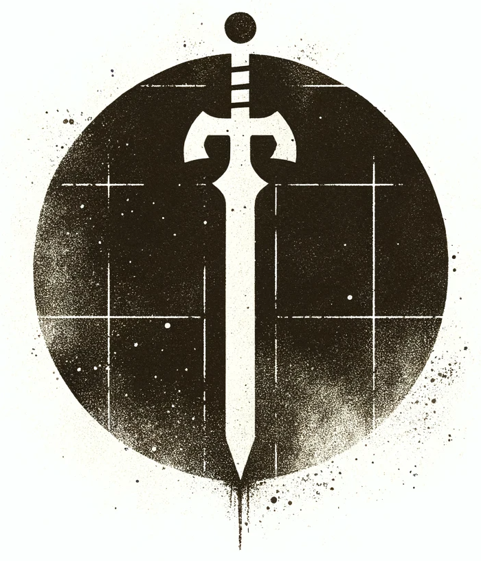

# Grimdark

{ width="300" }

## Inspired by Deathbringer

Grimdark draws its inspiration from the Deathbringer addon created by the Dungeoncraft [YouTube channel](https://www.youtube.com/@DUNGEONCRAFT1) and [Patreon](https://www.patreon.com/DungeonCraftYouTube). Building upon the innovative ideas and concepts presented in Deathbringer, Grimdark takes the spirit of gritty and intense tabletop role-playing to new heights.

## Definitions

Game Master (GM): the narrator and referee.
Player Characters (PC): Fictional characters devised by players.
Non-Player Character (NPC): Fictional individuals brought to life by the GM
Party: a group of PCs collaborating for a common goal
Monster: a hostile NPC who wants to kill and/or eat the PCs.
Adventure/Scenario: a series of encounters with an objective
Campaign: a series of connected adventures featuring the same characters
Test/Attempt/Check: rolling a target number or better on a twenty-sided die (d20).

## Introduction

Grimdark is the lean, mean cousin of the most renowned tabletop role-playing game out there. It's less of a game and more of a 'mod kit'—a set of tweaks for a quicker, rawer experience.

Deploy these rules solo, or blend them into any 5E or old-school renaissance game. Mix and match to your heart's content. Think of Grimdark as the kick of hot sauce to your RPG feast.

### Why Go Grimdark?

We enjoy RPGs teetering on the edge, where every shadow on the corner of your eye could be your last. We prefer our PCs as rough-around-the-edges underdogs, scrapping by in a world that's out to get them. And we're fans of gameplay that's more impromptu cinema than pushing pieces, where players say things like, “I silently sneak up behind him and stab him in his kidney” instead of, “I roll 18 stealth, move to the tile next to his and attack”

### Embracing the Grimdark
In the realm of Tabletop RPGs, a trend has emerged: complexity that bogs down the essence of adventure. Battles that should be swift and thrilling stretch into hour-long marathons. Character sheets have become as daunting as advanced calculus. Characters start off as mighty heroes and only get mightier, rarely tasting defeat or death. Magic, once a rare and wondrous art, has turned routine, losing its mystique.

Screw that.

Grimdark is here to shake things up. Here, combat is quick, instinctual, and full of flair. Forget about intricate character sheets – we’re keeping it straightforward. Characters gain power, but they’re not invincible. They’re heroes, yes, but still mortals vulnerable to a well-placed strike. Magic here is volatile and unpredictable. Death is a constant companion in our adventures, making every moment in the dungeon pulse with peril.

We stand for a few fundamental beliefs:

    Rules Limit, Not Liberate

The common notion is that rules define a character's capabilities. More rules, more options, right? Wrong. We argue that rules actually constrict creativity. 

Specific skills and feats condition players to think inside the box, trapped by the confines of their character sheets. This leads to repetitive gameplay and a reluctance to try actions not explicitly listed. Grimdark breaks these chains. 

Here, your limits are bound only by your creativity. Outmaneuver a giant by sliding between its legs? Why not. Use your shield as a surfboard in a staircase showdown? Absolutely. Make a weapon out of a dinner plate? Go for it. Every character can wield an improvised weapon – no special skill needed. 

What you do hinges on the scenario and your imagination, not a list on paper.

    Simplicity Speeds Up the Game

Actions, ready actions, bonus actions, reactions, grids, individual initiative—all of these create a game that is slower and longer. Especially during combat, when it should be getting faster!

Overcomplicating character sheets with endless subskills only slows the game further as players sift through minutiae. In Grimdark, character sheets are streamlined. Key information like Ability Score bonuses and a universal ‘Expertise’ bonus for relevant skills keep things moving fast. The GM handles the nitty-gritty, guiding players on what to roll and when.

    The GM Reigns Supreme

There’s a misconception that the Game Master's role is to be a rulebook with legs. We couldn’t disagree more. In Grimdark, the GM isn’t just a rule interpreter – they are the rule. 

They’re what sets TTRPGs apart from video games and board games. They're the human element that allows for spontaneous and creative gameplay. Remember, board games need rigid rules because there's no GM. But in TTRPGs, we have the best AI there is – the human brain. That's why our rules are intentionally malleable, empowering the GM to keep the adventure flowing. The cardinal rule here is simple:

    The Game Master's word trumps all.

No RPG can perfectly simulate real combat, skill mastery, or physics. That's why we trust our GMs to make smart calls and bridge gaps. This book? It’s a guide, not gospel.

    The GM is the Final Judge

When rules and GM decisions collide, the GM’s call is final. They are the heart and soul of the gameplay, the architects of adventure, and the ultimate authority.

Grimdark is about returning to the roots of roleplaying – fast, fierce, and fun. It's about rekindling the spirit of adventure where anything is possible and the only limit is your imagination.

## Core Mechanic: Test

In Grimdark, the process for resolving actions is streamlined and intuitive:

Setting the Scene: The GM outlines the current scenario. The player then declares their character's intended action.

Determining Difficulty: Should the GM assess that the action has a significant risk of failure, they establish a Difficulty Rating (DR). The DR reflects the task's complexity, with more difficult tasks having a higher DR.

Rolling for Outcome: The player rolls a d20, adding relevant Ability Score Modifiers from their character sheet. Success is achieved by rolling the DR or higher. Failure, naturally, occurs when the roll falls short.

    Formula for Test: d20 roll + Ability Score Modifier + Expertise Bonus (when relevant)

In Grimdark, the dice rolls also carry extra weight:

Critical Success: Rolling a natural 20 isn't just a success; it's a triumph, bringing additional perks. In combat scenarios, this translates to an added d12 damage roll.

Critical Failure: Conversely, a natural 1 spells disaster, leading to unforeseen consequences. This could mean weapon damage or loss during combat, or a botched spell with unintended effects in magic use.

### Assigning a Difficulty Rating

| Task Complexity | Difficulty Rating |
| --- | --- |
| Easy | 5 |
| Medium | 10 |
| Difficult | 15 |
| Improbable | 20 |

This scale is universal, applicable to all challenges: from physical feats like breaking doors or scaling walls to more nuanced tasks such as social interactions or combat. The GM evaluates the situation and sets the Difficulty Rating (DR). Players then roll a d20, add relevant Ability Score Modifiers, and aim to meet or exceed the DR. It's straightforward.

#### Easy Tasks

Easy tasks are commonplace, almost second nature. For instance:

- A skilled rogue easily picking a standard lock.
- Striking an unsuspecting adversary.
- Casting a well-practiced spell in a tranquil setting.
- A seasoned hunter following tracks on a clear day.

#### Medium Tasks

Medium tasks require focus and skill. Examples include:

- A rogue scaling a typical wall.
- Engaging an alert and prepared enemy.
- Casting an attack spell against a dodging target.
- Tracking wildlife on a slightly rainy day.

#### Difficult Tasks

Difficult tasks push characters to their limits, often involving stress or unfamiliarity. Examples:

- A rogue picking a lock amidst enemy fire.
- Battling a formidable leader or a fearsome creature.
- Spellcasting against a hostile, dual-headed troll.
- An amateur trying their hand at lockpicking.

#### Improbable Tasks

Improbable tasks are those of exceptional challenge, often bordering on the heroic or foolhardy. For example:

- Trying to rope a dragon mid-flight.
- Climbing a slick, equipment-free cliff.
- Breaking free from iron chains.
- Diving off a cliff into a turbulent river to escape a goblin horde.

### Advantage & Disadvantage

In certain scenarios, the GM can determine that a PC either has an advantage or a disadvantage during a Test. This could be due to various factors, like attempting a stealth attack from behind or engaging in combat under challenging conditions like deep mud.

Advantage: Think of it as your lucky day. The GM decides the stars are aligned for your character - maybe you're pulling off a ninja move from the shadows or dropping down on some poor sap from above. You get to roll two d20s and keep the better one. It's like getting a second shot at success because the first one was just a warm-up.

Disadvantage: This is when the universe decides to have a laugh at your expense. Maybe you're trying to swing a sword in a swamp, or you're blindfolded on a tightrope. Roll two d20s, but guess what? You're stuck with the worse one. It's the game's way of saying, “Good luck with that.”

The use of Advantage and Disadvantage streamlines complex calculations and keeps the game moving at a brisk pace. It adds an exciting element as well, because let's face it - rolling more dice is always a blast!

### Expertise

Every character possesses a wide range of skills called Expertise. If a character attempts an action that falls within the range of their Expertise, the player adds a bonus to their attempt.

| Character Level | Expertise Bonus |
|---  | ---|
| 1-3 | +1 |
| 4-6 | +2 |
| 7-9 | +3 |
| 10+ | +4 |

If a character attempts a common action (hiding, climbing, riding a horse, etc.) outside their field of Expertise, they apply their Ability Score Modifier to their d20 test.
If a character attempts an uncommon action (safecracking, open-heart surgery, disarming an explosive device) outside their field of Expertise, the GM may assign a harder DR, disadvantage, or both.

## Character Creation

Some characters rise to great heights of power. Most will meet an ignominious end, devoured by monsters or left to rot on a cold dungeon floor. If adventuring were easy, every peasant would drop their hoe and run off to explore the nearest cave! Because Grimdark is so deadly, we recommend you make two characters to start. Think of one as the main character and the other as the replacement character when the first one bites the dust.

- All characters are human. 
- No one can see in the dark.
- The gods of Grimdark are indifferent.
- Spellcasters have been hunted to near extinction.

To create a Player Character (PC), follow these steps:

1. Determine ability scores.
2. Choose a Profession and roll a random Background; note your powers, special abilities, Expertise, and starting equipment.
3. Determine starting Hit Points (HP).
4. Determine your Defense (DEF).
5. Name the Character.

### Ability Scores

Characters are defined by six ability scores: Strength, Intelligence, Wisdom, Dexterity, Constitution, and Charisma.

**STR**ength: Add to melee weapon attacks AND damage.
Lift gates, bend bars, smash doors, grapple, bonus to melee attacks.

**DEX**terity: Add to DEF, missile attacks AND damage, stealth, climbing, lockpicking, acrobatics, etc.

Defend from attacks, dodge, bonus when attacking with ranged weapons, picking locks, climbing, delicate tasks—anything done with the hands and/or requiring agility. A character’s DEFENSE (DEF) is based on Dexterity.

**CON**stitution: Saves v. poison. Resist heat, cold, starvation, poison, torture; run long distances.

You can carry items = CON+10
For each day of rest you regain HP = CON
Note: CON does NOT add to HP.

**INT**elligence: Add to spellcasting rolls, history, knowledge, +1 indicates literacy.

Know obscure things, read & write languages, bonus to cast wizard spells.

**WIS**dom: Add to mind-based Saving Throws, searching, perception & tracking.
Intuition, insight, cunning, perception, bonus to searching and casting prayers.

**CHA**risma: Add to all reaction checks, charm, deception, intimidation, performance, persuasion.

Your ability to persuade, charm, flirt, and influence people; all social interactions.

Your Ability Bonus **IS** your proficiency bonus, skill level, and natural ability. A +1 STR means you are proficient with ALL hand weapons. A +1 DEX means you are proficient with all ranged weapons, acrobatics, climbing, stealth, etc. A high CHA means you are good will all social interactions.

#### Determining Ability Scores

There are three methods for determining Ability Scores

**5E Standard Array**

Start out with 8 “build points.” Distribute these as bonuses between your six Ability Scores, with no higher than +5 in any one Ability Score.
Ex: STR +5, DEX +2, CON +1, INT 0, WIS, 0, CHA +1

**OSR Standard Array**

Start out with 3 “build points.” Distribute these as bonuses between your six Ability Scores, with no higher than +3 in any one Ability Score.
Ex: STR +1, DEX +1, CON 0, INT 0, WIS, 0, CHA +1

**Roll The Bones!**
5E: for each Ability, roll 4d6, determine the bonus, arrange as desired. No re-rolls!
OSR: for each Ability, roll 3d6, determine the bonus, arrange as desired. No re-rolls!

| Stat   | Bonus/Penalty |
| ------ | ------------- |
| 18     | +4            |
| 16-17  | +3            |
| 14-15  | +2            |
| 12-13  | +1            |
| 10-11  | 0             |
| 8-9    | -1            |
| 6-7    | -2            |
| 4-5    | -3            |
| 3      | -4            |

If you have no bonuses, your character has died of plague and is buried in a mass grave. Roll again.

### Profession and Background

    Work in Progress

### Hit Points (HP)

Hit Points are a combination of overall health, skill, and luck. Most characters begin with d6HP and gain an additional d6hp at every level. 

    Hit points = Hit Dice + CON

This is what separates the bad assess from the masses:
- Characters roll for HP on 1st level. If they roll a 1 or a 2, too bad. They must keep it.
- No “do-overs,” re-rolls, or claiming ‘interference” because the dice bounced off a pencil or a book.
- CON score is the Max HP

    DEFense= 10 + DEX + Armor.

Zero HP means a character is unconscious. Negative HP means you are
dead. No death saves. No resurrections. Dead. Deal with it.

### Determine your Defense (DEF)

Defense (DEF) is what enemies need to roll to hit your character. Characters begin with a DEF of 10+ their DEX bonus/penalty + armor bonuses.

| Armor Type | Description                     | DEF Bonus | Cost  |
|------------|---------------------------------|-----------|-------|
| Shield     | Wood, battered.                   | +2        | 15gp  |
| Light      | Leather coat, jacket, or doublet  | +1        | 10gp  |
| Medium     | Gambeson, chain vest, scale shirt | +2       | 75gp  |
| Heavy      | Full plate armor                  | +3        | 1000gp |

### Determine Personality (Optional)

Toss 2d20 to determine a random vice and virtue for your character. If you roll the same number, toss one die again. If you don’t like the result, roll again—or choose. The point is to distinguish your character’s personality from all the other characters with the same profession.

| Number | Virtue        |
| ------ | ------------- |
| 1      | brave         |
| 2      | cautious      |
| 3      | courteous     |
| 4      | generous      |
| 5      | honorable     |
| 6      | studious      |
| 7      | pious         |
| 8      | merciful      |
| 9      | stoic         |
| 10     | industrious   |
| 11     | optimistic    |
| 12     | idealistic    |
| 13     | reserved      |
| 14     | Non-drinker   |
| 15     | Modest/humble |
| 16     | disciplined   |
| 17     | chaste        |
| 18     | forgiving     |
| 19     | rational      |
| 20     | contemplative |

| Number | Vice                |
| ------ | ------------------- |
| 1      | cowardly            |
| 2      | compulsive gambler  |
| 3      | rude                |
| 4      | greedy              |
| 5      | self-serving/cheater|
| 6      | inattentive         |
| 7      | irreverent          |
| 8      | ruthless            |
| 9      | Ill-tempered        |
| 10     | lazy                |
| 11     | pessimistic         |
| 12     | cynical             |
| 13     | boisterous          |
| 14     | drunkard            |
| 15     | Vain/braggart       |
| 16     | rebellious          |
| 17     | promiscuous         |
| 18     | vengeful            |
| 19     | superstitious       |
| 20     | unreflective        |

### Roll a Random Background (Optional)

You can choose from these tables or make your own background, it's your choice
Toss some dice. If the results don’t make sense, roll again.

| D20 | RANDOM MISERY |
| --- | ---- |
| 1 | Abandoned at birth. |
| 2 | Banished from home. |
| 3 | Betrayed by a loved one. |
| 4 | Cursed by vengeful witch. |
| 5 | Disinherited or disowned. |
| 6 | Escaped bondage or prison. |
| 7 | Fled a scandal. |
| 8 | Framed for a crime. |
| 9 | Killed someone important. |
| 10 | Left for dead. |
| 11 | Locusts ate your crops. |
| 12 | Owe someone money. |
| 13 | Pursued by the law. |
| 14 | Raised in the streets |
| 15 | Reduced to poverty. |
| 16 | Rejected by society. |
| 17 | Ruined by vice. |
| 18 | Suffering from amnesia. |
| 19 | Survived a massacre. |
| 20 | Town ravaged by plague. |

| D20 | BACKGROUND |
| --- | --- |
| 1 | Bounty Hunter |
| 2 | Courtesan |
| 3 | Duelist |
| 4 | Executioner |
| 5 | Farmer |
| 6 | Grave Robber |
| 7 | Leech Collector |
| 8 | Mercenary |
| 9 | Minor Noble |
| 10 | Outlaw |
| 11 | Performer |
| 12 | Pit Fighter |
| 13 | Pirate/Sailor |
| 14  | Priest/nun/monk |
| 15  | Rat Catcher |
| 16  | Servant |
| 17  | Student/Scholar |
| 18  | Swineherd |
| 19  | Soldier |
| 20  | Urchin |

| D10 | Birthplace |
| --- | --- |
| 1. Blighted | 1. Village |
| 2. Cursed | 2. Backwater town |
| 3. Decaying | 3. Hamlet |
| 4. Famine-Stricken | 4. Castle |
| 5. Haunted | 5. Slum |
| 6. Locust-ravaged | 6. Swamp |
| 7. Plague-infected | 7. Forest |
| 8. Putrid | 8. Outpost |
| 9. Squalid | 9. Ruin |
| 10. War-ravaged | 10. City |

| D10 | Parent fate |
| --- | --- |
| 1  | Both dead from plague |
| 2  | Burned at the stake. |
| 3  | Wrongly executed. |
| 4  | Killed in a raid. |
| 5  | Mother died in childbirth or disease. |
| 6  | Father died of pox. |
| 7  | Abandoned you at birth. |
| 8  | Sold you for coin. |
| 9  | Refuse to acknowledge you. |
| 10 | Alive and well |

| D10 | Tragic Love |
| --- | --- |
| 1.  | Died of plague. |
| 2.  | Was murdered |
| 3.  | Kidnapped or imprisoned. |
| 4.  | Betrayed you for another. |
| 5.  | Is betrothed or married to another. |
| 6.  | Is hated by your family. |
| 7.  | Is an occupational rival. |
| 8.  | Is of a different social class. |
| 9.  | Does not return your affections. |
| 10. |  You haven’t me them yet. |

SIBLINGS

You have d6-2

Roll D6
1-3 = Younger
4-6 = Older

Roll D6
1-3 = Male
4-6 = Female

| D10 | Sibling Fate |
| --- | --- |
| 1.  | Dead from plague. |
| 2.  | Murdered. |
| 3.  | Hate your guts. |
| 4.  | Want you dead. |
| 5.  | Jealous of you. |
| 6.  | Estranged. |
| 7.  | Starving from famine. |
| 8.  | Crushed by debts. |
| 9.  | Look up to you. |
| 10. |  Protective of you. |

## Experience and levelling

In Grimdark, characters level up when the GM says they do.

Experience points (XP) are awarded entirely at the GM’s discretion. How the GM awards XP will incentivize certain behaviors:

- If you want to emphasize story, award XP for completing scenario objectives. Example: each rescued prisoner is worth 1xp.
- If you want to emphasize character growth, award XP for character milestones. Example: when the fighter finds and kills the man who killed her father, she levels up.
- If you want to emphasize conflict, award XP for killing monsters. Ex: each monster is worth 1-2xp.
- If you want to emphasize exploration and risk-taking, award XP for accumulating wealth. Example: 100gp = 1xp.
- If you want to encourage role-playing, award 1xp for a player staying in character or acting in a manner that entertains the other players.

Level up at 10xp.

When you gain a Level:

- Gain an additional Grimdark Die each level.
- Test against each Ability Score. Roll a d20. If you roll higher than the current bonus number, raise that Ability Score by 1 (max 20)
- Gain d6+CON bonus HP (minimum 1)

Note: Maximum HP is your CON Ability Score (not bonus).

That’s it. We’re tempted to provide more guidance, like hard numbers to reach the next level, but every campaign is different and groups enjoy levelling up at different rates. We will provide, however, these firm principles:

- It should take a minimum of 3-4 sessions to rise one level.
- PCs can never rise more than one level in a single session.

## Encumbrance

### Item Slots

Each player character (PC) in Grimdark has a number of item slots equal to their Constitution (CON) score plus 10. These item slots represent the character's capacity to carry various items, weapons, armor, and supplies during their adventures.

For example, if a character has a Constitution score of 14, they would have a total of 24 item slots (14 CON + 10).

### Managing Coins

In Grimdark, coins have weight and take up space in a character's inventory. Specifically, 100 coins occupy one item slot. This rule encourages players to think about the practicality of carrying large amounts of currency, as it can quickly fill up their available item slots.

Once all slots are filled, characters move at half speed.

## Corruption

- Gain +1 when you commit and evil deed or roll Nat 1 when spellcasting.
- “Evil deeds” include killing prisoners who have surrendered, innocent people, or anything the GM determines to be morally wrong.
- At 10 Corruption you have lost all humanity and become a monster controlled by the GM.

Corruption is an essential part of the Grimdark universe. Actions have consequences and the PCs may be heroes—but flawed heroes who are haunted by their pasts and who must constantly struggle against becoming the very monsters they fight against. Some characters may be forced to retire before they lose their souls.

Characters begin with zero Corruption. When a character gains ten Corruption, they become a monster controlled by the GM and are removed from play. Corruption may manifest physically in the form of a physical mutation (a third eye, scaley skin, or a second head growing out of the PC’s shoulder, etc.) or it can be mental, with the character having a seemingly normal appearance, but completely depraved and murderous thoughts.

There is no way to remove Corruption. PCs can only gain it. Evil deeds haunt a character forever. If the GM chooses, a PC may gain a mutation once they gain +6 Corruption and an additional mutation every point thereafter.

MUTATIONS (D20)

| Roll| Mutation |
| -  | - |
| 1  | Pustules. |
| 2  | Candles dim when you enter a room. |
| 3  | Hair turns white or falls out. |
| 4  | Craving for raw meat. |
| 5  | Gaunt. |
| 6  | Strong, distinct scent. |
| 7  | Eyes glow faintly in the dark. |
| 8  | Black, pupilless eyes. |
| 9  | Translucent skin. Hates sunlight. |
| 10 | Ages d20 years. |
| 11 | Scaley skin. Craves live mice. |
| 12 | Craves brains. |
| 13 | Extra eye in random location. |
| 14 | Extra limb—withered and useless. |
| 15 | Extra fetal head growing on shoulder. |
| 16 | Extra mouths on back. |
| 17 | Tentacle. |
| 18 | Demonic horns. |
| 19 | Skull face. |
| 20 | Molts into a giant roach or worm. |

## Healing

Use a Grimdark Die to stitch up wounds after combat. If you stitch your own wounds, divide the Grimdark Die roll in half and round down.

Heal HP = CON every day of complete bedrest.

### No rest for he wicked

In Grimdark, the concept of "short rests" and "long rests" as commonly known in other role-playing games is entirely redefined. There are no moments of respite, no pauses to catch your breath, and no extended periods of restorative rest. In this harsh and unforgiving world, the only time for resting is in the grave.

## Combat

## Magic

In Grimdark, the practice of magic is a perilous endeavor fraught with uncertainty. There are no conventional spell slots, and spellcasters must rely on the roll of the dice to determine the outcome of their magical endeavors.

Roll to Cast
When a character attempts to cast a spell in Grimdark, they must make a roll to determine the success of their casting. This roll reflects the inherent volatility of magic in this world. The specific mechanics of the roll may involve rolling a twenty-sided die (d20) or using another appropriate method.

Success: If the roll results in a success (typically by meeting or exceeding a certain target number), the spell is cast as intended, and its effects manifest as expected.

Natural 1: However, if the roll results in a natural 1, it represents a critical failure and a potentially catastrophic outcome. Not only does the spell fail, but the caster also gains a Corruption Point.

## Spells

## Monsters

Import and monsters and spells you like from 5e/OSR games.

5E Monsters have pure HD (no CON bonuses). OSR monsters remain exactly as written in the description/module.

Spells do the same damage.

Magic items are virtually non-existent. Potions are rare.

## Rewards & Treasure

## Adventures

## GM Advice
