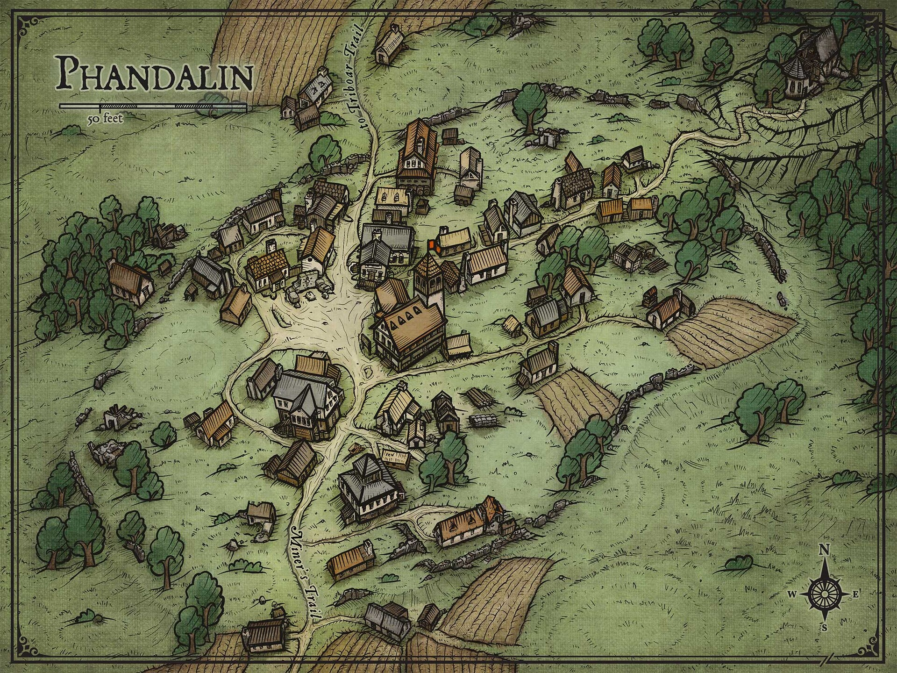
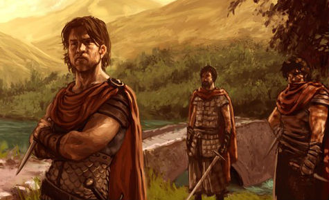
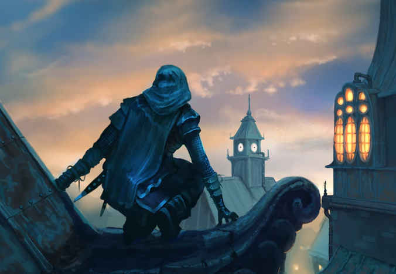
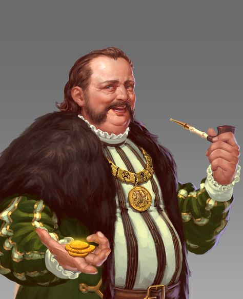
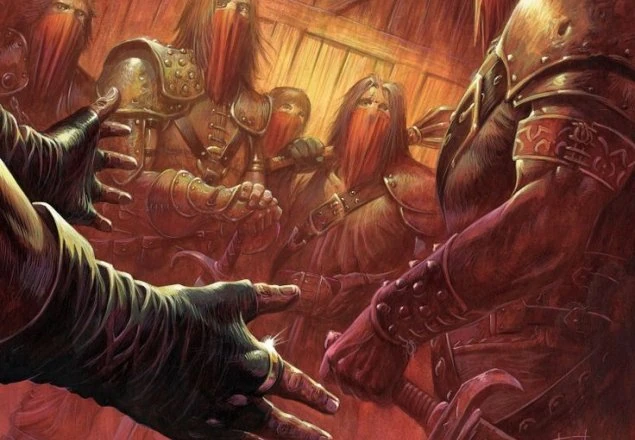

# Day 3

## Talking around town

As the party arrived in Phandalin, they quickly learned that asking around about Cragmaw Castle was a dead end. "Cragmaw Castle? I'm sorry, I haven't heard of it," Qelline Alderleaf, a kindly halfling farmer, told them apologetically. "But I do know that the Redbrands are causing trouble around town. I've heard they hang out at the Sleeping Giant tap house at the east end of town."

At the mention of the Redbrands, Sildar Hallwinter spoke up. "Those ruffians have been a thorn in the side of Phandalin for far too long. It's time someone took a stand against their leader, Glasstaff."

The group continued their inquiries, talking to the various townsfolk in the hopes of finding any useful information. They learned that the goblins, who had once been a problem in Phandalin, had seemingly disappeared since the Redbrands arrived. The lack of a functioning government was also evident, with the townsfolk electing a new mayor each year. The current mayor, a pompous old fool, seemed completely intimidated by the Redbrands. "Oh, they're just a mercenary guild, and not all that much trouble, really," he blustered.

As the characters wander through Phandalin, they may come across a small shrine made of worn stones from nearby ruins. The peacefulness of the shrine is interrupted by the sight of a worried-looking acolyte tending to it. Upon closer inspection, they see that she's Sister Garaele.

Approaching her, they can hear her murmur to herself, "If only I could get rid of those Redbrands...but it's hopeless." As she notices the characters, she looks up and greets them, "Greetings, travelers. I'm Sister Garaele, the caretaker of this humble shrine."

After some small talk, Sister Garaele confides in the adventurers. "I have a request, if you're willing to help. I've been trying to convince a banshee named Agatha to answer a question about a spellbook belonging to the legendary mage Bowgendle. But I can't seem to persuade her to give me a straight answer. Perhaps if someone were to bring her a gift, something shiny, she might be more willing to talk."

She pauses for a moment before continuing, "I would be eternally grateful if you could help me with this task. The spellbook in question is of great importance, and I believe it could help us rid Phandalin of the Redbrands."

The mere mention of spellbooks set Mortimer's mind racing with curiosity. His eyes lit up with a glint of fascination, and he leaned in, eager to learn more.

"Seems like there's a lot to be done in Phandalin" said Vaxidd. "But I fear we will accomplish nothing until we rid the town of the Redbrands." stated Sheod.

Feeling frustrated, the party decided to head to the Sleeping Giant to confront the Redbrands directly. As they arrived the tap house, they could hear the rowdy laughter and shouting of the ruffians.

## Brawling with the Redbrands

The adventurers walked stealthily walked around the back of the Inn, and looked into the Inn through the dirty windows.

The Redbrands lurked inside the grimy taproom, while the adventurers peered through the dusty windows. The atmosphere was thick with tension as they surveyed the dingy establishment. Tables and chairs were scattered haphazardly, and the walls were adorned with crude paintings and unidentifiable stains. It was clear that this was not a place for the faint of heart.

As the party was still devising a plan to enter,The door burst open, and the ruffians stormed out with menacing scowls. "What the hell do you think you're doing, peeping toms?" growled one of the Redbrands, cracking his knuckles. "This is our territory, and you're not welcome here!" Another ruffian sneered, "You're gonna regret crossing us, pretty boy." The adventurers knew they were in for a fight.

The Redbrands were dressed in scarlet cloaks, their eyes fixed on the adventurers with a menacing gaze.

The adventurers stood their ground, ready for a fight. Vaxidd charged forward, his warhammer glinting in the light. With a swift swing, as if Moradin himself was hammering iron on his anvil, he hammered one of the Redbrands caving his head into his torso.

Sheod, swiftly ran at the Inn's wall, kicking it at the last minute and jumping into the air, gaining height enough to seet eh face of the ruffian at the back. He pulled his arrow back and the arrow flew, skewering him between the eyes. The ruffian was dead before he dropped to the floor.

Orianna, the bard, played her lute "I didn't know a goblin's breath could be that foul! You must have eaten something truly disgusting!". HEr insults, laced with arcane power struck the very essence of the ruffian, and he dropped, clutching his chest, dead. With a flick of his wrist, Mortimer held out his well-worn spellbook and chanted the incantation for a sleep spell. As he did, he could feel the crackle of arcane energy building within him, and he directed it towards the ruffian with a fierce determination. The ruffian, caught off guard by Mortimer's sudden attack, felt a wave of drowsiness wash over him as he struggled to keep his eyes open. Despite his efforts, however, the sleep spell overcame him, and he slumped to the ground in a deep slumber. Mortimer let out a small sigh of relief as he closed his spellbook, satisfied that the ruffian would be no threat to him or anyone else for a while.

## An unlikely ally

Orianna volunteered to go fetch the mayor, while the others kept watch over the tied-up ruffian.

As the adventurers tied up the last ruffian, they noticed a strange figure lurking in the shadows. She was a woman, with dark hair and piercing eyes, who seemed to be watching them intently. She stepped forward and introduced herself as Sariel, and she was very interested in the box that Gundren had asked them to keep safe.

"I'll give you 50gp for it," she said, her eyes glinting with avarice.

Mortimer stepped forward, his hand on his spellbook. "Sorry, miss, but that box isn't ours to give away. It belongs to our friend Gundren."

Sariel smirked. "Ah, Gundren. Yes, I know of him. In fact, I may be able to help you find him."

The adventurers exchanged wary glances. "What do you mean?" asked Vaxidd.

"I have information about his whereabouts," said Sariel. "But it will cost you. Meet me outside of town at midnight, and I'll bring Gundren with me. We can make the exchange then."

The adventurers were skeptical. "Why should we trust you?" asked Sheod.

Sariel shrugged. "You don't have to. But I think you'll find that I'm the only one who can help you find your friend."

As they waited for Orianna's return, the Redbrands' bodies lay scattered around them, a testament to their skill and bravery. But the adventurers knew that their journey was far from over, and that danger lay ahead.

## Allying with the Mayor

Orianna ran off to fetch the Mayor while the adventurers secured the last ruffian. The Mayor's office was in the town hall, a modest building made of wood and stone. Orianna found the Mayor pacing back and forth inside his cluttered office.

"Mayor, we need your help, come quick!" Orianna said as she burst into the room.

The Mayor jumped at the sudden intrusion. "Good gods! Don't scare me like that!"

"We captured one of the of the Redbrands," Orianna continued, "and we need to keep him in jail. Can you help us with that?"

The Mayor's eyes widened in fear. "The Redbrands!? Oh, I don't know if I can do that. They'll retaliate for sure." fetching his jacket "Take me to where you have him".

Orianna and the Mayor rushed back to the Sleeping Giant inn, one of the ruffians tied and wrigglign to leave, Sheod keeping him in place with his boot.

Vaxidd stepped forward with his imposing figure towards the Mayor. "You're the Mayor of this town, aren't you? We need your authority to keep this town safe."

The Mayor cowered at Vaxidd's words. "Y-yes, yes, of course. I'll send some guards to lock up the prisoner."

Sheod chimed in, "We also heard that you were offering a reward for dealing with the Redbrands. Is that true?"

The Mayor's eyes darted around nervously. "W-well, yes. I can offer you 100 gold pieces if you rid us of those thugs."

Mortimer smirked. "That sounds like a fair deal. We'll take care of them, but you better make sure that prisoner stays locked up tight."

The Mayor nodded fervently. "I will, I will. Just please be careful. The Redbrands are a dangerous lot."

## Infiltrating the Redbrand hideout

Towering over the eastern edge of Phandalin, Tresendar Manor looms like a giant sentinel, a relic of a time long past. The once-grand estate has fallen into disrepair, its walls cracked and overgrown with vines, its windows shattered and boarded up. However, the true danger lies beneath the surface.

As the adventurers approach Tresendar Manor, they can feel the weight of its history bearing down upon them. The air is thick with the stench of decay and neglect. From the outside, the manor appears quiet and deserted, but the sound of muffled voices and the clinking of armor can be heard from below.

"There's no telling how many of them are down there," says Vaxidd, his hand tightly gripping the hilt of his hammer. "But we can't let them continue to terrorize Phandalin."

Mortimer pulled out a tiny, black velvet pouch from the folds of his robes, opening it carefully to reveal a spider with shimmering, dark celestial markings. He whispered an incantation, and the spider sprang to life, skittering onto his hand. 

Sheod recoiled at the sight of the spider, his hand reflexively gripping the hilt of his sword. "I don't like spiders, Mortimer. Not one bit," he said, eyeing the arachnid with unease.

"I know, but trust me, she'll be of great help to us," Mortimer reassured her, and with a flick of his wrist, he sent the spider scurrying towards the Tresendar manor.

Mortimer's eyes glowed with a faint, otherworldly light as he focused his mind, telepathically communicating with the spider. The spider crept under the manor, navigating its way through the dark and musty tunnels beneath. 

Suddenly, Mortimer's eyes went foggy, and he shuddered slightly as he became more attuned to the spider's senses. The spider had discovered a hidden room, where two Redbrand ruffians were slumped on cots, nursing their drinks and chatting about the recent arrival of the adventurers in town.

"You hear about those adventurers that came into town?" asked the first one. The second one nodded. "Yeah, I heard they were causing trouble for us."

"Well, we can't let them get in our way. We need to protect Glasstaff's plans."."Agreed," said the second one. "I heard they were at the Sleeping Giant earlier. Maybe we should pay them a little visit and teach them a lesson." The first one hesitated. "Let's not be hasty. We need to wait for the boss's orders before we do anything. We don't want to act without his permission.". "Fine," grumbled the second one. "But we need to be ready. I'm tired of these adventurers thinking they can just come here and cause trouble.". The first one nodded, a dark look in his eyes. "Me too, brother. Me too."

"We've got company," Mortimer said, his voice distant and unfocused as he maintained his telepathic link with the spider. "Two Redbrands in a hidden room beneath the manor. We need to move fast."

Sheod motioned for the others to stay quiet and crouch low to the ground. They moved forward cautiously, their eyes scanning the dimly lit basement for any sign of danger. The air was musty and thick with the scent of damp stone and mildew. The floor was slick with moisture, making it difficult to move silently. Vaxidd's heavy armor clanged loudly with each step, making Sheod wince. Suddenly, there was a loud commotion, and the sound of rushing footsteps. The Redbrands had been alerted to their presence.

As they descended further, the group reached a landing, and saw two Redbrands charging towards them with weapons drawn. Mortimer quickly drew his spellbook and began casting a spell, but it was too late. Vaxidd's heavy armor had already given them away.

The Redbrands lunged forward, their swords flashing in the dim light. Vaxidd swung his weapon, but one of the Redbrands deftly dodged the attack and struck him with the pommel of his sword. Vaxidd stumbled back, his armor clanging loudly as he fell.

Orianna quickly regained his composure and began casting a fear spell. One of the Redbrands shrieked and ran away, cowering in fear. The other continued to fight, but with Sheod's help, they managed to take him down.

As the dust settled, Mortimer sent out his familiar, a dark celestial spider, to scout ahead. The spider scurried along the walls and ceilings, making its way through the dark and musty tunnels. Finally, it reached a large natural cavern, and Mortimer saw the fleeing Redbrand.

He also saw something else, a creature lurking in the darkness. Mortimer's heart raced as he recognized it from his studies - a Nothic, an insane subterranean monster that hungered for flesh. Mortimer knew they were in for a fight if they wanted to get past the Nothic and uncover the secrets of the Redbrand stronghold.

## Admitting defeat