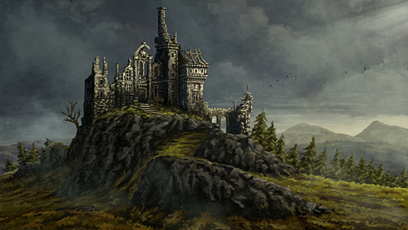
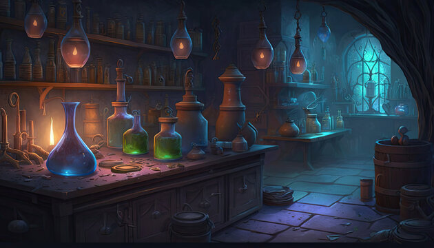

# Day 4

## Back to Tresendar Manor

The group awakens to the gentle rustling of leaves and the soft rays of the morning sun filtering through the Inn's window. They rise from their beds, stretching their weary muscles and preparing themselves for another day of travel. The events of the previous day linger in their thoughts, a testament to the dangers that await them in Phandalin.

Sheod, Mortimer, and Vaxidd huddle together, their voices low as they strategize their plan to infiltrate Tresendar Manor once again. The weight of their previous failure still hangs heavy in the air, and they are determined not to make the same mistakes again.

They overhear a few patrons sitting at the inn that they saw torches leaving from the south side of the Manor, where there is an old cave entrance. "We need to find a way back inside the manor without being detected," Sheod whispers, his eyes darting around to ensure their conversation remains private. "If they have torches leaving through the cavern entrance, it might be our best chance to slip back in unnoticed."

Mortimer nods, his brow furrowed in concentration. "Agreed. We'll have to be cautious and move quickly. We can't afford to be caught this time."

Vaxidd, his hand resting on the hilt of his hammer, adds, "I suggest we approach from the side, if they have left during the night, then the place will be mostly unguarded. It's our best shot at getting in."

As they finalize their plan, a sense of determination fills their hearts. They know the risks they are about to face, but their resolve remains unwavering. They understand that their success could mean the difference between life and death, not just for themselves but for the innocents trapped within the manor.

Silently, they make their way toward the cavern entrance. The nearby foliage wraps around them like a cloak, concealing their movements as they traverse the treacherous path. Cautiously, they approach the entrance, their bodies pressed against the cold stone walls. Peering around the corner, they observe torch light flickering.

With a nod of understanding, Sheod takes the lead, his agile form blending seamlessly into the shadows. He moves with a cat-like grace, his steps light and calculated. Mortimer and Vaxidd follow closely behind, their senses heightened and their weapons at the ready.

As they slip through the cavern entrance, the darkness engulfs them. The air grows colder, carrying the scent of damp earth and moss. They rely on their instincts, their eyes adjusting to the limited light filtering through the cracks in the rocky ceiling.

Every step brings them closer to their goal, closer to the heart of the manor where Glasstaff and his Redbrand thugs await. The tension builds with each passing moment, their nerves taut like a drawn bowstring. The weight of their mission rests upon their shoulders, but they are undeterred.

As Sheod, Mortimer, and Vaxidd cautiously traverse the dark corridors of Tresendar Manor, their ears catch a chilling sound that sends shivers down their spines. A low, guttural growl mixed with the sickening sound of flesh being torn apart and bones cracking fills the air. Their hearts pound in their chests as they realize the source of the horrifying noise.

With bated breath, they inch closer to the origin of the sound, their eyes adjusting to the dim light. Peering around a corner, they witness a ghastly sight that threatens to turn their stomachs. A grotesque creature with one bulging eye and disheveled hair, hunches over the mangled corpses of the bugbears they had encountered the day before.

Mortimer's face contorts with both disgust and intrigue as he observes the Nothic's behavior. "It's feeding on them," he whispers, his voice barely audible. "devouring their flesh."

Sheod's grip tightens around his bow, his knuckles turning white. "We must proceed with caution," he advises, his eyes locked on the monstrous creature. Mortimer continues "A Nothic is a formidable foe, and it won't hesitate to attack if it senses our presence. However they are intelligent and capable of reasonning"

Vaxidd, his voice filled with grim determination, adds, "If we are to navigate these treacherous halls and rescue the prisoners, we must find a way to deal with the Nothic. It could prove to be a deadly obstacle if left unchecked."

The trio exchanges a silent, knowing glance, their unspoken agreement cementing their next course of action. They must face the Nothic head-on, confronting the abomination and neutralizing its threat. The lives of the innocent prisoners depend on their success.

With practiced stealth, they advance towards it. Their footsteps are calculated and silent, their breaths held as they approach the lurking creature. The smell of blood and decay grows stronger, mingling with the dampness of the cavernous chamber.

As they reach the entrance to the Nothic's domain, Sheod notches an arrow to his bow, ready to strike if necessary. Mortimer's fingers twitch, longing to unleash a powerful spell, while Vaxidd's shield is raised in a defensive stance, prepared to protect his comrades.

The Nothic, engrossed in its grisly feast, senses their presence. Its milky, bulging eye swivel towards them, fixating on their intruding forms. A low, menacing growl rumbles from its throat, a clear warning to back away.

Mortimer, his voice laced with both apprehension and resolve, takes a step forward. "Nothic, we mean you no harm," he speaks in a measured tone, attempting to quell the creature's hostility. "We seek to aid those imprisoned within this manor. Will you allow us passage?"

The Nothic's response is a guttural hiss, filled with suspicion and hunger. Its gaze shifts from one member of the group to another, its eyes lingering on the gleam of Vaxidd's armor. It seems to weigh their intentions, torn between its insatiable appetite and the potential for alliance.

Vaxidd steps forward, lowering his shield just enough to show that they mean no immediate threat. "We offer you a deal," he proposes, his voice steady. "Assist us in our mission, and we shall provide you with sustenance—fresh meat that does not bear the taint of the Redbrands."

As the Nothic's milky eyes bore into their souls, a peculiar sensation washes over the group. Words form in their minds, a telepathic communication that bypasses spoken language. The Nothic's voice resonates within their heads, filled with a mix of hunger, desperation, and a hint of cunning.

"You offer sustenance and 'shinnies'?" the Nothic's telepathic voice echoes in their minds, its hunger laced with curiosity. "The Redbrands have kept feeding me their discarded corpses and tossing me their Shinnies" The Nothic's tone holds a touch of bitterness, as if it resigns to its current existence.

Mortimer exchanges a glance with his companions, silently acknowledging the potential benefit of striking an alliance with the creature. "We understand your plight," he responds telepathically, projecting a sense of sincerity and empathy. "If we can free the captives and put an end to the Redbrands' tyranny, we will provide you with both fresh sustenance and the shinnies you desire."

The Nothic's eyes narrow, its mind processing the offer. It seems to weigh the potential rewards against the risks. Moments stretch into an eternity before the Nothic finally relents, a hungry anticipation tinging its thoughts. "Agreed," it conveys, its voice resonating with a mix of hunger and anticipation. "Bring me the shinnies you find, and feed me the flesh of your defeated foes. I will not harm you"

The group, relieved that their negotiation has reached a positive outcome, exchanges glances of both caution and determination. They understand that this partnership, however reluctant, might be the key to success in their mission. They cautiously step closer to the Nothic, signaling their acceptance of the agreement.

"We shall honor our pact," Vaxidd speaks, his voice projected silently to the Nothic. "But remember, our ultimate goal is to rid this place of the Redbrands and ensure the safety of the innocents they have assaulted. We expect your cooperation in achieving that."

The Nothic's eyes gleam with a mix of hunger and an odd flicker of gratitude. The group can sense that the creature, bound by its insatiable desires, still recognizes the opportunity presented to it. It nods, a grotesque twitch of its misshapen head, acknowledging its role in their shared endeavor.

With the agreement reached, the group proceeds deeper into the manor, the Nothic's presence a constant reminder of their fragile alliance. As they continue their perilous journey, they can't help but wonder if they can truly trust the creature that lurks behind them. Only time will reveal the true nature of this unholy alliance and the impact it will have on their quest to liberate Phandalin from the clutches of the Redbrands.

## Crashing the party

As the Nothic greedily feasts on the remnants of the bugbear's flesh, its elongated claws tearing into the bones with a sickening crunch, the party cautiously ventures forth. Each step taken with a mixture of trepidation and determination, they press deeper into the depths of the manor, their senses alert and hearts pounding.

Descending a flight of worn stone stairs, the group enters a desolate room. It is a barracks, its atmosphere heavy with the stench of unwashed bodies and rotting meat. Four crudely constructed wooden bunks line the walls, their surfaces cluttered with disheveled blankets and scattered dirty dishes. The air hangs thick with the lingering residue of forgotten lives, abandoned in the wake of the Redbrands' tyranny.

Mortimer's nose wrinkles in disgust as he takes in the scene. "This place reeks of decay and despair," he mutters, his voice laced with a hint of sorrow. "It's a grim reminder of the suffering inflicted upon this town."

Vaxidd surveys the room, his eyes scanning for any signs of danger. "Indeed," he replies, his voice filled with determination. "But let us not dwell on the desolation. We must press on, for there are innocents to save and justice to be served."

With renewed resolve, the group moves past the empty barracks and continues along the winding tunnel. Their footsteps echo softly, each one a testament to their unwavering commitment to the task at hand. As they approach the next door, anticipation and tension fill the air.

The door creaks open, revealing a spacious chamber adorned with worn tables and chairs. The flickering glow of candlelight dances upon the walls, casting an ethereal ambiance upon the scene. Draperies of brown and red adorn the weathered walls, lending a touch of faded grandeur to the space. Wooden benches are positioned against the walls, their weary presence a silent testament to the gatherings that once took place within these walls.

In the center of the room, four rugged warriors, their scarlet cloaks a stark contrast against the dim surroundings, gather around a table. Coins and trinkets are stacked upon its surface, forming a glittering pile of ill-gotten gains. The warriors' voices carry a mixture of laughter and boastful banter, their eyes glinting with the thrill of their deeds.

Sheod's grip tightens around the hilt of his bow as he takes in the scene. A fire burns within his eyes, fueled by a combination of anger and determination. "These Redbrands mock the very essence of honor and decency," he whispers, his voice filled with quiet intensity. "We must put an end to their reign of terror."

Orianna, her fingers twitching with a desire to strum her lute, can't help but feel a pang of empathy for the innocents affected by the Redbrands' actions. "They have feasted upon the suffering of others for far too long," she murmurs, her voice resonating with a mix of determination and sorrow. "It's time we restore hope and bring an end to their wicked ways."

The group exchanges a knowing glance, their unspoken agreement fueling their collective resolve. With their weapons drawn and their spirits fortified, they step forward, ready to confront the Redbrand warriors and reclaim the stolen treasures. For within the depths of this room, the seeds of a pivotal battle have been sown, where the forces of justice and righteousness stand poised to confront the darkness that threatens to consume Phandalin.

Within the dimly lit chamber, the atmosphere grows tense as the characters step into the room. The air thickens with the scent of alcohol, the remnants of a heavy drinking session that has left the Redbrand ruffians inebriated and on the brink of hostility. Knucklebones clatter upon the table, their game teetering on the edge of turning acrimonious, as most gambling endeavors do.

Sheod, his bow at the ready, seizes the opportunity for a decisive strike. With a swift and precise movement, an arrow is unleashed from his bowstring, finding its mark with deadly accuracy. It pierces through the neck of one of the ruffians, causing him to stagger backward, his lifeblood staining his scarlet cloak.

The remaining three ruffians, fueled by a potent mix of liquor and fury, leap over the table, their eyes fixed upon the doorway where Sheod stands. Their intentions are clear—swift vengeance for their fallen comrade. 

However, Mortimer, ever resourceful, conjures an illusionary image of a swirling cloak, an ethereal apparition that confuses one of the ruffians at the crucial moment. The ruffian's strike misses its intended target, the cloak dissipating into mist as the illusion fades.

Vaxidd, muscles bulging beneath his armor, charges forward with resolute determination. Pushing past Sheod, he unleashes a devastating blow upon one of the ruffians. The force of his hammer connecting with flesh and bone is thunderous, and the ruffian crumples to the ground, life extinguished.

The remaining two ruffians, their faces etched with fear and desperation, seize the opportunity to escape. They dart towards a concealed back door, their fleeting forms a blur of panic and self-preservation. Sheod and Vaxidd give chase, their determination driving them forward. But the ruffians prove nimble, disappearing into the shadows beyond their reach.

Meanwhile, Mortimer remains in the room, his gaze shifting towards the table where the spoils of their wicked deeds lie heaped. The stolen wealth, amassed through deceit and ill-gotten gains, gleams under the flickering candlelight. Coins and trinkets, symbols of the ruffians' greed, glimmer enticingly before him.

With a sigh, Mortimer joins Sheod and Vaxidd back in the room, their pursuit having yielded no capture. Their faces bear the frustration of a missed opportunity, but their resolve remains unyielding. It is not vengeance they seek, but justice and the restoration of peace to Phandalin.

As they resume their investigation, their attention shifts once more to the room, to the wealth that adorns the table. It is a tangible reminder of the Redbrands' callous disregard for the well-being of the townsfolk. And while the battle may be temporarily stalled, their determination to see justice served burns brighter than ever.

With cautious steps, they approach the table, their hands reaching out to claim what was stolen. The weight of the coins and trinkets feels significant, not only in their material value but also in the symbolism it carries. Each piece of wealth reclaimed is a small victory, a step closer to dismantling the Redbrands' grip on the town and restoring hope to its inhabitants.

In this room, where blood has been spilled and fortunes gambled away, the trio stands united, their collective purpose undeterred. The path ahead may be fraught with danger and uncertainty, but their spirits remain unyielding, their resolve unshakable. Together, they will uncover the truth, face the challenges that lie ahead, and bring light to the darkness that has plagued Phandalin for far too long.

## The Laboratory

The party cautiously approaches the next door, their ears attuned to the faint bubbling and dripping sounds emanating from within the room. With a collective breath, they push the door open, revealing a sight that immediately captures their attention.

Before them lies a wizard's workshop, an array of alchemical apparatus and arcane tools scattered across the room. The pungent scent of potions fills the air, mingling with the faint aroma of brewing ingredients. The room hums with a palpable energy, the bubbling and hissing of the alchemical concoctions creating an auditory symphony.

Each contraption bubbles and steams, their contents a swirling cauldron of vibrant colors and enigmatic mixtures. It is evident that whoever has claimed this space is deeply devoted to the mastery of potion brewing and alchemy.

Mortimer's eyes light up with curiosity and intrigue as he surveys the room. His keen intellect recognizes the nature of the apparatus, the setup specifically designed for the delicate process of brewing potions of invisibility. However, it becomes apparent that the alchemist's attempts thus far have been met with limited success.

As the party further explores the room, their attention is drawn to the bookshelves brimming with parchment and tomes of arcane knowledge. The shelves are a treasure trove of alchemical texts, offering glimpses into the intricate art of potion-making. Mortimer, proficient in Arcana, examines the materials with a discerning eye, recognizing the fundamental texts on alchemy that line the shelves.

Amidst the collection, his gaze falls upon a tome written in the ancient script of Dwarvish. Intrigued, Mortimer carefully retrieves the journal and begins to decipher its contents. The tome reveals itself to be the journal of an adventurer named Urmon, its worn pages chronicling the rich history of the Lost Mine of Phandelver and the legendary Forge of Spells.

Page after page, Mortimer's eyes devour the words, learning of the ancient alliance between gnomes, dwarves, and mages known as Phandelver's Pact. He discovers that the priests of Lathander, the god of dawn, had commissioned a magical mace named Lightbringer from the skilled artisans involved in the pact. This divine weapon, imbued with the power of radiant light, was crafted to vanquish darkness and bring hope to the world.

The journal reveals a somber truth—a truth that resonates deeply within the hearts of the party. It speaks of the mace's unfortunate fate, lost to time and the enigmatic disappearance of Wave Echo Cave and its mine. The weight of this knowledge settles upon them, the potential significance of Lightbringer in their quest for justice and the restoration of Phandalin's prosperity becoming apparent.

Within the wizard's workshop, amidst the alchemical wonders and the forgotten history inscribed within the journal, the party feels a stirring sense of purpose. They recognize that the path they tread leads not only to uncovering the truth of the Redbrands' tyranny but also to unearthing the remnants of a forgotten legacy. The mace, Lightbringer, serves as a beacon of hope, awaiting rediscovery within the depths of Wave Echo Cave.

With renewed determination, the party continues their exploration, their minds and hearts aflame with the knowledge they have gained. They understand that their journey extends beyond the mundane and into realms steeped in magic, prophecy, and the echoes of a forgotten time. The wizard's workshop becomes a testament to the vast possibilities that lie ahead, propelling them closer to the answers they seek and the destiny that awaits

As the party pushes open the door at the end of the wizard's workshop, they are met with the sight of a lavishly decorated bedchamber. The walls are adorned with scarlet drapes that cascade down, creating a sense of opulence. The room exudes an air of comfort and relaxation, with a small writing desk and a matching chair placed near the window, inviting moments of quiet contemplation. A large, comfortable-looking bed takes center stage, adorned with richly embroidered sheets and plush pillows. At the foot of the bed rests a sturdy wooden chest, beckoning the curious adventurers.

With a mix of anticipation and caution, the party begins to explore the room. Their attention is immediately drawn to the neat stack of papers and notes resting upon the desk. 
Mortimer: "Look at these papers. They're orders to alchemists and apothecaries. GlassStaff has been busy stocking up his workshop. The meticulous nature of the notes hints at the dedication and expertise of this enigmatic figure. Seems like he's trying to master the art of brewing potions and concoctions. Though from what I can tell, he hasn't quite succeeded yet."

However, it is the discovery of a particular letter that sends a shiver down their spines. Signed with the symbol of the Black Spider, the letter bears the name Lord Albrek as the recipient. Sheod reads it aloud. "This letter... Lord Albrek, the Black Spider's agent, is instructing GlassStaff to capture or kill any strangers who could be working for the dwarves. And he wants any dwarven maps delivered to him. Iarno is Glass Staff."

The gravity of the situation weighs heavily upon the party's shoulders. The realization that their presence in Phandalin has not gone unnoticed ignites a sense of danger and urgency within them. They understand that their quest for justice and the restoration of peace in the town is intertwined with a much larger tapestry of power and manipulation.

Yet, amidst the somber atmosphere, their eyes catch a glimmer of hope. At the foot of Iarno's bed lies a sturdy, unlocked wooden chest, promising treasures untold. With a mix of anticipation and caution, they approach the chest and slowly lift its lid.

Inside, a gleam of golden coins catches their eyes, accompanied by the twinkle of small jewels. "Golden coins and precious jewels" says Sheod "These are the spoils of the Redbrands' wicked deeds." Among the treasures are two exquisite ruby earrings, their vibrant red hue a stark contrast against the surrounding wealth. It is a tangible reminder of the Redbrands' ill-gotten gains, their greed and malice now exposed.

Vaxidd picks up the earrings "These earrings are exquisite. We should set them aside. We promised the Nothic some 'shinnies,' remember?" They retrieve a few silver pieces and the precious ruby earrings, setting them aside for their peculiar ally. The act serves as a testament to their honor and integrity, an acknowledgment of their bond forged amidst the shadows of Phandalin.

In this bedchamber, the characters stand on the precipice of greater revelations and challenges. The letter and the chest hold keys to uncovering the truth and dismantling the web of darkness that plagues the town. With renewed determination, they take a collective breath, ready to face the impending trials and confront the insidious forces that seek to thwart their every step.

The party's footsteps echo through the dimly lit corridors as they meticulously scour every nook and cranny of the dungeon beneath Tresendar Manor. Their eyes dart from one shadowy corner to the next, anticipation mingling with caution. The air is heavy with a sense of trepidation, as if the very walls hold secrets waiting to be unveiled.

Mortimer's fingers brush against the cold stone walls, his touch lingering in search of hidden passages. Vaxidd's heavy boots echo with purpose, his hammer held firmly in his grasp, ready for any confrontation. And Sheod, ever the watchful ranger, scans the surroundings, his sharp eyes piercing through the darkness. 

As they enter the main chamber, a sense of anticipation fills the air. Their gazes converge on the fountain, where a wet rope lies haphazardly discarded next to it. It is a telltale sign that someone has retrieved an item from the depths of the fountain and hastily made their escape. Sheod, his brows furrowing with determination, steps forward to examine the evidence. "Someone has been here, and they've taken something of value. We must find out what it was and who took it."

The party's footsteps hasten as they make their way through the dungeon, their minds racing with questions. Inside the manor, they find the two ruffians they had previously locked away, their eyes filled with desperation and fear. "Please, let us go! We won't cause any more trouble, we swear!" Sheod, his voice laced with a menacing edge, steps closer, his presence commanding attention. "You two have one chance to redeem yourselves. Tell us everything you know about the whereabouts of the rest of the Redbrands. Conceal nothing, for your lives hang in the balance."

"Alright, alright! Most of them have left, including our leader, a towering green bugbear. But we don't know where they've gone. We swear!" The party's expressions shift, a mix of frustration and relief washing over their faces. They had hoped for more information, but it seems their captives have reached the limit of their knowledge.

After an intense session of interrogation, the decision is made to lock the ruffians away in the village's jail, ensuring they pose no further threat to Phandalin. With the ruffians secured, the party emerges from Tresendar Manor, their footsteps carrying them back to the heart of the town. Mortimer, his voice tinged with determination, addresses his companions. "Our journey beneath Tresendar Manor may not have yielded all the answers we sought, but we have taken a step towards reclaiming peace for Phandalin. Let us regroup, gather our thoughts, and chart our next course of action."

The sun casts its warm glow upon the village as the party makes their way through the bustling streets. Determined to uncover the truth and protect the innocent, they press on, their spirits unyielding despite the challenges that lie ahead. In this pivotal moment, the fate of Phandalin rests upon their shoulders, and they are prepared to face whatever trials await them in the pursuit of justice.

## Victorious

As the sun reaches it's zenith, our weary adventurers make their triumphant return. The streets are alive with the joyful chatter of villagers going about their daily routines. News of their courageous exploits has spread like wildfire, and the townsfolk gather to greet them, their eyes filled with gratitude and admiration.

Mayor Harbin Wester, a portly man with a kind face, stands at the entrance of the town hall, ready to receive the captured ruffians. The adventurers march forward, their strides purposeful and determined, as the two ruffians shuffle along, their heads hung low in defeat. The mayor nods approvingly, acknowledging the bravery of our heroes. "You have brought peace to our humble town, my friends." says the Mayor "These ruffians will face justice for their crimes. We are indebted to you."

The villagers, young and old, line the streets, clapping and cheering for the returning champions. Their voices intertwine, forming a chorus of gratitude that resonates in the hearts of our adventurers. They stand tall, humbled by the villagers' appreciation, their eyes reflecting a mixture of pride and humility.

Vaxidd, his voice filled with warmth, addresses the villagers. "We are but humble servants of justice, dear friends. It is through unity and courage that we have achieved this small victory. Together, we shall overcome any challenge that dares to threaten your beloved Phandalin."

The crowd erupts in applause, their cheers echoing through the town square. The adventurers take a moment to bask in the warmth of the villagers' gratitude, their chests swelling with a sense of fulfillment.

As the celebrations subside, the adventurers disperse to attend to their individual needs. Mortimer, with a gleam in his eyes, heads towards the local merchant, eager to sell the spoils of their hard-fought battles. Vaxidd, feeling the weight of his hammer, seeks solace at the inn, yearning for a well-deserved rest and a hearty meal. Sheod, ever vigilant, scans the crowd for any sign of trouble, his ranger instincts still sharp even in moments of respite.

Just as they begin to settle into the familiar rhythms of the town, Sister Garaele, the gentle elven priestess, approaches them with a look of gratitude upon her face. She extends her delicate hand, offering a small silver comb adorned with intricate carvings.

Sister Garaele: "I cannot express my gratitude enough for your valiant deeds. But there is one more task that requires your aid. Agatha, the reclusive banshee, holds the knowledge we seek. Take this silver comb as an offering. It may help in persuading her to share the location of the spellbook we seek."

The adventurers exchange glances, a mixture of curiosity and determination flickering in their eyes. They accept the comb, acknowledging the weight of the task that lies ahead.

Vaxidd, his voice filled with resolve, speaks on behalf of the group. "We hav not fogotten what we agreed, Sister. We shall not falter. The path to knowledge is often veiled, but we will tread it with courage and diplomacy. Thank you for entrusting us with this crucial mission."

With a gentle nod, Sister Garaele bids them farewell, her ethereal presence fading into the fabric of the town. The adventurers exchange a knowing glance, their spirits reinvigorated by the sense of purpose that lingers in the air.

## Travelling to see the ghost

As they embark on their new quest, the streets of Phandalin whisper tales of their valor and resilience. They carry the hopes of the villagers on their shoulders, their hearts brimming with determination. Through the trials that lie ahead, our intrepid adventurers venture forth, their footsteps echoing in the quiet evening streets of Phandalin. The weight of their previous triumphs and the burden of their new mission mingle within them, fueling their determination to seek out the reclusive banshee known as Agatha.

Under the tranquil glow of a crescent moon, they find themselves at the edge of the village, where the path meanders into ancient woods. The air grows thick with an aura of mysticism, and a gentle breeze carries whispers of forgotten tales and untold secrets.

Sheod, leading the way with his keen senses, guides the party deeper into the forest. The towering trees seem to stretch their branches as if in curiosity, casting dancing shadows upon the adventurers as they traverse the winding trail. A sense of reverence envelops them, a reminder of the ancient powers that dwell within this realm.

Vaxidd, his grip firm on his trusty hammer, gazes ahead, his eyes gleaming with a mixture of anticipation and caution. "We must approach Agatha with respect and humility. Banshees are known for their capricious nature. Let us tread lightly and choose our words wisely."

Mortimer, his mind brimming with arcane knowledge, nods in agreement, his steps light and purposeful. "Indeed, Vaxidd. Diplomacy shall be our weapon. Agatha holds the key to the hidden spellbook, and it is through understanding and mutual benefit that we shall unlock her wisdom."

## The Dancing Ogre

= 

## A restless night