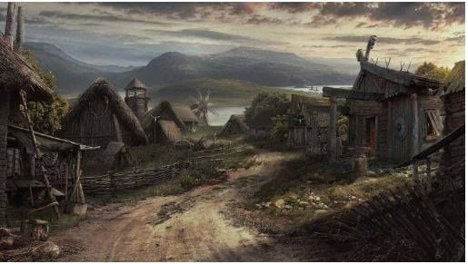
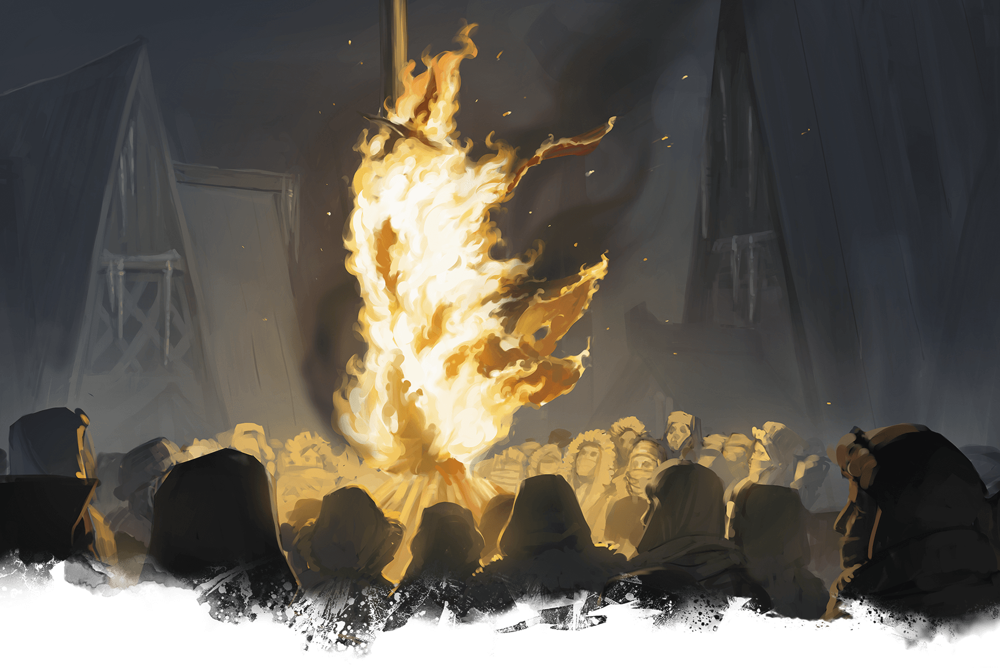

# Day 6

## Morning of Remorse

The morning sun brought no warmth for the adventurers as they found themselves outside the home of the grieving mother. Taking a collective breath, they entered the humble dwelling.

Inside, the mother sat, her eyes red from tears, yet vacant—as if the tears had long since drained her of emotion. The room was thick with an unspeakable grief.

"We've come to tell you what happened," Vaxidd began, his voice quivering despite his attempt at stoicism. "We wish to share the truth with you, in the hope that transparency may offer some small solace, though it cannot bring back your son."

Each member of the party took turns explaining their encounter with the Nothic, the decision they made to spare its life, and their deep regret that this choice had contributed to her son's death. Mortimer's eyes were particularly moist as he concluded, "We are so profoundly sorry. Our actions—or lack thereof—cost you dearly, and we bear the weight of that."

The mother stared at them, her gaze piercing but unfocused. "You come to my home with words," she said flatly, her voice tinged with bitterness. "Words do not bring back the dead."

"We understand that we can't undo what has happened," Orianna added gently, her voice carrying a sorrowful melody. "We wish we could, but we can't. All we can do now is to make sure it never happens again."

"You think that comforts me?" The mother's voice wavered between grief and anger. "Leave my home."

The adventurers retreated, their spirits broken, yet understanding the magnitude of her loss. Each step away from her door felt like a weight added to their already burdened hearts.

## The Burning Pyre

The town square was unusually quiet for what was to be a public execution. A large pyre was erected at the center, and upon it, the Nothic was bound and blindfolded. Its raspy voice broke the silence, "Was promised food! Not this! Was promised!"

The crowd's emotions were mixed. There were those who wanted the Nothic dead, a necessary end to the threat it posed. Others whispered amongst themselves, uncomfortable with the idea of executing a creature that was as much a victim of dark magic as the people it had endangered.

As the adventurers stepped into the square, the weight of the impending execution filled the air, made heavier still by the Nothic's insistent cries. Vaxidd locked eyes with the creature for a moment, its blindfolded gaze filled with confusion and fear.

"We had a choice back then, and we've got another choice now," Vaxidd muttered to his companions.

Orianna looked at the bound Nothic, then back at her friends. "What are we going to do?"

Mortimer, still nursing the pain from their recent visit, said, "We can't undo our past mistakes, but we can make a decision now that might bring about some form of justice, or at least understanding."

The Nothic, seemingly sensing their deliberation, continued to plead. "Didn't kill the youngling! Was promised food! Not my fault!"

Sheod pulled an arrow from his quiver and stared at it contemplatively. "Are we going to intervene? And if we do, what then? What place do we have in deciding its fate?"

The crowd became restless, the time for the pyre to be lit was near. The adventurers exchanged glances, each one's face etched with the weight of the decision before them. And in that heavy silence, they knew that the choice they made would echo in the lives of everyone involved, for better or for worse.

Mortimer took a deep, steadying breath as he stepped forward, gripping his staff tightly in his hands. He struck the staff on the cobblestones with a force that emanated a thunderous sound, filling the air with its rumbling resonance.

"SILENCE!" he bellowed, his voice carrying across the square and hushing the murmurs.

Heads turned, eyes met his, and in that moment, the crowd gave him their undivided attention.

"We owe you the truth," Mortimer began, his voice quivering but determined. "We, the so-called champions of this town, are responsible for the tragedy that has befallen us. We left the Nothic alive, believing it was not an immediate threat, believing that perhaps it could change. Our judgment was flawed. The young boy—may his soul rest—paid the price for our foolishness. We stand before you, not as heroes, but as people who erred gravely. I ask you all...can you ever forgive us?"

His words hung in the air like a thick fog, and as he spoke, the faces in the crowd showed a range of emotions—from understanding to resentment, from pity to pure rage.

Before anyone could respond, a ruckus erupted from the pyre. The Nothic had managed to wriggle enough to shake off its blindfold. Its single eye glinted menacingly as it looked around. With a terrifying screech, it unleashed a burst of psychic energy, disintegrating a villager in the front row. Screams filled the air, the crowd scattering in panic.

In that moment, regret and hesitation vanished from Mortimer's being. He extended his staff toward the creature and chanted an incantation. A bolt of fire sprang from the staff, igniting the pyre instantly.

At the same moment, Sheod nocked an arrow, his aim true despite the chaotic scene. The arrow flew through the air, striking the Nothic's eye. Blinded and pained, the creature let out a bone-chilling scream, its words still lamenting its fate. "Was promised food! Not fai—"

The flames consumed the Nothic, cutting off its words and its life. Its screams faded into the crackling of the burning wood, its form reduced to ashes.

Amidst the chaos, as the Nothic's screams died down and the crowd erupted into arguments, Mortimer felt himself being bumped. His attention had been firmly on the Nothic and the fire, but now he turned to see what had jostled him.

There, atop one of the nearby buildings, stood the enigmatic Drow Nezz. Her violet eyes gleamed with a mischievous spark as she effortlessly manipulated the three vials he had carried: mercury, dragon bile, and powdered nightshade. With an incantation, she mixed them, creating an eerie, iridescent concoction.

Before anyone could react, Nezz threw the vial towards the ground with practiced precision. The moment the glass shattered, an explosion of magical energy rippled through the square. From the remnants of the vial, a gruesome entity emerged—the Dragonblood Ooze.

The congealed blood of a dragon, imbued with dark magic, had taken form. However, its attempts to shape itself into a draconic form were twisted and unstable. It quivered and trembled, constantly shifting, as if attempting to don the guise of a dragon but failing miserably.

In a bizarre display of its confusion, the ooze attempted to manifest a breath weapon, but instead, it spewed forth a part of its own body, which it quickly reeled back in with a disgusted squelch.

The party, still reeling from the events surrounding the Nothic, now found themselves facing this bizarre monstrosity.

"Weirdest. Monster. Ever!" Orianna exclaimed between musical flourishes.

Vaxidd, resolute in his role as protector, couldn't help but chuckle as he blocked a particularly erratic lunge from the ooze. "At least it's as confused as we are!"

Sheod, with a smirk, quipped, "This thing should audition for a shape-shifting contest!"

Mortimer, despite his prior moral turmoil, flung firebolts towards the shifting target. With a determined grimace, he also cast an enchantment upon his owl familiar. Now, the owl was capable of shooting lightning bolts from its beak. A mischievous grin crept onto Mortimer's face as he muttered to himself, "Take that, you quivering mess!"

Sheod, a hint of disbelief in his eyes, drew his bow and fired arrows at the ever-shifting form of the ooze. "I thought we've seen it all," he muttered to himself.

Vaxidd, with his unwavering determination, positioned himself in front of his friends, shield raised high. "Stay behind me! I'll keep it at bay!" Orianna, the bard with a talent for magic, unleashed a flurry of musical notes that reverberated through the air, empowering her allies and resonating with the chaos of the ooze.

Mortimer, his owl familiar now an instrument of lightning, couldn't resist a final taunt. "Time to zap some sense into it!"

Vaxidd's shield clashed with the amorphous body of the Dragonblood Ooze, causing ripples to traverse its jelly-like surface. The creature tried to shape itself into something resembling a dragon's maw, attempting to chomp down on Vaxidd. However, the magical shield seemed to sizzle upon contact, forcing the ooze to recoil.

"Incorporate this, you slithering pile of goo!" Vaxidd roared, driving his hammer into the creature. As if struck by the force of his conviction, the ooze shivered, splattering globs of itself away from its core.

From a distance, Mortimer channeled another firebolt through his staff. The spell hurtled through the air with an infernal hiss, colliding with the ooze and turning part of its body into a splash of evaporating liquid. His owl familiar, empowered by the earlier enchantment, took to the skies. With a majestic beat of its wings, it ascended above the chaotic battlefield before swooping down like a bolt of feathery lightning. A crackling discharge emanated from its beak, jolting the ooze.

"This is a real hoot, isn't it?" Mortimer chuckled, his eyes gleaming with the flash of the spell.

Sheod, aiming carefully, loosed an arrow enshrouded in a glimmering magical aura. It pierced the ooze and emerged from the other side, leaving a tunnel-like void in its wake. "Pin the tail on the ooze!" Sheod announced, grinning from ear to ear. His eyes flicked to Orianna, who was strumming her lute with a frantic energy.

Each note that poured from Orianna's lute seemed to strike the ooze like a physical blow, vibrating its form as if disrupting its very essence. A crescendo built, each chord amplifying the attacks of her companions.

"And now for the finale," she said, striking a powerful chord that unleashed a visible wave of force, causing the ooze to quiver uncontrollably.

Seizing the moment, Mortimer, Vaxidd, and Sheod combined their attacks. Firebolts, arrows, and hammer strikes converged on the ooze in a coordinated flurry. The creature let out a noise—half growl, half screech—as it lost its form entirely, splattering onto the ground as nothing more than a lifeless puddle.

Just then, a shadow darted across the rooftops. It was Nezz, the elusive Drow. With no time to lose, Vaxidd sprinted ahead, his eyes locked onto his elusive target. Just as he was about to leap and tackle her, Nezz turned and murmured an incantation. A wave of magical energy enveloped Vaxidd. "Why don't you take a rest, you look so tired?" quipped Nezz. His eyes glazed over, and he sat down, as if in a trance, his hammer slipping from his grasp. "Yes... so tired, I'll rest for a bit"

"Vaxidd!" Sheod shouted, releasing an arrow in a fluid motion. The missile found its mark, embedding itself in Nezz's calf. She staggered but remained upright, cursing under her breath.

Mortimer, seizing the moment, stretched out his hand and chanted an incantation. The earth beneath Nezz quivered, then disappeared, leaving a gaping pit. With a cry of surprise and anger, she plummeted into the hole.

Both Sheod and Mortimer reached the pit's edge, peering down to see Nezz scowling up at them. Their hearts were pounding, not only from the battle but from the realization that they had just engaged with a foe who was likely far more dangerous than any they had faced before.

Orianna approached the pit's edge, lute in hand, and looked down at Nezz who was still scowling despite her precarious situation. "How about we lighten the mood?" she mused, strumming a unique set of chords on her lute. As she played, the air seemed to fill with an ethereal echo, forming an almost tangible aura of levity.

"In a cavern full of goblins," she began, her voice magically amplifying the punchline, "why did the goblin chef get kicked out? Because his food was always a little too 'stew-pid'!"

The magical reverberations of the joke intertwined with the melody, descending into the pit like a warm breeze. Nezz's expression contorted, fighting against the magical compulsion, but then broke into an involuntary, raucous laughter. Her laugh was so loud and forceful it was almost maniacal, echoing off the walls of the pit.

Seizing the opportunity, Sheod nimbly climbed down into the pit with a length of rope. He skillfully looped it around the still-laughing Nezz, his hands working quickly to form ranger knots—complex and nearly unbreakable.

Once satisfied with his handiwork, he climbed back out, and with Vaxidd now recovering from the charm, they pulled Nezz out of the pit and set her down. Her laughter subsided, but the knot held strong.

"Now," Mortimer started, pointing his staff at her, "you will tell us what you're doing here, the location of Cragmaw Castle, and why you've taken an interest in our affairs."

Nezz smirked. "Why would I tell you anything? You're the fools who let a monster kill a child. What makes you think you can handle what lies ahead?"

"We can handle more than you think," Vaxidd retorted, still a bit shaken from her charm spell. "But the question is, can you handle us?". Sheod tightened his grip on his bow. "Speak, or the next arrow might not be aimed at your leg."

For a moment, it looked like Nezz might actually comply, but just then, her hand wiggled free enough to grab a ruby pendant around her neck. Before anyone could react, she muttered a quick incantation. In an instant, her form turned blurry, as if she were made of mist, and then she vanished.

They stood there, their eyes meeting in disbelief and frustration. Nezz was gone, but the air was thick with the implication of her presence and the unanswered questions she left behind. The tension in their group was palpable—each of them knew that whatever lay ahead in their quest, the stakes had just gotten much higher.

## The dust settles

The sun dipped beneath the horizon as the villagers worked side by side with the champions to clear away the smoldering remnants of the pyre and the ooze's acidic puddles. The atmosphere was still thick with tension, but the appreciation for their heroic efforts was unmistakable. Grateful nods and subdued thank-yous filled the air, their emotional weight just as meaningful as any effusive praise.

Feeling the ache in their bones and the toll of their moral and physical trials, the champions finally retired to Orianna's Inn. As they stepped into the warm glow of the hearth, each sank into a chair with palpable relief. A round of ale arrived courtesy of a grateful barmaid, foamy heads overflowing in their mugs.

"So, what now?" Sheod asked, setting down his mug and looking at the others. "That Drow is still out there, and we know she's connected to Cragmaw Castle and this 'Spider' character."

Orianna strummed her lute softly. "We must go to the castle. I don't know what awaits us there, but I sense that the threads of this wicked web originate from that place."

Vaxidd nodded, his jaw set firmly. "Agreed. But we need information, a plan. We can't just waltz into enemy territory unprepared."

Mortimer pondered, staring into the flames of the hearth. "Perhaps we should seek out those goblins we encountered earlier. We let them go in exchange for information, and they owe us. Maybe they can provide more insight into the castle's location."

The idea met with unanimous approval. Exhausted but resolute, they each retired to their rooms to prepare for the next leg of their journey.