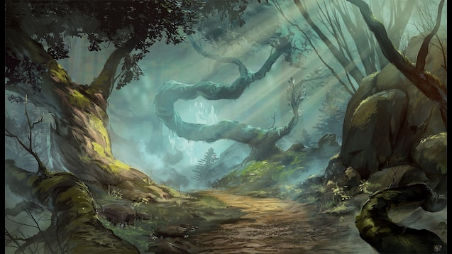

# Day 5

## An unusual encounter

As the morning sun cast its golden rays upon the adventurers' path towards Conyberry, a distressing cry pierced through the tranquil ambiance of the forest. The sound, a desperate plea for help, tugged at their hearts and beckoned their attention.

Sheod, his newfound ability to communicate with animals still fresh in his mind, turned his head, his ears attuned to the cries. His eyes widened with recognition as he deciphered the distress call—an anguished squirrel in need of assistance. Without a moment's hesitation, he broke away from the group, determined to investigate and offer aid.

Pushing through the thick underbrush of the swampy forest, Sheod's heart pounded with a mix of apprehension and curiosity. And then, amidst the tangled foliage, he beheld a sight that defied all logic and reason—a squirrel, not of its usual diminutive size, but towering as tall as a human. Its plump cheeks were filled to the brim, a testament to its foraging efforts.

Yet, the surreal scene quickly turned dire as Sheod's eyes followed the desperate creature's gaze. A colossal snake, its scaled body coiled and ready to strike, loomed nearby. The creature's size was a spectacle in itself, stretching to a staggering two meters in length, its girth rivaling that of a mighty tree trunk.

Sheod's instincts kicked into overdrive as adrenaline surged through his veins. He swiftly notched an arrow onto his bowstring, taking aim with the precision of a practiced archer. With a steady hand, he released the projectile, the arrow finding its mark with unerring accuracy, striking the snake's scaly hide.

A cry for aid erupted from Sheod's lips, his voice carrying a mix of urgency and determination. "Help! I've found a massive snake attacking an unusually large squirrel! We must act swiftly!"

Mortimer, Vaxidd, and Orianna, startled by Sheod's urgent plea, snapped into action. 
Mortimer quipped “Ah, Sheod, the protector of the fluffy-tailed kingdom. I can see it now, a squirrel monarchy with acorn crowns and tree stump thrones. All hail King Sheod, ruler of the Nutlands!”

With a surge of purpose, the trio raced through the swampy terrain, their footsteps splashing through muddy puddles. Vaxidd, his righteous fury ignited, clutched his warhammer tightly, prepared to face the monstrous snake head-on. Orianna, her agile form moving with grace, unsheathed her lute, ready to lend her dexterous skills to the fray.

As they arrived on the scene, their eyes widened in astonishment at the bizarre tableau before them. The squirrel, though frightened, held its ground with surprising courage, its eyes pleading for salvation. The snake, wounded but still dangerous, hissed with venomous intent.

With adrenaline coursing through his veins, Vaxidd unleashed a battle cry, his warhammer cleaving through the air with a mighty swing. It connected with a satisfying thud, shaking the very ground beneath them. "Take that, you scaly menace!" he exclaimed, a victorious grin spreading across his face.

Orianna, her lute humming with arcane power, stepped forward with a mischievous glint in her eyes. Her fingers danced along the strings, weaving a spell of cutting words. With each word she sang, the air seemed to thicken with a subtle enchantment, the very essence of her insults striking at the snake's confidence and competence.

As the battle unfolded, Mortimer, ever the resourceful spellcaster, reached into his robe's inner pocket. From within emerged a furry white ball, transforming before their eyes into a majestic owl. He whispered ancient incantations, infusing the owl with potent arcane energy. The owl soared gracefully above the giant snakes, its wings trailing trails of mystical light. With a sudden burst, it unleashed a torrent of crackling lightning, searing and electrocuting the serpentine foes.

The startled squirrel took advantage of the distraction, darting away from the snakes with a renewed sense of freedom. However, the snakes, undeterred, pursued their prey onto dry land, slithering relentlessly in their pursuit. Vaxidd, his determination unwavering, brought his warhammer crashing down upon one of the snakes, its scales yielding to the forceful blow. Sheod, an arrow poised in his bow, released it with unerring accuracy, piercing the flesh of another snake.

Mortimer, emboldened by his newfound prowess, held his hand aloft, a small indicator glowing with arcane energy. With a resolute shout, he unleashed a fiery projectile, a scorching orb hurtling toward the remaining snake. The projectile erupted in a brilliant display of flames, enveloping the serpent in a fiery embrace.

As the defeated snakes writhed and succumbed to their wounds, the adventurers stood triumphant amidst the aftermath of their fierce battle. Panting heavily, they exchanged glances of pride and relief, a camaraderie forged through shared danger.

"Well, I'd say we made quite the team, wouldn't you?" Vaxidd chuckled, wiping sweat from his brow.
Orianna smirked, her lute still humming with residual magic. "Indeed, our insults were truly cutting this time."
Mortimer grinned, his owl familiar perched on his shoulder. "Looks like I've found my groove. Fiery projectiles seem to be my calling."
Sheod, his bow in hand, nodded appreciatively. "We fought well together. And I must admit, Mortimer, your newfound affinity for owl-induced lightning was quite impressive."

As the group cautiously approached the distressed squirrel, they observed its seemingly harmless appearance, its cheeks engorged with something peculiar. With a sudden burst, the squirrel expelled two lifeless bodies, revealing them to be elves clad in vibrant circus attire. The adventurers recognized them instantly as members of the famed Jumping Wood Elves, a troupe known for their acrobatic feats and daring performances.

A mix of shock and sorrow washed over the party as they inspected the lifeless forms of the fallen elves. The realization of their tragic fate weighed heavy upon their hearts. The elves' colorful costumes, now stained with dirt and blood, told a tale of a wandering circus act disrupted by unforeseen circumstances.

Vaxidd's voice broke the silence, his tone somber yet resolute. "These performers deserved a proper farewell. Let us build a pyre and give them a respectful send-off." The others nodded in agreement, recognizing the importance of honoring the fallen.

With a collective effort, the adventurers gathered wood and constructed a pyre in a suitable clearing nearby. They carefully laid the bodies of the two wood elves upon it, their limbs arranged with care and reverence. Mortimer, his voice tinged with sadness, uttered words of farewell and remembrance, his magical incantations lending an ethereal quality to the air.

As the flames began to consume the pyre, casting a warm glow upon the surrounding area, the group stood in solemn silence, paying their respects to the departed souls. Their promise to return the money they had discovered among the elves' possessions echoed in their minds, a testament to their integrity and the bond they shared.

Orianna's gaze lingered upon the cloaks of billowing, a glimmer of curiosity dancing in her eyes. "These cloaks hold an enchanting charm," she remarked, her voice filled with intrigue. "While wearing them, we can command them to billow dramatically, adding a touch of flair to our presence."

Vaxidd's lips curled into a bittersweet smile. "Perhaps, in their memory, we can carry a piece of their performance with us," he suggested. "Let these cloaks serve as a reminder of the joy and artistry they brought to the world."

With the pyre now reduced to flickering embers, the adventurers took a moment to collect themselves, their thoughts turning to the ongoing journey that lay before them. They carefully gathered the sack of golden coins, a small token of remembrance for the fallen elves, and vowed to return the wealth if they were to encounter any surviving relatives in their travels.

Bound by a shared commitment to honor and camaraderie, the group resumed their path, the cloaks of billowing adorning their shoulders and the memory of the Jumping Wood Elves forever imprinted in their hearts. With every billow of their cloaks, they would carry the spirit of the fallen performers, a testament to the indomitable nature of the human spirit and the power of unity in the face of adversity.

## Attacked by skeletons during the night

As the night settled in and the weary adventurers prepared to rest, Vaxidd, Mortimer, and Orianna took their positions for the first watch. Sheod, with his elven nature and unique meditation practice, found solace atop a nearby tree, ever vigilant and ready for any danger that might arise.

In the stillness of the night, a cacophony of sounds reached Sheod's keen ears. The rhythmic marching of feet blended with the bone-chilling clatter of skeletal creatures, unsettling the tranquility of the surroundings. He quickly scanned the area, alerting his companions to the approaching threat.

Mortimer, jolted from his drowsiness, snapped into action. His mind raced with possibilities as he summoned his arcane abilities. With a flick of his wrist, he conjured an illusion of a towering and enraged barbarian, the illusionary figure brandishing a menacing log. Through the power of his telekinesis, the log appeared to be wielded with lethal force, giving the illusion life.

The sound of marching ceased, momentarily halted by the sight of the intimidating illusion. Arrows whistled through the air, finding their mark in the illusion's form. Mortimer's illusory creation absorbed the projectiles, mimicking the impact of real arrows striking a flesh-and-blood adventurer.

Sensing the opportunity, Vaxidd charged forward with unyielding resolve. Sheod and Orianna moved with calculated precision, flanking their paladin companion. Their weapons sliced through the air, clashing against the skeletal foes with a resounding clash. The clash of steel against bone echoed through the night as they engaged in a fierce battle.

Mortimer's attention turned to his loyal familiar, an owl perched nearby. With a touch and a whispered incantation, he bestowed upon the owl the power to unleash a cone of magical fire. The familiar took flight, soaring above the battleground. With a graceful sweep of its wings, the owl unleashed a blazing inferno upon the approaching skeletal horde, reducing their brittle forms to charred remnants.

The skirmish unfolded with a dance of steel and magic. Vaxidd's hammer found its mark, pulverizing the skeletal adversaries with each mighty swing. Sheod's arrows whistled through the air, striking the weak points of their bony frames. Orianna's bardic magic resonated, empowering her allies and striking fear into the hearts of their foes.

The battle was fierce, but the adventurers fought with unwavering determination. The skeletons, once a formidable force, were reduced to shattered bones and smoldering ashes. Their numbers dwindled with each well-placed strike and devastating spell.

As the final skeleton crumbled to the ground, silence settled over the battleground. The adventurers stood amidst the remnants of their fallen enemies, their breaths ragged and hearts pounding with the adrenaline of victory. The night air whispered their triumph, carrying the echoes of their valiant efforts.

With a mixture of relief and satisfaction, the group regrouped, taking a moment to catch their breath and assess the aftermath of the skirmish. The bones lay strewn across the forest floor, a testament to their prowess and teamwork.

"We make quite the formidable team, don't we?" Mortimer quipped, a hint of pride in his voice.

Vaxidd, wiping the sweat from his brow, offered a smile of camaraderie. "Indeed, my friends. Our unity and skill have once again proven victorious."

Orianna nodded, her eyes gleaming with admiration for her companions. "Together, we can face any challenge that comes our way. The night may be dark, but our spirits shine bright."

The adventurers took a moment to bask in their hard-earned triumph, knowing that their journey would continue, fraught with both peril and glory. With renewed determination, they readied themselves for the road ahead, their bond forged stronger through the crucible of battle.

## A decoy

The distant sound of marching skeletons grew louder, a chilling reminder of the relentless pursuit behind them. Panic gripped the hearts of the adventurers as they realized the impending danger. With fear guiding their actions, they darted through the dense forest, their feet pounding against the earth with desperate urgency.

Sheod, ever quick-witted, had a spark of inspiration amidst the chaos. "I have an idea!" he shouted to his companions, a glimmer of determination in his eyes. "I'll serve as a decoy and draw them away. Mortimer, lend me a hand!"

Mortimer, his mind a whirlwind of arcane possibilities, unleashed his magical prowess once more. With a wave of his hand, a magnificent horse materialized before them, its form ethereal and radiant. The unexpected sight elicited a mix of surprise and admiration from the rest of the party, their trust in Mortimer's extraordinary abilities solidifying.

With a nod of agreement, the adventurers split into two groups, their destinies intertwined yet divergent. Mortimer, Orianna, and Vaxidd set off on the main road towards Conyberry, their steps resolute and their determination unyielding. Sheod, on the other hand, veered off in the direction of Phandalin, his plan to serve as a tantalizing lure for the encroaching skeletal horde.

Sheod's heart raced as he pushed his physical limits, his senses attuned to the approaching threat. Drawing nearer to the relentless march of skeletons, he skillfully weaved through the treacherous terrain, a dance of evasion and misdirection. His ranger instincts guided his every move, enabling him to outmaneuver his relentless pursuers, leading them astray from his comrades.

Meanwhile, the rest of the party, their hearts heavy with concern for Sheod's safety, raced forward, their feet pounding against the earth. They pushed through exhaustion, their determination fueled by the knowledge that their fates were intertwined. The outskirts of Conyberry beckoned like a beacon of respite, a temporary sanctuary amidst the encroaching darkness.

Finally reaching the relative safety of Conyberry's outskirts, Mortimer, Orianna, and Vaxidd paused to catch their breath. A mixture of relief and worry filled the air, their minds filled with thoughts of Sheod's perilous journey. They knew they must wait, giving Sheod the time needed to circle back and reunite with their band of adventurers.

As the sun set and rose once again, Sheod maneuvered with calculated precision, his senses attuned to the movements of the skeletal horde. With a deft display of skill and ingenuity, he steered the relentless pursuers in the wrong direction, exploiting their lack of sentience to his advantage. The shadows became his ally as he navigated through the undergrowth, each step bringing him closer to his comrades in Conyberry.

Finally, the long-awaited moment arrived. Sheod emerged from the forest, a triumphant smile upon his face. He had successfully eluded the skeletal horde, employing his ranger skills to navigate the perilous landscape. The weary adventurers greeted him with a mixture of relief and admiration, their bond strengthened by their collective triumph over adversity.

As the weary adventurers gathered in Conyberry, their exhaustion palpable, Mortimer couldn't help but interject with a lighthearted remark, aiming to lighten the mood.

"Phew! Sheod, I must say, you really know how to take a scenic detour," Mortimer chuckled, his eyes twinkling mischievously. "I mean, who needs a grand entrance when you can lead a parade of skeletons, right?"

Sheod let out a good-natured laugh, his fatigue momentarily forgotten. "Ah, you've got me there, Mortimer. I always aim for the unconventional approach, even when it comes to skeleton escorts. Keeps things interesting, don't you think?"

The rest of the party joined in the laughter, and the weight of their recent trials felt a little lighter. With renewed determination, the adventurers settled into a momentary respite, their spirits emboldened by their unwavering resolve. They knew that their paths would intersect once more, their destinies forever intertwined in the face of the challenges yet to come.

## Arriving at Conyberry

As the party steps into the eerie shelter formed by the twisted vines and ancient trees, a hushed silence envelops them. The air grows colder, and a faint flickering light dances in the shadows. A shiver runs down their spines as Agatha, the banshee, materializes before them, her ethereal form exuding an otherworldly presence.

"Foolish mortals," Agatha's voice echoes with a mixture of disdain and curiosity. "What brings you to this sacred place? Do you not know it is death to seek me out?"

Vaxidd, the charismatic paladin, steps forward, his voice steady and respectful. "Honored Agatha," he begins, holding out the silver comb bestowed upon them by Sister Garaele, "we come seeking guidance and knowledge. We bear a token of our respect and a symbol of our sincere intentions."

The banshee's piercing gaze softens for a moment as she examines the silver comb. A faint smile plays upon her spectral lips. "Very well," she concedes, her voice carrying an ancient wisdom. "You have shown yourselves to be worthy of my attention. Ask me one question, and I shall provide you with an answer."

Orianna, the inquisitive bard, steps forward, her eyes filled with curiosity. "Agatha, we seek the whereabouts of Bowgentle's spellbook. Can you reveal to us where it might be found?"

Agatha's ethereal figure leans closer, her eyes gleaming with an otherworldly wisdom. "Long ago, I traded the coveted tome to a necromancer named Tsernoth in the bustling city of Iriaebor," she divulges, her voice carrying the weight of forgotten years. "As for its fate thereafter, the knowledge eludes even me."

The adventurers absorb the information, their minds racing with thoughts and possibilities. Gratitude fills their hearts as they thank Agatha for her guidance. With a flicker of her pale form, she fades back into the ethereal plane, leaving them in the quiet shelter, the remnants of elven craftsmanship surrounding them.

Stepping out of the dome, the adventurers are greeted by the tranquility of Conyberry, the ruins of a once-thriving town. The forest seems to hold its breath, as if whispering ancient secrets to those who would listen. The air is heavy with a sense of mystery and lingering sorrow.

Vaxidd, his eyes gleaming with renewed determination, turns to his companions. "We have obtained the knowledge we sought," he declares, his voice filled with resolve. "Now, let us continue our journey, for there are still more mysteries to uncover and challenges to face."

The party bids farewell to the desolate ruins of Conyberry, their footsteps echoing through the silence. With each step, their hearts grow lighter, buoyed by the guidance of Agatha and the knowledge she imparted. They venture forth, their path clearer than ever before, eager to uncover the remaining secrets that await them in the vast realm of adventure.

## Back to Phandalin

As the sun begins its descent, casting an orange glow across the land, the adventurers make their way back to Phandalin. The familiar sight of the town on the horizon fills them with a sense of comfort and familiarity. However, their peaceful journey is abruptly interrupted by the sight of figures in the distance, stumbling and lurching with an unsettling gait. Zombies.

"By the gods!" Vaxidd exclaims, his eyes narrowing as he recognizes one of the undead figures. "Tharden... my cousin."

The party braces themselves for the battle ahead, their hearts heavy with the knowledge that they must face not only mindless abominations but also the remnants of their own kin. The clash is fierce, swords slashing through decaying flesh, and spells crackling with arcane energy.

Amidst the chaos, Vaxidd finds himself locked in combat with the zombified form of Tharden. Memories of their childhood together, of shared laughter and dreams, flood Vaxidd's mind. His heart aches with grief, torn between the duty to protect and the desire to preserve the memory of his cousin.

In a moment of somber realization, Vaxidd makes his choice. With tears in his eyes, he raises his warhammer high, calling upon the divine power bestowed upon him by Moradin, the dwarven deity. With a heavy blow, Tharden's undead form crumbles to dust, the spirit within released from its torment.

The battle rages on, Mortimer conjuring the might of his familiar's dragon breath, a blaze of fiery destruction that engulfs the remaining zombies. The creatures, once threats, are reduced to smoldering remnants, scattered across the battlefield.

As the dust settles, the party gathers together, a shared grief uniting them. Words are spoken in hushed tones, comforting gestures offered in silent support. They understand the weight of the choices made in the heat of battle, and the pain that comes with them.

"Sometimes the greatest act of mercy is to release those we love from their suffering," Mortimer says softly, his voice carrying a mix of compassion and wisdom. "Tharden may have been lost to us, but his spirit is now at peace."

A moment of silence follows, the weight of loss hanging in the air. Then, Orianna, the ever-optimistic bard, breaks the tension with a touch of levity. "Well, I guess we can say family reunions aren't always what they're cracked up to be," she quips, a faint smile tugging at the corners of her lips.

The tension eases, and a brief chuckle escapes the lips of the party members. It is in these moments, amidst the trials and tribulations, that the bonds between them grow stronger, forged in shared experiences and the understanding that they are not alone on their journey.

With heavy hearts and renewed determination, the adventurers continue their path towards Phandalin, knowing that there are still challenges to face and mysteries to unravel. Together, they will forge their own destinies and find solace in the strength of their unity.

The sun had set, casting a warm orange glow on the horizon as the party returned to Phandalin, heavy with the weight of their recent battle. The figures in the distance, emerging from the shadows just outside the town, caught their attention. As they drew nearer, the flickering light revealed the unsettling truth: zombies. Grotesque forms, once familiar faces, now twisted and menacing.

Vaxidd's heart skipped a beat as he recognized one of the zombies among them – his cousin, Tharden Rockseeker. It was a sight that struck a painful chord deep within him, a reminder of the perils of their journey and the horrors that could befall even those they held dear. Tharden's vacant eyes met Vaxidd's, but the spark of recognition was long gone.

The battle that ensued was fierce, a chaotic dance of steel and magic against the undead. Orianna's lute hummed with an otherworldly melody, enhancing the power of her words as they cut through the air like blades. Mortimer's owl familiar, fueled by arcane energy, unleashed torrents of flame upon the encroaching zombies. Sheod's arrows found their marks, each shot a testament to his skill with the bow. And Vaxidd, the paladin, fought with a determination that seemed to channel his sorrow into every swing of his hammer.

The tide of battle turned, with the adventurers slowly gaining the upper hand as their teamwork and resolve held strong. As half of the zombies fell, the clash between Vaxidd and the zombified Tharden became the focal point of the fight. Every strike felt like a stab to Vaxidd's heart, a brutal reminder of the twisted fate that had befallen his cousin.

Amidst the chaos, a moment of decision hung in the air. Vaxidd's grip on his warhammer tightened, his mind torn between avenging Tharden's fate and showing him mercy. In that moment, the divine connection he shared with Moradin, the god of his people, surged within him. With a heavy heart, he called upon that power, allowing divine energy to course through his weapon as he delivered a final blow.

Tharden's zombified form crumbled, his torment finally coming to an end. The battle drew to a close, the last of the zombies falling under the party's combined might. The air was thick with a solemn silence as they surveyed the aftermath of the fight.

Among the fallen, the party discovered clues that added a layer of mystery to the encounter. The bodies of the undead held unusual marks – arrows embedded in their flesh, but not the cause of their death. The diversity of the fallen was striking – two human redbrands, an Aracroka with a severed hand, and a Tabaxi with a vibrant red mohawk. It was a peculiar group, and the motives behind their transformation into zombies remained unclear.

With a shared determination, the party gathered the remains of the fallen, constructing a massive pyre. As the flames engulfed the bodies, a mix of emotions swirled within them – grief for those lost, uncertainty about the circumstances, and the unspoken camaraderie that had strengthened through their trials.

The crackling fire illuminated their faces, casting flickering shadows that danced upon their features. It was a moment of reflection, a reminder of the unpredictability of their journey, and a testament to their resilience in the face of darkness. The night was still, the echoes of their battle fading into the quiet of the town.

As the pyre burned down to embers, the party knew that their path was far from over. The mysteries surrounding the zombies and their unsettling origins demanded further exploration. But for now, they found solace in the unity forged through their shared experiences and the bond that had grown among them. And in that moment, amidst the remnants of the fire, they found a moment of respite, a chance to gather their strength before the next chapter of their adventure began.

## Arriving at Phandalin

As the party returned to Phandalin, the air felt heavy with a mixture of anticipation and sadness. News of a tragedy awaited them. The sheriff's son, the young boy they had saved alongside his mother, had met a grim fate. The very Nothic that they had left behind in the depths of the Redbrand hideout had claimed his life. The weight of the situation settled on their hearts, a stark reminder of the consequences their actions – or lack thereof – could bring.

The village, usually bustling with a peaceful atmosphere, now carried an air of tension. Adults walked with weapons at their sides, a stark contrast to the usual serene ambiance. A strange realization dawned on the adventurers – most of these weapons were the very ones they had retrieved from the Redbrands. Their efforts to rid the village of the ruffians had not only brought safety but had also armed the townsfolk.

Upon visiting the Local Merchant, gratitude radiated from her as she expressed her thanks for the adventurers' continuous efforts. Their heroic deeds had ignited a surge in business, with customers flocking to her shop to purchase the weapons and equipment the party had recovered. The store shelves, once barren, now gleamed with polished weapons and armor.

The news about the sheriff's son was somber. The young boy had ventured into the Redbrand hideout, driven by curiosity or perhaps a misguided sense of bravery, and paid the ultimate price. His loss cast a shadow over the village, a poignant reminder of the dangers that still lingered.

The Nothic's fate hung in the balance, and the village had decreed an execution at dawn. It was a decision met with mixed emotions, as the creature's presence had haunted the town for too long. While some viewed it as a necessary measure, others couldn't help but feel a tinge of sympathy for the tragic fate that had befallen the once-humanoid creature.

As evening descended, the party sought refuge at the familiar inn owned by Orianna's father. The warmth of the hearth and the camaraderie of their companions offered a bittersweet comfort. They shared the news of the Nothic with Orianna's father and Sister Garaele, confessing that they had allowed it to live – a decision that now carried unforeseen consequences.

