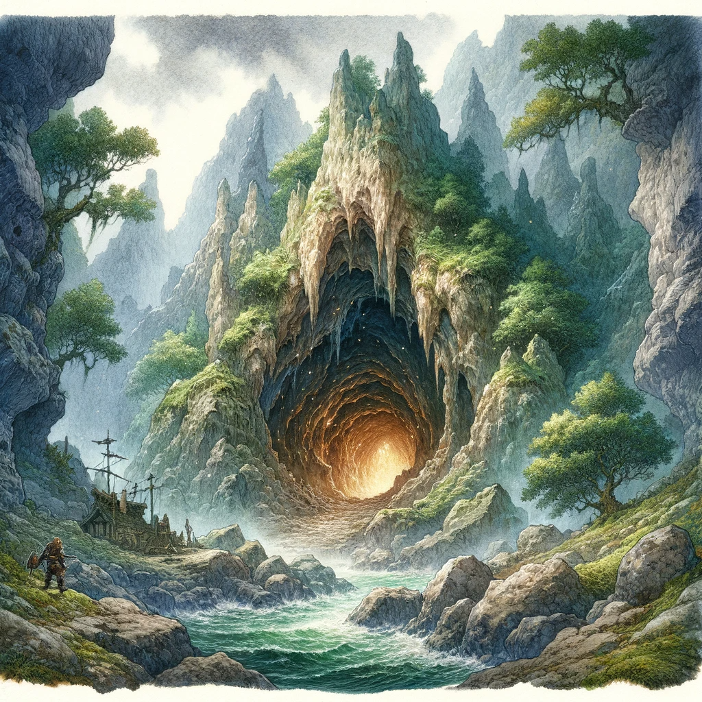
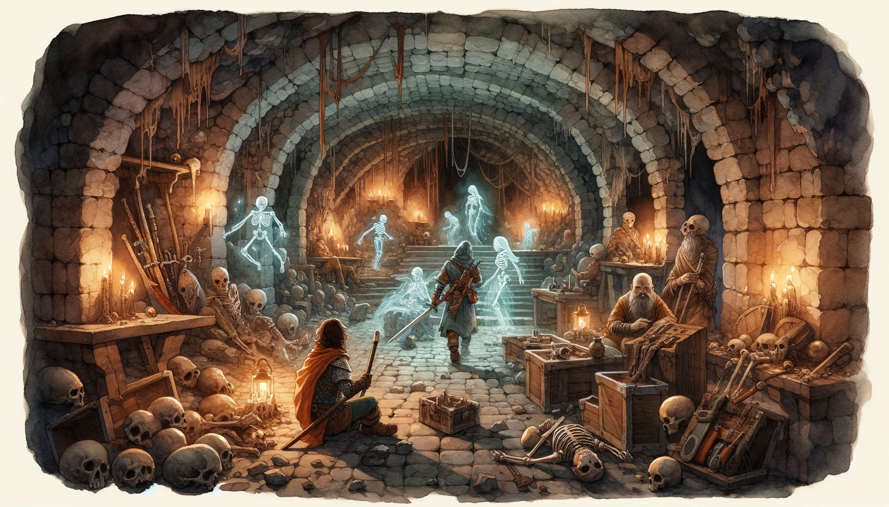
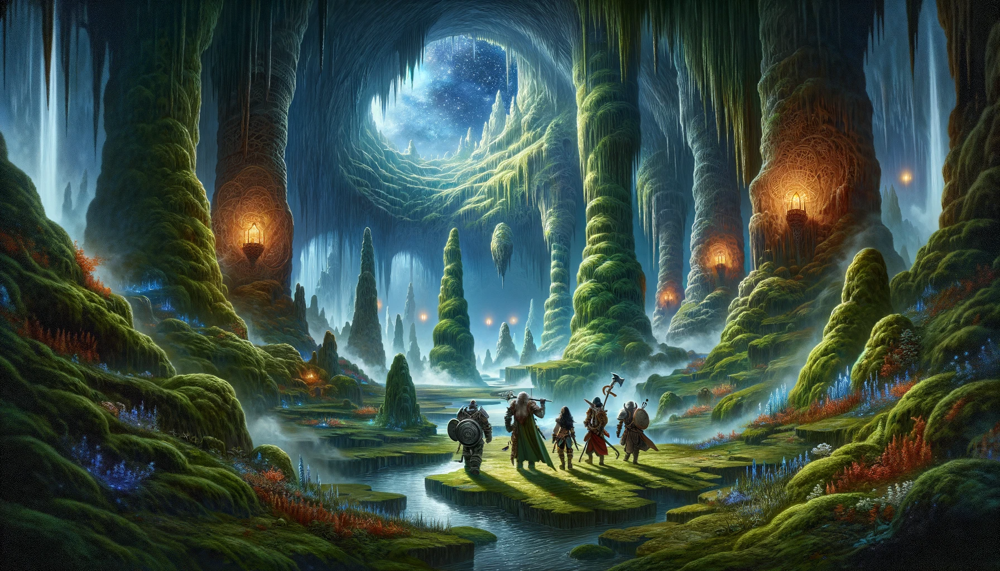
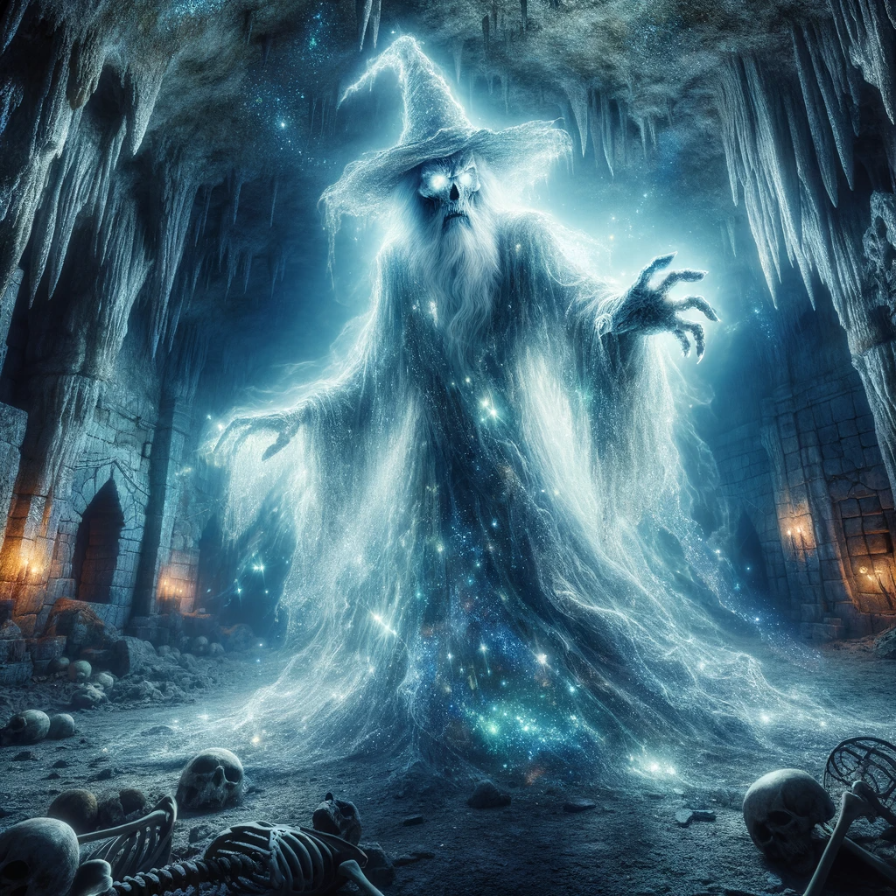

# Day 8

## To the Wave Echo Cave

As the party materialized within the narrow tunnel hidden in the foothills of the Sword Mountains, the abrupt transition from Phandalin's serenity to the dark, cavernous depths of the earth left them momentarily disoriented. Orianna, with her musical grace, was the first to regain her bearings. She looked around, her gaze sweeping the cavern that unfolded before them.

The entrance tunnel led them into a vast underground chamber, its boundaries marked by towering stalagmites that reached toward the heavens like ancient sentinels of stone. Natural pillars of rock supported the massive weight of the earth above, and the air was filled with the earthy scent of dampness and age. It was a stark contrast to the open skies and rolling hills they had grown accustomed to.

Sheod, always vigilant, took a cautious step forward, his keen elven senses alert to any potential threats. Vaxidd, the unwavering protector, held his shield high, ready to defend his companions. Mortimer, the enigmatic scholar, adjusted his spectacles and surveyed their surroundings with a mix of curiosity and trepidation.

The party's entrance didn't go unnoticed. In the western part of the cavern, behind a massive column of rock, their eyes fell upon an unexpected sight—three simple bedrolls and a haphazard collection of supplies strewn about. Sacks of flour, bags of salt, and casks of salted meat mingled with lanterns, flasks of lamp oil, pickaxes, shovels, and other mining gear. Among this utilitarian clutter lay the lifeless form of a dwarf miner, his fate sealed in the depths of the earth at least a week prior.

Orianna's expression shifted from curiosity to somberness as she recognized the tragic scene. "This was the campsite of the Rockseekers," she murmured, her voice carrying the weight of the realization. "Tharden... Gundren's brother," she added, the name spoken like a solemn epitaph for the fallen dwarf.

Vaxidd's eyes narrowed with determination. "And Nundro is the Black Spider's prisoner," he stated, his voice leaving no room for doubt. The fate of their friend and ally hung heavily in the air, a stark reminder of the urgency of their mission.

The supplies, while not particularly valuable, still held the potential for usefulness. The adventurers surveyed the assortment of gear, contemplating their choices. Mortimer, ever the pragmatist, examined the items with an eye for practicality. "These supplies might come in handy down the line," he remarked, his fingers tracing the outlines of pickaxes and shovels.

Amid the myriad of objects, a sturdy hemp rope caught Sheod's attention. It was tied off securely around a nearby stalagmite and dangled down the side of a ten-foot-wide, twenty-foot-deep pit that marred the northeastern section of the cavern. The pit was an ominous reminder of the dangers that lurked beneath the earth's surface.

With a nod of agreement, Orianna added, "That rope could be essential for our descent into the unknown. We should make sure to take it with us."

The party's options lay before them, illuminated only by the faint glow of lanterns and the dim light filtering through the stalactites above. The choices they made in this moment would determine the path they followed deeper into the heart of Wave Echo Cave, where the shadows of the past and the looming threat of the Black Spider awaited their arrival.

As the party stood on the precipice of the pit, uncertainty lingering in the air like a shroud, Mortimer couldn't resist the urge to inject a bit of levity into the situation. His voice, tinged with playful sarcasm, broke the silence that had settled over the group.

"Ah, you know, it's moments like these that make me truly appreciate my profession," he quipped, adjusting his spectacles with exaggerated theatrics. "I mean, who doesn't love spelunking in the pitch-black unknown with nothing but a few lanterns and the hope that gravity is on our side?"

Vaxidd, his stoic demeanor unyielding, gave Mortimer an unamused glance. "Quit your jesting, Mortimer. We have a mission to accomplish, and we can't afford any missteps."

Mortimer chuckled in response, his voice lighthearted despite the gravity of their situation. "Oh, come now, my dear paladin. I'm just trying to shed some light on the situation, or lack thereof. Besides, I can't see a thing down there. Perhaps our brave protector should lead the way, shining his beacon of righteousness into the abyss."

Vaxidd, ever the dutiful guardian, didn't need any more encouragement. He stepped forward, shield raised, and began the descent into the pit with resolute determination. The rest of the party followed suit, their lanterns casting flickering shadows on the cavern walls as they descended into the unknown depths.

Mortimer's jests may have added a touch of humor to their journey, but the looming presence of Wave Echo Cave and the weight of their mission were never far from their minds. With each step into the darkness, they drew closer to uncovering the secrets of the past and confronting the menacing threat of the Black Spider, their resolve unshaken by the challenges that lay ahead.

## The large room

The party ventured deeper into the heart of the cavern, their lanterns casting eerie shadows on the rough-hewn walls. The air was heavy with the weight of history and the lingering remnants of a battle fought long ago. As they reached the threshold of the old guardroom, the grim scene that unfolded before them spoke of the tragedy that had befallen the dwarves and orcs who once called this place their stronghold.

Splintered stone benches and piles of rubble lay scattered about, bearing witness to the violence that had torn through the chamber. Broken bunks and toppled weapon racks whispered tales of a desperate last stand. And amidst the debris, the skeletal remains of both dwarves and orcs lay as silent witnesses to the past.

The party approached cautiously, their eyes scanning the room for any signs of danger. It was then that the drow ranger, Sheod, took a bold step forward, crossing the threshold into the chamber. In an instant, the bones that had lain dormant for centuries began to stir, a macabre dance of reanimation.

Sheod retreated with lightning speed, the skeletons crumbling back down to the floor as if only the presence of the living awakened the skeletons. The adventurers stood at the precipice of a battle they hadn't anticipated, their weapons drawn and their resolve steeled.

"Well, that is certainly a bone-chilling encounter! But don't worry, folks, I've always believed in a fair fight – after all, it's only fair that we get all these nifty weapons, right?" Mortimer, the ever-cunning spellcaster, saw an opportunity amidst the chaos. With a flick of his fingers and a focused concentration, he summoned his telekinetic powers. One by one, the weapons, shields, and helmets that had once belonged to the fallen dwarves and orcs lifted into the air, hovering in a spectral display of force.

With delicate precision, Mortimer brought the weapons and equipment out of the room, each piece floating effortlessly into the waiting hands of the adventurers. Spirits high, they ventured back into the chamber, now facing a legion of unarmed skeletons.

The battle that followed was a testament to their teamwork and ingenuity. The skeletons, devoid of weapons, were no match for the champions as they fought with a coordinated effort that left no room for hesitation. Blades clashed, magic crackled, and the skeletal foes were dismantled one by one, reduced to lifeless bones once more.

As the last skeleton crumbled, the chamber fell silent, save for the ragged breaths of the victorious adventurers. They exchanged glances, a mix of relief and triumph in their eyes. The old guardroom, once a place of death and despair, had become a testament to their resourcefulness and resilience. With their newfound gear and a renewed sense of purpose, they continued their descent into the depths of Wave Echo Cave, ready to face whatever challenges lay ahead.

## The Poisonous Cavern

The adventurers cautiously entered the cavern, their senses alert to the strange and eerie environment that surrounded them. The fungi-covered floor stretched out before them, an otherworldly landscape of puffballs, shelf fungus, and towering stalks and caps. The occasional eerie green glow from the puffballs provided an eerie, ethereal illumination, casting long, shifting shadows that danced on the cave walls.

As they ventured deeper into the cave, the sound of distant waves grew louder, echoing through the subterranean chamber. It was a curious sensation, being so far below the surface yet feeling the presence of the ocean's relentless embrace.

Vaxidd, ever the stalwart guardian of the group, led the way, his armored boots making a soft but resolute thud with each step. He moved with caution, knowing that danger could lurk in the most unexpected places.

However, the cave had a treacherous surprise in store for them. As Vaxidd set his foot upon the fungal carpet that covered the cave floor, the air suddenly filled with noxious gas. It billowed up from the fungi, enveloping the adventurers in a choking haze. Vaxidd, with his robust dwarven constitution, resisted the worst of its effects, but the rest of the party wasn't so fortunate.

Coughing and spluttering, the adventurers found themselves poisoned by the toxic gas, their vision blurred and their movements sluggish. They knew they needed to act fast if they were to escape the deadly cloud.

Mortimer, always ready with a clever solution, called for the party to step aside. With a twinkle in his eye and a flourish of his fingers, he mimicked guns and began firing firebolts at the fungi. The fiery bolts of magic seared through the growth, igniting it in a spectacular display of flames. The burning fungi released even more gas into the air, creating a swirling vortex of fire and poison.

The adventurers watched with a mix of awe and concern as Mortimer's fiery path gradually cleared a safe passage through the cave. The noxious gas, while still present, began to disperse, allowing the party to breathe easier. It took several tense minutes, but the combined efforts of Mortimer and his magical flames had created a navigable path.

As the last tendrils of poisonous gas faded away, the adventurers were finally able to move forward, their steps cautious but determined. The eerie, phosphorescent glow of the remaining fungi cast an otherworldly light on their path, guiding them deeper into the mysterious cavern.

With their encounter with the poisonous fungi behind them, the adventurers pressed on, the waves of the hidden ocean growing louder with each passing moment. They knew that greater challenges and mysteries lay ahead, but they were undeterred, for they were the champions of Phandalin, and the call of adventure beckoned them ever onward.

## The Wizard

The adventurers entered the cavern with awe as the glittering minerals in the ceiling created a mesmerizing illusion of a starry night sky. The skeletons scattered across the floor and the battered stone buildings spoke of a past tragedy.

As they approached the northern building, its cracked doors loomed before them. Mortimer, with his usual enthusiasm, remarked, "Ah, it seems we've found ourselves a room with a view, friends. Shall we see what treasures or terrors lie within?"

Vaxidd, cautious but curious, took a step forward and replied, "We've faced our fair share of terrors. I say we proceed, but stay vigilant."

With a collective nod, they forced open the doors with a resounding creak. The room beyond revealed the aftermath of a destructive blast. Furnishings lay in charred disarray, but something caught their eye—a scorched iron chest near the foot of one of the beds.

Just as they began to investigate, a chilling presence manifested itself before them. Mormesk, the wraith, materialized out of the floor. His voice, like the whispers of the grave, filled the room.

"Your presence is offensive to me, your life forfeit. My treasures are mine alone, not yours to plunder!" Mormesk's words were laden with centuries of anger and hatred.

Orianna, ever the diplomat, attempted to reason with the vengeful wraith. "Mormesk, we don't seek to plunder your treasures. We're here for a different purpose. Perhaps we can come to an understanding."

Mortimer chimed in, his tone sly, "Yes, you see, we're quite the collectors ourselves. We value magic items, arcane knowledge, and scrolls. What do you say, old friend? A fair exchange?"

Mormesk regarded them, his spectral form wavering. "Very well, offer something of value in exchange for your lives."

As Mormesk hovered, Mortimer could not help but notice a large scroll in the corner on top of a dusty chest. As Mortimer's telekinesis gently lifted the large scroll from the dusty chest, Mormesk's ethereal form shivered with fury. He hissed through translucent teeth, "You dare touch what is not yours, thieves!"

Orianna, her voice trembling with unease, tried to reason with the enraged wraith. "Mormesk, we meant no harm. We merely saw something of interest. Perhaps we can—"

But her words were cut short as Mormesk, consumed by wrath, lunged at them with spectral claws extended. His touch sent a chill through their souls, and they knew that reasoning was futile.

The room erupted into chaos as the adventurers defended themselves from the vengeful wraith. Spells crackled through the air, and Mortimer summoned a protective shield to ward off the wraith's ethereal attacks.

In the midst of the frantic battle, Sheod, quick-witted as ever, noticed the specter's fixation on the stolen scroll. With a swift motion, he snatched the scroll from Mortimer's grasp and dashed towards the exit, luring Mormesk in pursuit.

The wraith, driven by an insatiable desire for the scroll, followed Sheod through the corridors of the building. As he gave chase, Mormesk's spectral form grew increasingly frenzied, his hatred for the intruders overshadowed by his single-minded pursuit of the stolen item.

Meanwhile, Vaxidd seized the opportunity, his warhammer gleaming with divine purpose. With a resounding cry, he swung his weapon with all his might, the force of his blow connecting with Mormesk's spectral form.

The wraith let out a guttural howl of anguish as the divine energy coursed through him. "You shall not escape, thief!" he wailed, but it was too late. Vaxidd's strike had found its mark, and Mormesk's form dissipated into an eerie mist, vanishing into the ether.

The room fell silent, save for the heavy breathing of the adventurers, their bodies still tingling from the encounter. With the wraith defeated, they turned their attention back to the stolen scroll, now safe in Sheod's hands, and contemplated their next move in the labyrinthine caves of Wave Echo Cave.

## The not beholder

## The bugbears

## The Temple of Moradin

## Interlude

## The Temple of Moradin

## return to Phandalin