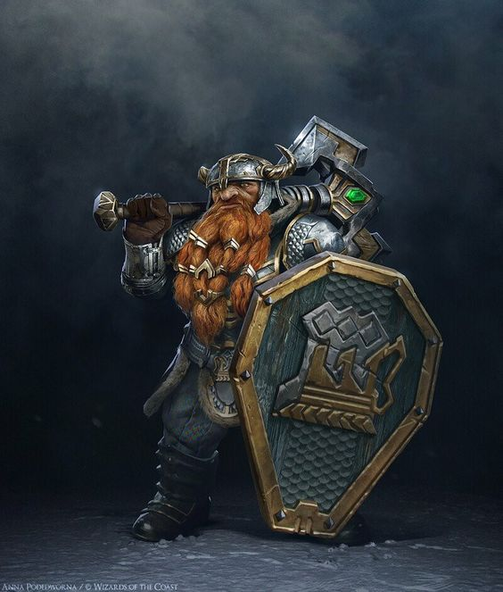

# Characters

## Orianna :material-guitar-acoustic:

{ width="300" }

Orianna is a 30-year-old Tiefling in the prime of her life. Her skin color is pink, her hair is dark purple, and her eyes are red. Standing at a width of only 1.65cm, Orianna has several differences compared to her siblings who have purple skin and much darker hair. However, they share the same eye color and horn shape.

As the only child in the middle of three siblings, Orianna dislikes being the youngest to help the party due to her overprotective family. Growing up, she was never allowed to be alone with other cubs or teenagers without one of her brothers nearby to ensure her safety.

Her family runs a tavern/station called Twilight Refuge's in Phandelven where she learned to sing, dance, and play the violin and flute with troupes that passed by. Her desire to learn about the world and adventurers she heard about in songs led her to finally convince her parents to let her go with a troupe at the age of 18.

During her travels with the troupe, Orianna had the opportunity to perform in various places and meet adventurers up to royalty. She eventually learned the art of being a bard and formed a friendship with Mortimer, a wizard who worked in the library of the academy of magic in Neverwinter as a librarian and scribe. Mortimer taught her various stories and legends of Mages and other adventurers who became great heroes in all corners of the world.

It was from Mortimer that Orianna met Gundram Rockseeker, a nomadic dwarf trader, and Vaxidd, a paladin who happened to be Gundram's cousin. Orianna didn't know much about them, but Mortimer respected them, so she did the same.

Several years later, Gundram contacted Mortimer with an unusual request. He needed a security escort for a caravan carrying goods and believed that Orianna and a few other adventurers were the right people for the job. Initially hesitant, Orianna agreed to go when she heard that they would pass through Phandelven. She missed her family and hoped to find inspiration for another song during her adventure.

## Mortimer :material-wizard-hat:

{ width="300" }

Mortimer is a 54-year-old human with a lean and wiry build. He has a scholarly and unassuming figure, with a hint of hidden strength and a keen intelligence lurking behind his unassuming facade. Despite his age, he moves with a surprising grace and agility. He stands tall at 6’, with a slightly stooped posture from years spent hunched over books and parchment. His face is lined with wrinkles, evidence of a life spent indoors under the dim light of candles and oil lamps. His hair is a greying brown colour, long enough to reach his shoulders. He wears it in a simple braid to keep it out of his face.

Mortimer's eyes are his most striking feature - they are a piercing blue colour, bright and inquisitive. They seem to sparkle with a mischievous glint, hinting at the sly wit and wry humour that lies beneath his serious demeanour. Despite his width and lean build, Mortimer is deceptively tough.

Mortimer was born on the outskirts of the large city of Neverwinter, the only child of a poor family. From a young age, he displayed an aptitude for magic, but he never had much ambition. His parents struggled to provide for their family, and Mortimer was often left to his own devices. He spent much of his childhood wandering the woods and fields outside the city, practising magic in secret and dreaming of a better life.

When Mortimer was fifteen, he caught the eye of a wealthy merchant who was passing through the area. The merchant recognized Mortimer's potential and offered to sponsor his education at the magical academy in Neverwinter. Mortimer's parents were overjoyed at the opportunity, and Mortimer himself was excited to finally have a chance to develop his magical abilities.

Mortimer excelled at the academy, but he never quite fit in with the other students. He was quiet and reserved, and he spent most of his free time in the library, poring over ancient tomes and manuscripts. After graduating, he was offered a job as a scribe and librarian at the academy, and he accepted without hesitation.

For the next thirty years, Mortimer lived a quiet and uneventful life in Neverwinter. He spent his days cataloguing and organising the academy's vast collection of magical texts, and his nights practising his spells in the privacy of his own home. He never married or had children, and he rarely left the city except to visit his ageing parents on the outskirts.

One of Mortimer’s friends is a dwarf named Gundram Rockseeker, who works as a travelling merchant and occasionally brings rare tomes and spellbooks to store in the academy library. Mortimer and Gundram have been close since they met at the academy many years ago, and Mortimer values Gundram's expertise in matters of magic and lore.

Another of Mortimer's friends is Vanessa, a bard who frequents the academy to share stories and ideas for new texts to be stored in the library. Vanessa and Mortimer have a mutual respect for each other's craft, and Mortimer often finds himself inspired by her creative energy.

Lastly, Mortimer is also acquainted with Gundram's cousin Vaxidd, a paladin who occasionally visits the academy to research ancient holy texts. Although Mortimer and Vaxidd come from very different worlds, they share a deep reverence for knowledge and a desire to use their respective talents for the greater good.

However, everything changed when his old friend Gundram Rockseeker came to him with a request. He needed an escort to ensure the safety of the caravan transporting goods to the site, and he had thought of Mortimer and Vanessa as the perfect people for the job.

Now, at the age of 54, Mortimer has decided to venture out into the world and start adventuring. He feels that he has spent too much of his life cooped up in the academy, and he wants to use and improve his magical skills in a more exciting and fulfilling way. He knows that the road ahead will be dangerous and uncertain, but he is willing to take the risk in order to finally experience the world beyond the walls of Neverwinter.

## Sheod :material-bow-arrow:

{ width="300" }

Once upon a time, there was a dark elf named Sheod who did not grow up in his native lands. His family had been murdered when he was just a baby, and his older sister managed to save him and flee to the Dark Forests. There, they lived for a few years, surviving by plundering the villages around the forest. However, a terrible encounter with an enraged beast left them vulnerable and exposed.

Fortunately, a tribe of forest elves found and rescued them. They took Sheod and his sister under their wing, teaching them various skills like hunting, farming, fighting, arts, and the language of men. Sheod grew up participating in patrols and expeditions, which fueled his desire to discover more about the region.

Despite the protection of the forest elves, Sheod still had the habit of looting things in the surrounding villages. He did so in the hopes of finding clues about his family's murder and his origins. After spending many years with the elves, he decided to leave his sister behind and set out on a journey to uncover more information about his race.

Sheod now offers escort services, patrols, and exploration throughout the kingdom. His deepest goal is to avenge his family's death by finding and confronting their murderers. He is capable of abandoning any task if he feels it could lead to useful information.

During one mission as a scout for a group of Paladins protecting the lands of the Kingdom, Sheod allied with men and dwarves to prevent an invasion. His espionage work helped reveal the enemy's tactics, allowing the group to prepare and win the battle. Sheod's bow was given to him by the elves of his tribe, and he makes his arrows using his hatchet and dagger.

Although Sheod does not care much for money, he uses it to support himself and makes tips for his long-range arrows. His journey led him to discover relevant information about the Drow society in Umbreterna, where he found out that mass murders can have countless motives. He learned that on the day he fled, there was a command of execution for some families, which could hold the key to his family's murder.

## Vaxidd :material-shield-sword:

{ width="300" }

Vaxidd Ironforger was born into the renowned Ironforger clan, known throughout the land for their exceptional blacksmithing skills and their unmatched prowess in battle. At the age of 200, Vaxidd had already gained a reputation as a seasoned warrior and a fierce protector of the innocent.

Years ago, Vaxidd's path crossed with that of his cousin, Gundram Rockseeker, a prominent merchant in Neverwinter, and Mortimer, a human scholar and librarian at the prestigious Neverwinter Academy. Gundram and Vaxidd were close, having grown up together, and they shared a passion for adventure and justice. Mortimer, with his extensive knowledge of the arcane, was a valuable asset to their group.

One day, Gundram came to Vaxidd, Mortimer, and three other adventurers. He needed an escort for his caravan of goods, which was travelling into a potentially dangerous area. He sought the aid of his trusted friends to ensure that the caravan would reach its destination safely.

Vaxidd, motivated by his sense of duty and his Paladin oath, could not refuse the call for help. He knew he could rely on his cousin and his friends' unique skills and abilities to overcome any challenge that lay ahead.

